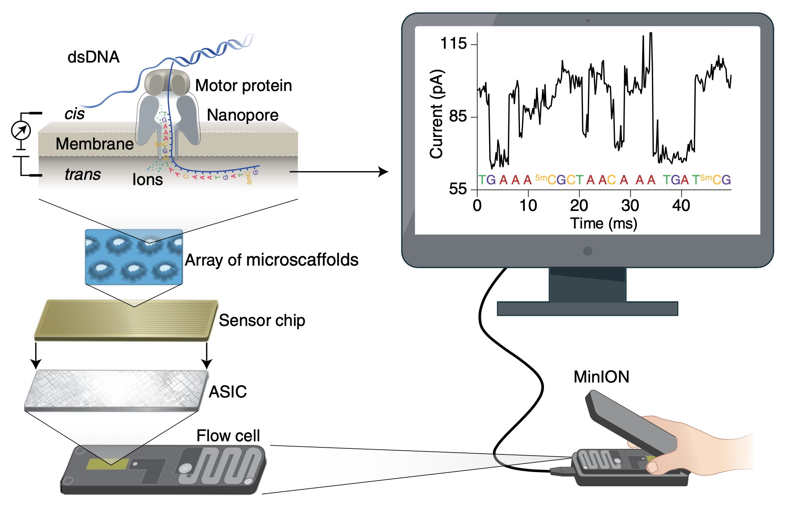
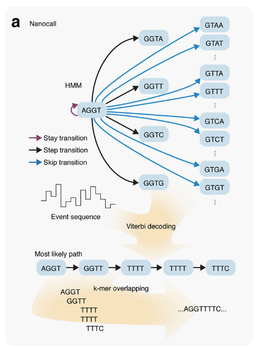

## Sequencing methods {#sec-sequencing-methods}

Molecular identification strategies have had a significant impact on
fungal ecology research and have allowed investigators to identify
organisms by sequencing their DNA. Early molecular studies in the 1990s
indicated that there were many unknown fungal species that could not be
detected from sporing bodies, isolation in culture or other observable
structures [@doi:10.1139/b96-190; @Nilsson2019a; @Allen1976].

High throughput sequencing (HTS) technologies (454 pyrosequencing and
IonTorrent) emerged in the 2000s that allowed for automated sequencing
of mixed samples, enabling the identification of tens to hundreds of
taxa from multiple samples [@Jumpponen2009]. The rapid adoption of 454
pyrosequencing lead to an influx of sequencing data and a boom of the
fungal ecology field [@Hibbett2009]. The 454 pyrosequencing platform was
primarily adopted for fungal ecology studies between 2008 and 2014 and
was capable of producing 1.2 million reads with a length of up to 1000
bases [@Nilsson2019a]. Drawbacks to the pyrosequencing technique were
the high cost and difficulties in sequencing homopolymer-rich
regions [@Allen1976]. As of 2016, the production of 454 sequencers was
discontinued [@BioIT2013].

Ion Torrent technology produced similar quality results to 454
pyrosequencing at lower cost, but was limited to shorter read lengths
(400--600 bp) and complex library preparation protocols [@Allen1976].
With these drawbacks, Ion Torrent was never broadly used in fungal
ecology [@Nilsson2019a].

The next advance in sequencing which has had wide adoption is the
Illumina MiSeq technology [@Allen1976]. The Illumina MiSeq, (and more
recently) NextSeq and NovaSeq platforms offer short reads of up to
$\sim$`<!-- -->`{=html}300 paired-end bp while providing very high
throughput that enables the production of high quality sequences. MiSeq,
NextSeq and NovaSeq can sequence up to 20, 360 and 6000 GB of read data
respectively [@Nilsson2019a; @Inc.2023]. Of the sequencing systems,
Illumina can provide one of the highest read qualities with typical
accuracy of 99.9% [@IlluminaQuality]. The use of paired end reads (on
forward and reverse strands) can enable the coverage of a longer
$\sim$`<!-- -->`{=html}550 base region [@Nilsson2019a]. For these
reasons, the Illumina sequencing platforms are currently the standard
for use in metabarcoding and metagenomics [@Nilsson2019a].

The latest step in sequencing technology provide much longer reads and
are capable of detecting the nucleotides of a single DNA molecule, as
opposed to clusters of DNA molecules as in Illumina sequencing
(@fig-NGS-comparison) [@RealTime2009; @Aigrain2021]. Until
recently, the low read quality of these techniques has been a limitation
for metabarcoding studies [@Nilsson2019a].

![DNA sequencing on different NGS platforms [@Aigrain2021]](resources/images/NGS-comparison.png){#fig-NGS-comparison}

The PacBio HiFi sequencing platform can provide read lengths of 10--25
KB and improves error rates through circular sequencing which allows the
same molecule to be sequenced repetitively, therefore reducing the
chance of errors [@PacBio2023; @Allen1976]. This approach leads to a
trade-off between read length and quality, as longer sequences produce
fewer circular passes [@Rhoads2015]. PacBio HiFi reads can reach a base
call accuracy comparable to Illumina of 99.9% [@Aigrain2021], but the
relatively high cost is a major drawback for its
adoption [@Murigneux2020].

Another technology that has gained much attention in recent years is
Oxford Nanopore Technology's sequencing platform which uses novel pore
design and has been observed to produce read lengths of up to 2.4
MB [@payneBulkVisGraphicalViewer2019]. With the ONT platform, sequencing
can be performed at a relatively low cost and is much more accessible
than other platforms since it can be run from a laptop, even in the
field [@Mafune2020]. Until recently, a large drawback of the ONT system
was the high raw error rate which had been reported to range between 1%
and up to 15% [@Baloglu2021; @Rang2018]. Techniques to improve accuracy
are advancing with new chemistry and basecalling. ONT is now claiming a
raw read accuracy rate of 99.5% with the latest Q20+
chemistry [@NanoporeQ20] which is comparable to Illumina MiSeq.

The technology works by threading a single strand of DNA (or RNA)
through a pore with an internal diameter on the order of
$\sim$`<!-- -->`{=html}1.4nm to 2.4nm [@Wang2021]. The pore is situated
on a charged membrane and allows ions to flow across the membrane. The
sequencing of base pairs is made possible by analysing the change of
electric current across the membrane as the DNA (or RNA) molecule is
ratcheted through the pore (see
@fig-nanopore-schematic).

Early nanopore techniques used a membrane channel protein
$\alpha$-Hemolysin taken from *Staphylococcus aureus* [@Wang2021].
Improvements were made to the system by engineering the
$\alpha$-hemolysin protein and using it in combination with a motor
protein to slow the DNA molecule's movement through the
pore [@Wang2021].

:::{#fig-nanopore-schematic}

A double-stranded DNA (dsDNA) molecule (or RNA–DNA hybrid)
is first unwound with the help of a motor protein, then single-stranded
DNA (or RNA) with negative charge is ratcheted through the nanopore
driven by the voltage. As nucleotides pass through the nanopore, current
change is measured and is used to determine the corresponding nucleotide
type. Each channel is associated with an electrode on the sensor chip
and is controlled and measured by the application-specific integration
circuit (ASIC) [@Wang2021]
:::

ONT's first product was the smartphone sized MinION, which was released
in 2014 [@ONTHistory2023]. Improved versions of their nanopore and motor
proteins have been iteratively released starting with version R6 (in
2014) and their latest being R10.4.1 (2022) [@Wang2021; @NanoporeQ20].
It is worth noting that none of specifications for the proteins used in
these systems have been fully disclosed by ONT [@Wang2021].

Basecalling is the step where raw electrical signals from the device are
analysed to determine the sequence of nucleotides. The electrical signal
is influenced by the nucleotides that occupy the pore at a given
time [@Wick2019]. First generation basecallers used hidden markov models
(HMMs) to predict the DNA sequence and required the raw signal to be
segmented into discrete events (see Figure
[5](#fig:hmm-basecalling){reference-type="ref"
reference="fig:hmm-basecalling"}, [@Rang2018]). Newer basecallers such
as DeepNano [@DeepNano], Albacore and Guppy [@Technologies] have
improved accuracy by shifting away from HMMs to use neural
networks [@Wick2019; @Rang2018]. Newer basecallers also use the raw
current signal as input instead of requiring an additional discrete
event segmentation step [@Rang2018]. These methods require a training
step to optimize the parameters of the HMM or neural network. The
dataset used to train the model has a significant impact on the
basecaller's performance [@Rang2018]. The training dataset can lead to
biases when applied on new organisms due to differences in GC content,
codon usage and base modifications [@Rang2018]. For example, when
BasecRAWller [@Stoiber2017] was trained on an *E. coli* dataset, the
accuracy of basecalling human data was much lower than on new *E. coli*
data [@Stoiber2017].

:::{#fig-hmm-basecalling

A schematic of a HMM to predict a DNA sequence from event
data. Transition probabilities are determined from the training dataset
and the most probable path is calculated using the Viterbi decoding [@Rang2018]
:::

High error rate is the largest issue for the use of ONT sequencing in
fungi identification and metabarcoding
studies [@Nilsson2019a; @Tedersoo2022]. While the quality of reads is
improving with better basecalling and consensus methods, special
considerations in our analysis pipeline will be needed if we wish to
leverage the benefits of long reads to accurately identify fungi.

## Fungal barcode regions {#sec-fungal-marker-regions}

Molecular barcoding is a technique for identifying organisms using a
unique DNA region (or barcode) that is common to the group of targeted
organisms [@Taberlet2018]. The variability of a DNA sequence among
species provides the ability to discriminate between taxa [@Hebert2003].
For an ideal molecular barcode, the interspecific variation is much
higher than the intraspecific variation [@Schoch2012]. The difference
between these variations is called the barcode gap [@Puillandre2012]. A
barcode is optimal when the sequence is unique to one species are there
is little variability of the barcode in that same species [@Schoch2012].

In fungi, genes used for species identification are usually from regions
that encode the nuclear ribosomal RNA (rRNA) and more rarely from other
regions that encode proteins [@Schoch2012]. The nuclear rRNA region
contains the 18S small subunit (SSU), 5.8S and 28S large subunit (LSU)
rRNA genes. These genes are transcribed by RNA polymerase I and two
spacer regions (ITS1 and ITS2) between the genes are removed through
post-transcriptional modifications. The region covering the two spacers
are referred to as the internal transcribed spacer (ITS) region and
typically spans 500--700 bases but is highly variable among fungal
groups (see @fig-its-region-simple) [@Nilsson2019a].

:::{#fig-its-region-simple}
.png)

A simplified map of the ITS region showing common primer sites and
typical amplicon lengths (edited from @Furneaux2021a)
:::

Due to read length limitations of short-read sequencing platforms,
generally only one of the ITS1 or ITS2 subregions (250-400 bases) are
targeted for sequencing [@Nilsson2019a]. The limitations of using the
ITS1 or ITS2 subregions in isolation is that they have lower taxonomic
resolution and universal primer sites are less convenient than the full
ITS region (see [@Tedersoo2022] and [@Tedersoo2015]).

The ITS region has limitations on its coverage of taxa and is unsuitable
for some groups of fungi. For example some species in the
*Microsporidia* group may lack the ITS region, and other orchid root
symbionts (*Tulasnellaceae*) have mutations in primer
sites [@Allen1976; @Tedersoo2022]. The arbuscular mycorrhizal
*Glomeromycota* have highly variable copies of the ITS region, with up
to 20% divergence in a single multinucleate spore [@Schoch2012]. For
these reasons, metabarcoding studies targeting arbuscular mycorrhizal
fungi commonly use SSU or LSU instead of
ITS [@delavauxEnvironmentalIdentificationArbuscular2022; @opikOnlineDatabaseMaarjAM2010].
Other fungal genera such as *Trichoderma* and *Fusarium* lack
variability, making ITS unsuitable to discriminate between
species [@Tedersoo2022].

Copy numbers of the ITS region can vary between species and
non-identical copies can co-exist within the same
individual [@bradshawExtensiveIntragenomicVariation2023]. This can lead
to amplification bias, inflating diversity in organisms with higher copy
numbers [@Nilsson2019a]. Despite these limitations, ITS has a mucher
higher PCR amplification success rate compared to protein coding genes
such as RPB1, RPB2 and MCM7 and is therefore better suited for
metabarcoding [@Schoch2012].

Other rDNA genes used as fungal barcodes are the 18S SSU and 28S LSU.
Since they encode RNA involved in ribosome formation, these regions are
highly conserved and there is often insufficient variation in the SSU
and LSU regions to discriminate between many basidiomycete and
ascomycete species [@Schoch2012]. Nevertheless, the SSU and LSU markers
can be very useful at higher taxonomic levels to resolve the
evolutionary history of genera, families, order and fungal
class [@Nilsson2019a].

## Bioinformatic analysis {#sec-bioinformatic-analysis}

### Quality filtering {#sec-quality-filtering}

Quality filtering is an initial step in a metabarcoding pipeline that
processes the raw output of the sequencing instrument for further
analysis and involves: demultiplexing, trimming of primer and index
sequences, and removal of low quality and off target
reads [@Tedersoo2022].

Multiplexing is a method for reducing costs by sequencing multiple DNA
samples simultaneously, where each sequence contains a tag (or barcode)
that is unique to the sample it belongs to [@Id2018]. Demultiplexing is
the process of sorting the resulting reads by that unique tag so the
original sample can be recovered [@Id2018]. Demultiplexing is often
incorporated into metabarcoding pipeline tools targeting short-read data
such as AMPtk [@Palmer2018], mothur [@Schloss2009] and
QIIME2 [@Bolyen2019]. The demultiplexing tool DeepBinner [@Id2018]
follows an approach that is unique to ONT data, where reads are
classified based on raw electrical signals (in fast5 files) as opposed
to classifying reads after basecalling. This approach was observed to
have greater accuracy over alternative tools such as Albacore and
Porechop [@Wick] that use basecalled sequences but has become outdated
due to the rapid advances in recent basecalling
models [@Id2018; @wickRrwickDeepbinner2023].

Tools such as cutadapt [@Cutadapt] and Trimmomatic [@Bolger2014] are
designed to remove sequencing adapters, indexes, primers and low-quality
ends from short-read data. Specific tools for adapter trimming of ONT
data such as Porechop [@Wick] are designed for long reads and can handle
special cases where adapters are occasionally found within the middle of
a read [@Wick].

It is worth noting that many quality filtering tools have been developed
for bacterial 16S sequence data and may therefore not be adequate to
handle fungal ITS sequences, due to its variation in length and high
variability [@Tedersoo2022; @Anslan2018].

For ITS metabarcoding, it is important to remove the genes flanking the
ITS1 and ITS2 subregion (such as 18S, 5.8S and 22S) as they are more
conserved and do not enhance species level
resolution [@Nilsson2019a; @Tedersoo2022]. The tools
ITSx [@Bengtsson-Palme2013] and ITSxpress [@Rivers2018] are capable of
extracting ITS1, ITS2 and full length ITS regions using hidden markov
models. ITSxpress expands on the functionality of ITSx, targeting its
use for amplicon sequence variant techniques (discussed in
@sec-clustering) over OTU clustering [@Rivers2018].
Similarly, LSUx [@Furneaux] is a tool for extracting the 5.8S, ITS2, and
28S regions [@Furneaux2021a].

For sequencing platforms that use paired reads, such as Illumina, it is
common to disregard unpaired reads as a way to discard low quality
reads [@Tedersoo2022]. Nevertheless, some taxa can fail to pair
successfully (due to the size of ITS1 or ITS2 fragments exceeding 600
bp), so discarding unpaired reads can lead to biased taxa selection and
considerable data loss [@Nguyen2015; @Truong2019; @Tedersoo2015]. An
alternative strategy is to exclusively use high quality paired and
unpaired reads even though they may be
shorter [@Truong2019; @Taylor2016].

To ensure the read data is usable for downstream analysis, read
quality-based filtering removes entire reads that do not meet a quality
threshold or trims low quality segments from a
read [@Taberlet2018; @Hakimzadeh2023]. Some considerations are needed
when performing read quality filtering for ONT data. Tools such as
NanoFilt [@DeCoster2018] and Chopper [@DeCoster2023] accept or reject an
entire read based on an average quality score threshold. For ONT reads
with variable quality, stretches of the read with high sequence quality
may still be salvaged using Prowler [@Lee2021] or Filtlong [@Wicka].

Index switching (also known at tag jumps) is the process where the
identifying tag of a sample is misread, based on PCR or sequencing
errors [@Schnell2015]. This process can lead to the incorrect assignment
of a sequence to the wrong sample and artificially inflate
diversity [@Caroe2020]. The rate of index switching artefacts, which can
be highly variable between Illumina runs, can be assessed using tools
such as UNCROSS [@Edgar2018] and unspread [@Larsson2018], but also by
analysing the distribution of spike-ins or artificial positive control
in samples [@guenay-greunkeHandlingTargetedAmplicon2021; @Tedersoo2022].

### Clustering {#sec-clustering}

In a metabarcoding pipeline, clustering is the process of aggregating
DNA sequences into groups called Operational Taxonomic Units (OTUs)
based on a sequence similarity threshold [@Cline2017; @Blaxter2005]. The
similarity thresholds of OTUs usually range from 95% to 100%, most often
delineating species at 97% [@Tedersoo2022; @Joos2020]. Three types of
clustering frequently seen in metabarcoding are: de novo, closed
reference and open reference clustering [@Tedersoo2022; @Cline2017].

De novo clustering is one of the widely employed methods for defining
fungal OTUs, where clustering is performed based on the similarity of
sequences within the same data set [@Cline2017]. The OTUs generated by
de novo clustering are dependent on the data set in which they are
defined, therefore de novo OTUs clustered from different datasets cannot
be reliably compared [@Callahan2017].

Closed reference clustering is a method where OTUs are constructed based
on similarity to sequences in a reference database [@Cline2017]. As a
drawback, the biological variation that is not represented in the
reference database is lost when clustering with this
method [@Callahan2017]. Compared with de novo clustering, closed
reference clustering produces more stable OTUs but is limited by the
quality of the reference database [@He2015]. Despite this, closed
reference clustering allows OTUs to be tracked across studies provided
the same reference database is used [@Cline2017; @Callahan2017].

Another method is open reference clustering, where sequences are first
clustered based on similarity to those in a reference database followed
by de novo clustering of the unassigned sequences [@Cline2017]. This
approach combines the benefits of closed reference and de novo methods
by ensuring all sequences are clustered while also maintaining OTU
stability [@Rideout2014; @He2015].

An alternative method to infer OTUs is the amplicon sequence variant
(ASV, also called the exact sequence variant) approach. ASV methods
discriminate biological sequences from errors on the basis that we
expect to observe biological sequences more frequently than sequences
that contain errors [@Callahan2017]. ASV methods can detect small
biological sequence variants, such as infraspecific variation (i.e.
between poplations within a species), while disregarding errors
introduced through sequencing or library preparation, therefore
increasing the taxonomic resolution of the
results [@Joos2020; @Glassman2018]. Compared to OTU clustering that are
produced \"artificially\", ASVs have the advantage to be more precise,
reusable and reproducible [@Callahan2017]. ASVs are largely used in
metabarcoding studies targeting conserved regions such as the bacterial
16S. However, in fungal metabarcoding, ASVs are expected to perform
poorly for groups that have multiple ITS copies and variants within
individuals [@Tedersoo2022].

Therefore, ASV approaches tend to overestimate richness of common fungal
species (due to haplotype variation) and underestimate richness of rare
species (by removing rare variants) [@Tedersoo2022; @Joos2020].
Nevertheless, when analyzing diversity patterns based on dominant
members of fungal communities, results are usually similar between ASV
and OTU based approaches [@Glassman2018].

In bacterial 16S metabarcoding, the number of errors introduced (such as
insertions and deletions) by ONT sequencing has been a major limitation
of finding similarity between reads, making the ASV approach using
DADA2 [@Callahan2016] and deblur [@Amir2017] unviable [@Santos2020].
Methods have been developed to improve ASV recovery of long-read PacBio
ITS reads by splitting the read into homologous regions (with
LSUx [@Furneaux]), then reassembling and generating the ASVs using
TZARA [@Furneauxa; @Furneaux2021a]. This approach may also be adaptable
to ONT sequences and would enable increased ASV recovery without
additional sampling depth [@Furneaux2021a].

### Taxonomic assignment {#sec-taxonomic-assignment}

Taxonomic assignment is the process of assigning sequences to species or
higher taxonomic ranks [@Taberlet2018]. If the sequences have been
clustered into OTUs, a representative sequence from each OTU is used for
the classification [@Tedersoo2022]. Sequences that have been trimmed and
filtered can also be given a taxonomic assignment directly without
clustering [@Klaubauf2010; @Nygaard2020].

The quality of the taxonomic assignment depends on the reference
database and algorithm used [@Furneaux2021a]. Public INSDC databases
such as GenBank
([www.ncbi.nlm.nih.gov/genbank](www.ncbi.nlm.nih.gov/genbank){.uri}) are
problematic for taxonomic assignment as a significant number of entries
are incorrectly identified at the species
level [@Nilsson2006; @Bidartondo2008]. Curated databases such as
UNITE [@Koljalg2005] address this problem by maintaining high quality
reference records of ITS sequences and curating taxonomic designation by
researchers well versed in the taxonomic groups [@Abarenkov2010].
Similarly, the Ribosomal Data Project (RDP) [@Cole2014] provides curated
fungal LSU sequences while Silva [@Quast2013] provides both SSU and LSU
reference sequences. A drawback of curated databases is that they have
limited taxonomic coverage and do not always include the most recently
published sequences [@Furneaux2021a].

A common method for taxonomic assignment is a BLAST [@Camacho2009a]
search, where pairwise comparisons are made between representative
sequences and those in a reference database to assign the closest
matching reference [@Taberlet2018; @Tedersoo2022].

Alternative methods that use fixed length subsequence (k-mer) searches
to assign taxonomy include Naive Bayesian Classifier [@Wang2007],
SINTAX [@Edgar2016a] and IDTAXA [@Murali2018]. These methods use
information on the variability within taxa from a reference database to
assign unknown sequences, therefore they are highly dependent on having
high taxonomic coverage in the reference
database [@Furneaux2021a; @Ceballos-Escalera2022].

Phylogenetic placement algorithms such as pplacer [@FA2010] and
EPA-ng [@Barbera2019] place amplicon reads onto a pre-established
phylogenetic tree. They are not well suited for ITS sequences due to the
high variability in length and content that produces alignments with low
accuracy, but work well with more conserved regions such as 16S, SSU and
LSU [@Furneaux2021a; @Tedersoo2022].

Taxonomic assignment of fungi from studies using long-read sequences
(PacBio or ONT) follow similar methods to the ones described above. The
method of clustering ITS reads into OTUs, then performing BLAST searches
on representative sequences has been performed for fungal communities
sequenced with ONT and PacBio (see
 [@Mafune2020; @Tedersoo2018; @loitRelativePerformanceMinION2019]).
In [@Mafune2020] ONT reads were clustered and BLAST searches performed
against the NCBI reference database.
In [@loitRelativePerformanceMinION2019], there was difficulty clustering
ONT reads due to quality, so unclustered reads were mapped to the UNITE
database directly.
In [@Tedersoo2018; @loitRelativePerformanceMinION2019], ITS subregions
were extracted from reads using ITSx and assigned using top BLAST hits
against the UNITE reference database.

Alternative approaches extract multiple barcodes from the same PacBio
read to improve taxonomic
assignment [@Meidl2021; @Furneaux2021a; @eshghisahraeiEffectsOperationalTaxonomic2022].
This approach groups reads into ASVs where ITSx or LSUx are used to
extract ITS and LSU regions. Taxonomic assignment is performed
separately for each region using one or more classifiers, then these
assignments are refined in combination with a phylogenetic
tree [@Furneaux2021a; @Meidl2021; @brendanfPhylotax2021].
In [@Furneaux2021a], the use of a phylogenetic tree increased the
percentage of reads assigned to genus from 46% to 73% and family from
62% to 81%. These approaches are expected to be applicable to ONT data
and enhance the recovery of rare taxa [@Furneaux2021a].

High throughput sequencing techniques applied to metabarcoding have
detected a high diversity of fungal taxa that are undescribed and entire
groups (even phyla) that cannot be placed with the current fungal tree
of life [@Nilsson2019; @Phukhamsakda2022]. These so-called \"dark taxa\"
do not seem to form discernible morphological structures or be
cultivatable in the lab, therefore dark taxa are predominantly detected
by DNA sequencing [@nilssonWhatMycologistsShould2023]. In some cases of
environmental metabarcoding, dark taxa make up the majority of taxa
recovered [@retterExploringTaxonomicComposition2019]. Long-read
sequencing technology is being used to help phylogenetic placement for
previously undescribed sequences by capturing the SSU and LSU genes in
combination with the ITS region and improving taxonomic
resolution [@tedersooIdentifyingUnidentifiedFungi2020]. Taxa known only
from sequence data poses a dilemma for the field of mycology as the
existing taxonomic system requires morphology-based
classification [@James2020]. This trend is expected to continue as the
cost of sequencing decreases and the volume of undescribed sequences
continues to grow and outnumber the fully described taxa [@James2020].