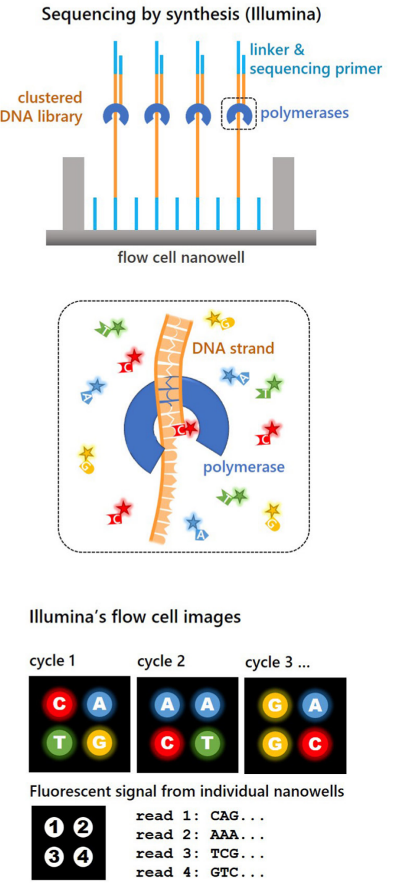
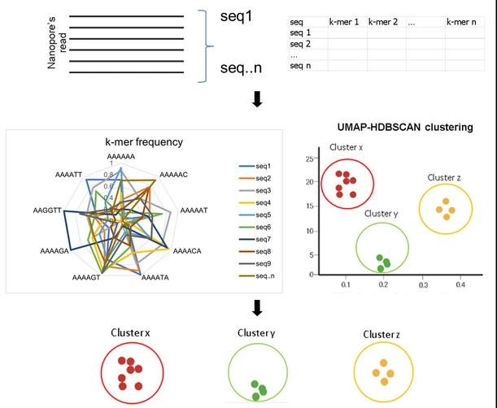

## Fungal barcode regions {#sec-fungal-marker-regions}

Molecular barcoding is a technique for identifying organisms using a
unique DNA region (or barcode) that is common to the group of targeted
organisms [@Taberlet2018]. The variability of a DNA sequence among
species provides the ability to discriminate between taxa [@Hebert2003].
For an ideal molecular barcode, the interspecific variation is much
higher than the intraspecific variation [@Schoch2012]. The difference
between these variations is called the barcode gap [@Puillandre2012]. A
barcode is optimal when the sequence is unique to one species and there
is little variability of the barcode within that same species [@Schoch2012].

<!-- TODO review wording -->
In fungi, barcode regions used for species identification are often from regions
that encode the nuclear ribosomal RNA (rRNA) and more rarely from other
regions that encode proteins [@Schoch2012]. The nuclear rRNA region
contains the 18S small subunit (SSU), 5.8S and 28S large subunit (LSU)
rRNA genes. These genes are transcribed by RNA polymerase I and two
spacer regions (ITS1 and ITS2) between the genes are removed through
post-transcriptional modifications. The region covering the two spacers
are referred to as the internal transcribed spacer (ITS) region and
typically spans 500--700 bases but is highly variable among fungal
groups (@fig-its-region-simple) [@Nilsson2019a].

:::{#fig-its-region-simple}
.png)

A simplified map of the ITS region showing common primer sites and
typical amplicon lengths (edited from @Furneaux2021a)
:::

Due to read length limitations of short-read sequencing platforms,
generally only one of the ITS1 or ITS2 subregions (250-400 bases) are
targeted for sequencing [@Nilsson2019a]. The limitations of using the
ITS1 or ITS2 subregions in isolation is that they have lower taxonomic
resolution and universal PCR primer sites are less convenient than the full
ITS region (see [@Tedersoo2022] and [@Tedersoo2015]).

The ITS region has limitations on its coverage of taxa and is unsuitable
for some groups of fungi. For example some species in the
*Microsporidia* group may lack the ITS region, and other orchid root
symbionts (*Tulasnellaceae*) have mutations in primer
sites [@Allen1976; @Tedersoo2022]. The arbuscular mycorrhizal
*Glomeromycota* have highly variable copies of the ITS region, with up
to 20% divergence in a single multinucleate spore [@Schoch2012]. For
these reasons, metabarcoding studies targeting arbuscular mycorrhizal
fungi commonly use SSU or LSU instead of
ITS [@delavauxEnvironmentalIdentificationArbuscular2022; @opikOnlineDatabaseMaarjAM2010].
Other fungal genera such as *Trichoderma* and *Fusarium* lack
variability, making the ITS region unsuitable to discriminate between
species [@Tedersoo2022].

Copy numbers of the ITS region can vary between species and
non-identical copies can co-exist within the same
individual [@bradshawExtensiveIntragenomicVariation2023]. This can lead
to amplification bias, inflating diversity in organisms with higher copy
numbers [@Nilsson2019a]. Despite these limitations, ITS has a much
higher PCR amplification success rate compared to protein-coding genes
such as RPB1, RPB2 and MCM7 and is therefore better suited for
metabarcoding [@Schoch2012].

Other rDNA genes used as fungal barcodes are the 18S SSU and 28S LSU.
Since they encode RNA involved in ribosome formation, these regions are
highly conserved and there is often insufficient variation in the SSU
and LSU regions to discriminate between many basidiomycete and
ascomycete species [@Schoch2012]. Nevertheless, the SSU and LSU markers
can be very useful at higher taxonomic levels to resolve the
evolutionary history of genera, families, order and class [@Nilsson2019a].

## Sequencing methods {#sec-sequencing-methods}

Molecular identification strategies have had a significant impact on
fungal ecology research and have allowed investigators to identify
organisms by sequencing their DNA. Early molecular studies in the 1990s
indicated that there were many unknown fungal species that could not be
detected from sporing bodies, isolation in culture or other observable
structures [@doi:10.1139/b96-190; @Nilsson2019a; @Allen1976].

The high throughput sequencing (HTS) technologies 454 pyrosequencing and
IonTorrent emerged in the 2000s that allowed for automated sequencing
of mixed samples, enabling the identification of tens to hundreds of
taxa from multiple samples [@Jumpponen2009]. The rapid adoption of 454
pyrosequencing led to an influx of sequencing data and a boom of the
fungal ecology field [@Hibbett2009]. The 454 pyrosequencing platform was
primarily adopted for fungal ecology studies between 2008 and 2014 and
was capable of producing 1.2 million reads with a length of up to 1000
bases [@Nilsson2019a]. Drawbacks to the pyrosequencing technique were
the high cost and difficulties in sequencing homopolymer-rich
regions [@Allen1976]. As of 2016, the production of 454 sequencers was
discontinued [@BioIT2013].

Ion Torrent technology produced similar quality results to 454
pyrosequencing at lower cost, but was limited to shorter read lengths
(400--600 bp) and complex library preparation protocols [@Allen1976].
With these drawbacks, Ion Torrent was never broadly used in fungal
ecology [@Nilsson2019a].

The next advance in sequencing which has had wide adoption is the
Illumina MiSeq technology [@Allen1976]. The Illumina MiSeq, (and more
recently) NextSeq and NovaSeq platforms offer short reads of up to
~300 paired-end bp while providing very high
throughput that enables the production of high quality sequences. MiSeq,
NextSeq and NovaSeq can sequence up to 20, 360 and 6000 GB of read data
respectively [@Nilsson2019a; @Inc.2023]. Of the sequencing systems,
Illumina can provide one of the highest read qualities with typical
accuracy of 99.9% [@IlluminaQuality]. The use of paired end reads (on
forward and reverse strands) can enable the coverage of a longer
~550 base region [@Nilsson2019a]. For these
reasons, the Illumina sequencing platforms are currently the standard
for use in metabarcoding and metagenomics [@Nilsson2019a].

Recent advances in sequencing technology have provided much longer reads and
are capable of sequencing a single DNA molecule, as
opposed to clusters of DNA molecules as in Illumina sequencing
(@fig-NGS-comparison) [@RealTime2009; @Aigrain2021]. Until
recently, the low read quality of these techniques has been a limitation
for metabarcoding studies [@Nilsson2019a].

:::{#fig-NGS-comparison width=8cm}

In the Illumina sequencing process, DNA fragments hybridise and are fixed to the bottom of a nanowell.
These fragments are amplified into a cluster of identical sequences.
Fluorescent dye–labeled dNTPs are incorporated into a complementary DNA strand by a DNA-polymerase.
Synthesis is paused after each dNTP is incorporated allowing the device to take an image of the flow cell.
The colour of each cluster is used to identify the base (A, C, G or T) that was incorporated.
The process is repeated in a step-wise manner and the signals from each cluster produce a read.
Source: [@Aigrain2021].

:::

The PacBio HiFi sequencing platform can provide read lengths of 10--25
KB and improves error rates through circular sequencing which allows the
same molecule to be sequenced repetitively [@PacBio2023; @Allen1976].
PacBio HiFi reads can reach a base
call accuracy comparable to Illumina of 99.9% [@Aigrain2021], but the
relatively high cost is a major drawback for its
adoption [@Murigneux2020].

Oxford Nanopore Technology's (ONT) sequencing platform has gained much attention in recent years and
has been observed to produce read lengths of up to 2.4MB [@payneBulkVisGraphicalViewer2019].
With the ONT platform, sequencing
can be performed at a relatively low cost and is much more accessible
than other platforms since it can be run from a laptop, even in the
field [@Mafune2020]. Until recently, a large drawback of the ONT system
was the high raw error rate which had been reported to range between 1%
and up to 15% [@Baloglu2021; @Rang2018]. Techniques to improve accuracy
are advancing with new chemistry and basecalling. ONT is now claiming a
raw read accuracy rate of 99.75% with the latest
chemistry [@oxfordnanoporetechnologiesNanoporeSequencingAccuracy2024] which is comparable to Illumina MiSeq.

ONT sequencing works by threading a single strand of DNA (or RNA)
through a pore with an internal diameter on the order of
~1.4nm to 2.4nm [@Wang2021]. The pore is situated
on a charged membrane and allows ions to flow across the membrane. The
sequencing of base pairs is made possible by analysing the change of
electric current across the membrane as the DNA (or RNA) molecule is
ratcheted through the pore (see
@fig-nanopore-schematic).

:::{#fig-nanopore-schematic}

A double-stranded DNA (dsDNA) molecule (or RNA–DNA hybrid)
is first unwound with the help of a motor protein, then the negatively charged single-stranded
DNA (or RNA) is ratcheted through the nanopore
driven by the voltage. As nucleotides pass through the nanopore, the change in current
is measured and is used to determine the corresponding nucleotide.
Each channel is associated with an electrode on the sensor chip
and is controlled and measured by the application-specific integration
circuit (ASIC) [@Wang2021]
:::

ONT's first product was the smartphone sized MinION, which was released
in 2014 [@ONTHistory2023]. Improved versions of their nanopore and motor
proteins have been iteratively released starting with version R6 (in 2014)
and their latest being R10.4.1 [@Wang2021; @OxfordNanoporeTechnologies2024].
It is worth noting that none of the specifications for the proteins used in
these systems have been fully disclosed by ONT [@Wang2021].

Basecalling is the step where raw electrical signals from the device are
analysed to determine the sequence of nucleotides. The electrical signal
is influenced by the nucleotides that occupy the pore at a given
time [@Wick2019].
Historically, basecallers used hidden markov models
(HMMs) to predict the DNA sequence, but modern basecallers have adopted neural networks
and improved accuracy significantly [@Wick2019; @Rang2018].
ONT’s latest basecaller is Dorado [@OxfordNanoporeTechnologies] which is: open source, optimised for graphics processing units (GPUs)
and replaces ONT’s previous (now unsupported) basecaller Guppy.

## Bioinformatic analysis {#sec-bioinformatic-analysis}

Here we will outline the key computational steps common to many metabarcoding analyses (@fig-metabarcoding-workflow).

### Quality filtering {#sec-quality-filtering}

Quality filtering is an initial step in a metabarcoding pipeline that
processes the raw output of the sequencing instrument for further
analysis and involves: demultiplexing, trimming of primer and index
sequences, and removal of low quality and off target
reads [@Tedersoo2022].

Multiplexing is a method for reducing costs by sequencing multiple DNA
samples simultaneously, where each sequence contains a tag (or barcode)
that is unique to the sample it belongs to [@Id2018].
Demultiplexing is the process of splitting reads by tags to determine which sample a read came from [@Id2018].
The ONT basecallers Dorado and guppy have built-in support for demultiplexing,
while minibar [@californiaacademyofsciencesCalacademyresearchMinibarDual2024] is suitable for custom barcoding schemes.
Historically, custom tools such as Porechop [@Wick] were developed to trim ONT sequencing adapters from reads, but
currently this functionality is supported by dorado.

For ITS metabarcoding, it is important to remove the genes flanking the
ITS1 and ITS2 subregion (such as 18S, 5.8S and 22S) as they are more
conserved and do not enhance species level
resolution [@Nilsson2019a; @Tedersoo2022]. The tools
ITSx [@Bengtsson-Palme2013] and ITSxpress [@Rivers2018] are capable of
extracting ITS1, ITS2 and full length ITS regions using hidden markov
models. ITSxpress expands on the functionality of ITSx, targeting its
use for amplicon sequence variant (ASV) techniques over OTU clustering [@Rivers2018].

To ensure the sequence data is usable for downstream analysis, read
quality-based filtering removes entire reads that do not meet a quality
threshold or trims low quality segments from a
read [@Taberlet2018; @Hakimzadeh2023]. Some considerations are needed
when performing read quality filtering for ONT data. Tools such as
NanoFilt [@DeCoster2018] and Chopper [@DeCoster2023] accept or reject an
entire read based on an average quality score threshold.
For ONT reads with variable quality, stretches of the read with high sequence quality
may still be salvaged using Prowler [@Lee2021] or Filtlong [@Wicka].

<!--
Index switching (also known at tag jumps) is the process where the
identifying tag of a sample is misread, based on PCR or sequencing
errors [@Schnell2015]. This process can lead to the incorrect assignment
of a sequence to the wrong sample and artificially inflate
diversity [@Caroe2020]. The rate of index switching artefacts, which can
be highly variable between Illumina runs, can be assessed using tools
such as UNCROSS [@Edgar2018] and unspread [@Larsson2018], but also by
analysing the distribution of spike-ins or artificial positive control
in samples [@guenay-greunkeHandlingTargetedAmplicon2021; @Tedersoo2022].
-->

### Clustering {#sec-clustering}

In general, clustering is an unsupervised technique for grouping items together
based on their similarity to each other.
In the context of metabarcoding, clustering is the process of aggregating
DNA sequences into groups based on a similarity metric.

A commonly used similarity metric used in metabarcoding is sequence identity
and is defined as the proportion of nucleotides that match exactly between two sequences.
Sequences are considered to be in the same cluster when the pairwise sequence identity is above a predefined threshold.
The resulting clusters are called Operational Taxonomic Units (OTUs) [@Cline2017; @Blaxter2005].
For fungal metabarcoding, sequence identity thresholds of OTUs usually range from 95% to 100%, most often
delineating species at 97% [@Tedersoo2022; @Joos2020].
Three types of clustering frequently seen in metabarcoding are: closed
reference, *de novo* and open reference clustering [@Tedersoo2022; @Cline2017].

Closed reference clustering is a method where OTUs are constructed based
on similarity to sequences in a reference database [@Cline2017].
As a drawback, the biological variation that is not represented in the
reference database is lost when clustering with this method [@Callahan2017].
Closed reference clustering allows OTUs to be tracked across studies provided
the same reference database is used [@Cline2017; @Callahan2017].

*De novo* clustering is one of the widely employed methods for defining
fungal OTUs, where clustering is only performed for
sequences within the experimental dataset [@Cline2017]. The OTUs generated by
de novo clustering are dependent on the dataset in which they are
defined, therefore de novo OTUs clustered from different datasets cannot
be reliably compared [@Callahan2017].
Compared with closed reference clustering,
*de novo* clustering produces less stable OTUs but can detect biological variation that
is not present in a reference database [@He2015].

Open reference clustering combines the benefits of closed reference and *de novo* methods.
Sequences are first clustered based on similarity to those in a reference database followed
by *de novo* clustering of the unassigned sequences [@Cline2017].

The amplicon sequence variant (ASV, also called the exact sequence variant) approach
differs significantly from traditional OTU clustering by aiming to
correct errors in reads then group the reads by 100% identity.
ASV methods discriminate biological sequences from errors on the expectation that errors are rare [@Callahan2017].
ASV methods can detect small
biological sequence variants, such as infraspecific variation (i.e.
between populations within a species), while disregarding errors
introduced through sequencing or library preparation, therefore
increasing the taxonomic resolution of the results [@Joos2020; @Glassman2018].
Compared to OTU clustering where identity thresholds are defined *a priori*, ASVs have the advantage to be more precise,
reusable and reproducible [@Callahan2017].
ASVs are largely used in metabarcoding studies targeting conserved regions such as the bacterial
16S.
However, in fungal metabarcoding, ASVs are expected to perform
poorly for groups that have multiple ITS copies and variants within
individuals [@Tedersoo2022].

Therefore, ASV approaches tend to overestimate richness of common fungal
species (due to haplotype variation) and underestimate richness of rare
species (by removing rare variants) [@Tedersoo2022; @Joos2020].
Nevertheless, when analysing diversity patterns based on dominant
members of fungal communities, results are usually similar between ASV
and OTU based approaches [@Glassman2018].

A completely different approach to clustering has been implemented in the NanoCLUST pipeline [@rodriguez-perezNanoCLUSTSpecieslevelAnalysis2021] which groups sequences by k-mer signature similarity.
First, each sequence is transformed into a k-mer frequency vector and stored in a tabular format (one column per k-mer).
A dimension reduction step converts the multidimensional tabular structure into two dimensions using Uniform Manifold Approximation and Projection (UMAP) [@mcinnesUMAPUniformManifold2020].
The similarity of sequences is represented as distances between points in two-dimensional space where
the Hierarchical Density-Based Spatial Clustering of Applications with Noise (HDBSCAN) algorithm is then used to cluster points (@fig-nanoclust-steps, @mcinnes2017hdbscan).
HDBSCAN is a dynamic clustering approach that considers the density surrounding a point to detect and remove noise.
HDBSCAN requires setting a minimum cluster size parameter which controls how many points are required to be considered a cluster
 and has the effect of filtering out small clusters or merging nearby clusters together [@lelandmcinnesParameterSelectionHDBSCAN2016].
NanoCLUST has been developed for the analysis of 16S rRNA amplicons but other researchers [@langsiriTargetedSequencingAnalysis2023] have had success applying the same approach to fungal ITS sequences.

:::{#fig-nanoclust-steps width=15cm}

Steps for clustering reads with NanoCLUST.
Reads are transformed into a k-mer frequency vector and stored in a tabular format.
Uniform Manifold Approximation and Projection (UMAP) is applied to reduce the multidimensional tabular structure into two dimensions.
The Hierarchical Density-Based Spatial Clustering of Applications with Noise (HDBSCAN) algorithm clusters points in two-dimensional space.
Adapted from: [@langsiriTargetedSequencingAnalysis2023]
:::

### Taxonomic assignment {#sec-taxonomic-assignment}

In fungal metabarcoding, taxonomic assignment is the process of classifying sequences to species or
higher taxonomic ranks [@Taberlet2018]. If the sequences have been
clustered into OTUs, a representative sequence from each OTU is used for
the classification [@Tedersoo2022]. Sequences can also be given a taxonomic assignment directly without
clustering [@Klaubauf2010; @Nygaard2020].

The quality of the taxonomic assignment depends on the reference
database and algorithm used [@Furneaux2021a]. Public INSDC databases
such as GenBank
([www.ncbi.nlm.nih.gov/genbank](www.ncbi.nlm.nih.gov/genbank){.uri}) are
problematic for taxonomic assignment as a significant number of entries
are incorrectly identified at the species
level [@Nilsson2006; @Bidartondo2008].
<!-- TODO: check if still relevant -->
Curated databases such as UNITE [@Koljalg2005] address this problem by maintaining high quality
reference records of ITS sequences and curating taxonomic designation by
researchers well versed in the taxonomic groups [@Abarenkov2010].
Similarly, the Ribosomal Data Project (RDP) [@Cole2014] provides curated
fungal LSU sequences while Silva [@Quast2013] provides both SSU and LSU
reference sequences.
A drawback of curated databases is that they have
limited taxonomic coverage and do not always include the most recently
published sequences [@Furneaux2021a].

<!--
The most common sequence similarity approach for taxonomic classification is a search using the Basic Local Alignment Search Tool (BLAST) algorithm (Altschul et. al., 1990; Camacho et al., 2009), where pairwise comparisons are made between representative sequences and those in a reference database to assign the closest matching reference (Taberlet et al., 2018; Tedersoo et al., 2022).
Using heuristics, BLAST allows for considerably faster searches of sequence similarity compared to exact alignment algorithms such as Smith-Waterman or Needleman-Wunsch (Camacho et al., 2009).
The BLAST algorithm can massively reduce search space by scanning a database of sequences for small, fixed size subsequences (knows as words), then these matching sites are used as starting points to initiate more in-depth alignment.

BLAST is highly sensitive alignment but is also computationally intensive and may not be practical for classifying huge numbers of sequences (Ye et al., 2019), and furthermore may not be the most accurate classification option for long ITS metabarcoding pipelines (Lu et. al., 2022), especially when using with fixed threshold values of sequence similarity (Vu et. al., 2022).
-->

A common method for taxonomic assignment is a Basic Local Alignment Search Tool (BLAST) search [@Camacho2009a],
 where pairwise comparisons are made between representative sequences and those in a reference database to assign the closest matching reference [@Taberlet2018; @Tedersoo2022].
The BLAST algorithm can massively reduce search space by scanning a database of sequences for small, fixed size subsequences (knows as words),
then these matching sites are used as starting points to initiate more in-depth alignment.
Fixed BLAST percent identity cutoffs have often been used to classify sequences at a given taxonomic rank
(i.e. 98%, 90% and 85% sequence identity to assign species, genus and family as in [@tedersooFungalBiogeographyGlobal2014]),
but this approach is restrictive because fixed thresholds that accurately delineate taxa in one part of the fungal tree
of life may not be accurate for other clades in the tree [@vuDNABarcodingAnalysis2016; @vuLargescaleGenerationAnalysis2019; @vuDnabarcoderOpensourceSoftware2022].
Dnabarcoder is a tool that has been developed to address this issue by predicting similarity cutoffs for different fungal clades in a reference sequence dataset and can also classify sequences (via BLAST) using these predicted cutoff [@vuDnabarcoderOpensourceSoftware2022].

Minimap2 [@liMinimap2PairwiseAlignment2018a] and Kraken2 [@woodImprovedMetagenomicAnalysis2019] can be used as alternatives to BLAST for taxonomic classification.
They both use minimisers [@robertsReducingStorageRequirements2004] to improve performance and handle long, potentially noisy reads.

Alternatively, there is an expanding field of machine learning (ML) techniques to classify sequences.
Generally, ML techniques optimise a computer model to correctly identify sequences from a training set (where taxonomic identity of sequences are known).
The trained model is then used to classify new, unseen sequences.
ML techniques will not be discussed in detail here but some notable tools for taxonomic classification are: the Naive Bayesian Classifier [@Wang2007],
SINTAX [@Edgar2016a] and IDTAXA [@Murali2018].
Recent neural network based ML methods such as MycoAI [@romeijnMycoAIFastAccurate2024] show promise in performing rapidly with comparable accuracy to other classification methods.

Phylogenetic placement algorithms such as pplacer [@FA2010] and
EPA-ng [@Barbera2019] place amplicon reads onto a pre-established
phylogenetic tree. They are not well suited for ITS sequences due to the
high variability in length and content that produces alignments with low
accuracy, but work well with more conserved regions such as 16S, SSU and
LSU [@Furneaux2021a; @Tedersoo2022].

<!--

Taxonomic assignment of fungi from studies using long-read sequences
(PacBio or ONT) follow similar methods to the ones described above. The
method of clustering ITS reads into OTUs, then performing BLAST searches
on representative sequences has been performed for fungal communities
sequenced with ONT and PacBio (see
 [@Mafune2020; @Tedersoo2018; @loitRelativePerformanceMinION2019]).
In [@Mafune2020] ONT reads were clustered and BLAST searches performed
against the NCBI reference database.
In [@loitRelativePerformanceMinION2019], there was difficulty clustering
ONT reads due to quality, so unclustered reads were mapped to the UNITE
database directly.
In [@Tedersoo2018; @loitRelativePerformanceMinION2019], ITS subregions
were extracted from reads using ITSx and assigned using top BLAST hits
against the UNITE reference database.

Alternative approaches extract multiple barcodes from the same PacBio
read to improve taxonomic
assignment [@Meidl2021; @Furneaux2021a; @eshghisahraeiEffectsOperationalTaxonomic2022].
This approach groups reads into ASVs where ITSx or LSUx are used to
extract ITS and LSU regions. Taxonomic assignment is performed
separately for each region using one or more classifiers, then these
assignments are refined in combination with a phylogenetic
tree [@Furneaux2021a; @Meidl2021; @brendanfPhylotax2021].
In [@Furneaux2021a], the use of a phylogenetic tree increased the
percentage of reads assigned to genus from 46% to 73% and family from
62% to 81%. These approaches are expected to be applicable to ONT data
and enhance the recovery of rare taxa [@Furneaux2021a].
-->

High throughput sequencing techniques applied to metabarcoding have
detected a high diversity of fungal taxa that are undescribed and entire
groups (even phyla) that cannot be placed with the current fungal tree
of life [@Nilsson2019; @Phukhamsakda2022]. These so-called \"dark taxa\"
do not seem to form discernible morphological structures or be
cultivatable in the lab, therefore dark taxa are predominantly detected
by DNA sequencing [@nilssonWhatMycologistsShould2023]. In some cases of
environmental metabarcoding, dark taxa make up the majority of taxa
recovered [@retterExploringTaxonomicComposition2019]. Long-read
sequencing technology is being used to help phylogenetic placement for
previously undescribed sequences by capturing the SSU and LSU genes in
combination with the ITS region and improving taxonomic
resolution [@tedersooIdentifyingUnidentifiedFungi2020]. Taxa known only
from sequence data poses a dilemma for the field of mycology as the
existing taxonomic system requires morphology-based
classification [@James2020]. This trend is expected to continue as the
cost of sequencing decreases and the volume of undescribed sequences
continues to grow and outnumber the fully described taxa [@James2020].