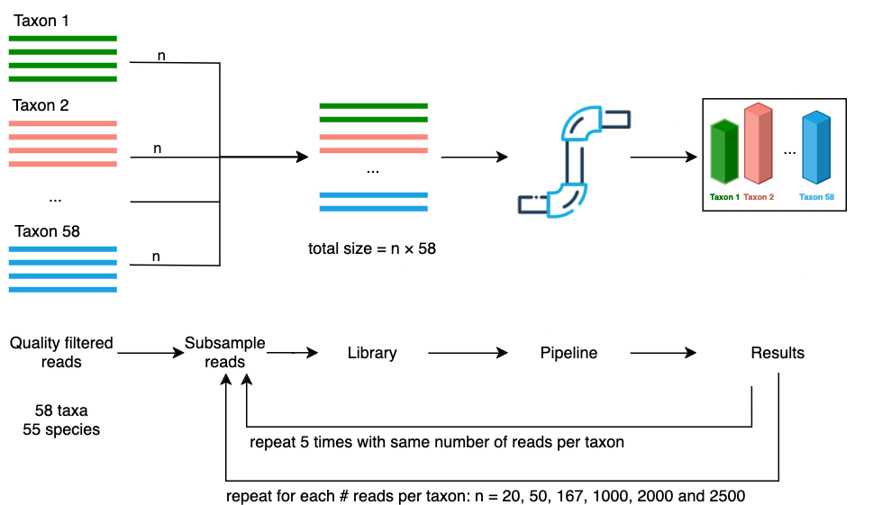
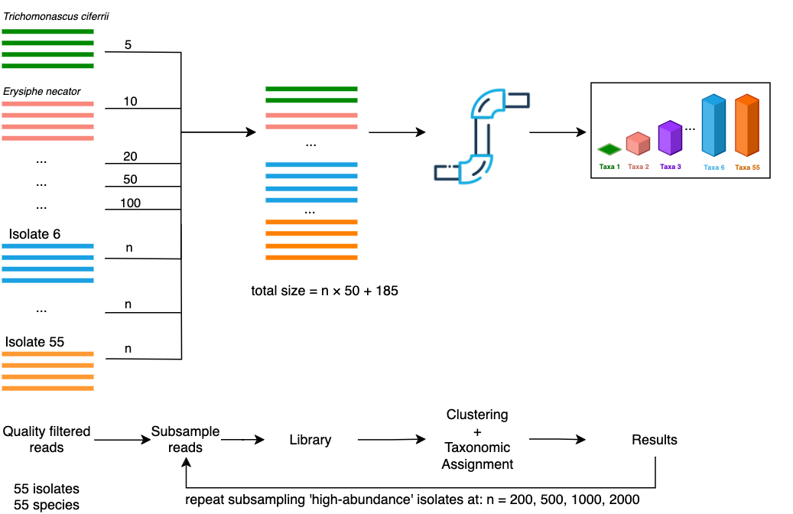

## Workflow description {#sec-pipeline-description}

Our approach for metabarcoding long-read fungal ITS amplicons was packaged into a workflow using the Nextflow language [@ditommasoNextflowEnablesReproducible2017].
As input, the workflow takes a set of `fastq` formatted files where each file contains the basecalled sequences from each sample.
The stages of the metabarcoding workflow are outlined below.
The full set of software and versions used can be found in @apptbl-software-pipeline.
We have named the workflow nanoporcini, and it is accessible online at [https://github.com/aringeri/nanoporcini](https://github.com/aringeri/nanoporcini).

### Adapter and primer trimming

Sequencing adapters were trimmed from raw basecalled reads using Dorado v0.6.1 with the '`--no-trim-primers`' option to avoid removing primer sequences. Cutadapt v4.6 [@Cutadapt] was used to select and trim primers from amplicons that contain both forward (NS5) and reverse primer (LR6) sequences. Amplicons where both of these primer sequences could not be detected were excluded from the analysis. Cutadapt was also used to re-orient reads that have been sequenced by the reverse strand ('`--revcomp`' option), facilitating analysis by downstream tools (@fig-filterTrimFlowchart).

### ITS extraction and quality filtering

The full ITS region of these reads was extracted using ITSxpress v2.0.1 [@Rivers2018] with default settings other than '`--single_end`' and '`--taxa Fungi`' options. Chopper v0.7.0 [@DeCoster2023] was used to select reads of the full ITS region having a length between 300-6000bp and mean Phred quality score above Q20. Chimeric reads were detected with VSEARCH v2.21.1 [@rognesVSEARCHVersatileOpen2016] using *de novo* and reference based methods. The database used for reference based chimera detection of full ITS sequences was the UNITE+INSD 2024 reference database [@abarenkovFullUNITEINSDDataset2024; @vu_2024_12580255]

::: {#fig-filterTrimFlowchart}
```{dot}
//| fig-width: 6.5
//| fig-height: 0.65
digraph {
  graph [layout = dot, rankdir = LR, fontsize=30]
  node [shape = rectangle, peripheries=2, fontsize="20"]
    rec1 [label = "Adapter trimming\n(dorado)"]
    rec2 [label = "Primer trimming\n(cutadapt)"]
    rec3 [label = "Barcode region extraction\n(ITSxpress)"]
    rec4 [label = "Quality filtering\n(chopper)"]
      subgraph chimera {
      rank = same
      rec5 [label = "Chimera filtering\n(vsearch)"]
      node [shape = rectangle, peripheries=1]
      rec7 [label = "UNITE DB"]
      rec7 -> rec5;
    }

    node [shape = plaintext, peripheries=0]
    rec0 [label = "Raw demultiplexed reads\nfastq"]
    rec6 [label = "Quality filtered\nfull ITS sequences"]
	

    # edge definitions with the node IDs
    edge [ fontsize="20"]
    rec0 -> rec1 -> rec2 -> rec3
    rec3 -> rec4 [ label = "Full ITS"]
    rec4 -> rec5 -> rec6
}
```

Stages of trimming and quality filtering. The process in which trimming and quality filtering is applied to raw reads with the software used in parentheses.
:::

### Clustering

For each scenario, full ITS sequences were grouped into approximate species-level OTUs using two de-novo clustering approaches (@fig-clusterAssignFlowchart).

The first approach uses centroid-based clustering on sequence similarity as implemented in VSEARCH v2.21.1 [@rognesVSEARCHVersatileOpen2016]. The sequences were first de-replicated using VSEARCH's '`--fastx_uniques`' option to merge identical sequences into a single record, then clustered with the '`--cluster_size`' option. 97% identity was used as the pairwise sequence similarity threshold. This clustering approach resulted in many low-abundance operational taxonomic units (OTUs). Methods for selecting a threshold to remove low-abundance spurious OTUs are explored in @sec-even-scenario.

The second clustering approach grouped sequences by similarity of their k-mer signatures. We followed the clustering approach used by the tool NanoCLUST [@rodriguez-perezNanoCLUSTSpecieslevelAnalysis2021; @langsiriTargetedSequencingAnalysis2023]. Each sequence was transformed into a k-mer frequency vector and stored in a tabular format. In our workflow, 6-mer frequencies were computed (as opposed to 5-mers in NanoCLUST). The multidimensional tabular structure was then projected into two-dimensions using Uniform Manifold Approximation and Projection (UMAP) [@mcinnesUMAPUniformManifold2020]. Sequences (represented as points in the two-dimensional space) were then clustered using Hierarchical Density-Based Spatial Clustering of Applications with Noise (HDBSCAN) [@mcinnes2017hdbscan]. The '`cluster_selection_epsilon`' parameter used in HDBSCAN was set to 0.5, while the multiple '`min_cluster_size`' parameters were tested and explored in @sec-even-scenario.

::: {#fig-clusterAssignFlowchart}
```{dot}
//| fig-width: 6.5
//| fig-height: 1
digraph {
  graph [layout = dot, rankdir = LR, fontsize="50"]

  node [shape = rectangle, peripheries=1, fontsize="30", width=3.5]

  subgraph {
    subgraph A {
      derep [ label = "Read dereplication\n(vsearch)" ]
      vsearch [ label = "97% identity clustering\n(vsearch)" ]
    }
    subgraph B {
      kmer [ label = "k-mer frequencies\n(python)" ]
      umap [ label = "Dimension reduction\n(UMAP)" ]
      hdbscan [ label = "Clustering\n(HDBSCAN)" ]
    }
  }
  subgraph {
    rank = same
    mostA [ label = "Most abundant sequence\n(vsearch)" ]
    consA [ label = "Consensus sequence\n(polishing)" ]
    centr [ label = "centroids\n(vsearch)" ]

  }

  node [shape = plaintext, peripheries=0]
  qc [label = "Quality filtered\nfull ITS sequences"]

  reps [label = "Representative sequences\nfor classification" ]

  # edge definitions with the node IDs
  edge [ fontsize = "20"]
  
  qc -> derep -> vsearch
  qc -> kmer -> umap -> hdbscan -> mostA
  hdbscan -> consA
  vsearch -> consA

  vsearch -> centr -> reps
  consA -> reps
  mostA -> reps
  #vsearch -> dnabarcoder [ label = "centroids" ]
  #mostA -> dnabarcoder [ label = "most abundant" ]
  #unite -> dnabarcoder
  }
```

Stages of clustering. Reads are clustered using two approaches: VSEARCH and NanoCLUST (UMAP + HDBSCAN), with the software tools used in parentheses. A representative sequence from each operational taxonomic unit (OTU) was selected either based on the most abundant sequence or the consensus sequence.
:::

### Taxonomic assignments

A representative sequence was selected from each OTU to aid their taxonomic assignment. Our initial approach used the most abundant sequence as the representative sequence of each OTU. The VSEARCH clustering approach provided the most abundant sequences with the '`--centroids`' option. To determine the most abundant sequence from clusters in the UMAP + HDBSCAN approach, the VSEARCH v2.21.1 '`--fastx_uniques`' command in combination with '`--topn 1`' option was used (@fig-clusterAssignFlowchart).

Alternatively, a consensus sequence was built from the reads of each OTU following a similar approach used by NanoCLUST (@fig-clusterPolishFlow). First, a subset of 200 sequences was selected from each OTU to reduce computation time and space requirements. Then a draft sequence was selected by choosing the read with the highest Average Nucleotide Identity (ANI) to all the other sequences with FastANI v1.34 [@jainHighThroughputANI2018]. The 200 reads used for polishing were then aligned to the draft sequence using minimap2 v2.28 [@liMinimap2PairwiseAlignment2018]. Subsequently, the draft read underwent polishing using Racon v1.5.0 [@vaserFastAccurateNovo2017] then Medaka v1.12.0 (<https://github.com/nanoporetech/medaka>). As Canu [@korenCanuScalableAccurate2017] is designed as a long-read assembler, it has a strict minimum genome size of 1000 making it unable to polish full ITS sequences from this dataset (which were around 400bp).

::: {#fig-clusterPolishFlow}
```{dot}
//| fig-width: 6.5
//| fig-height: 1
digraph {
  graph [layout = dot, rankdir = LR, fontsize="50"]

  node [shape = rectangle, peripheries=1, fontsize="30", width=3.5]

  subset [ label = "Subset reads for polishing\n(n=200)" ]
  subgraph {
  fastANI [ label = "Select draft by max ANI\n(fastANI)" ]
  minimap [ label = "Align reads to draft\n(minimap2)"]
  racon [  label = "Polish draft\n(racon)" ]
  medaka [ label = "Polish draft\n(medaka)" ]
  }

  node [shape = plaintext, peripheries=0]
  reads [label = "Set of reads in same cluster"]
  reps [label = "Representative sequences\nfor classification" ]

  # edge definitions with the node IDs
  edge [ fontsize = "20"]
  reads -> subset -> fastANI -> minimap -> racon -> medaka -> reps [ weight = 10 ]
  subset -> racon:sw
  subset -> medaka:nw
  subset -> minimap:sw
  fastANI:ne -> racon:nw
}
```

Stages of consensus sequence generation. The process of producing a consensus sequence for each OTU by selecting and polishing a draft read. An initial draft sequence is selected by taking the read with the highest Average Nucleotide Identity (ANI) from the first 200 reads in the OTU. The 200 reads used for polishing were first aligned to the draft sequence, then polished using racon [@vaserFastAccurateNovo2017] and medaka (<https://github.com/nanoporetech/medaka>).
:::

The representative sequence from each OTU was then given a taxonomic assignment with dnabarcoder v1.0.6 [@vuDnabarcoderOpensourceSoftware2022]. In this case, full ITS sequences were classified against the UNITE+INSD 2024 reference database [@abarenkovFullUNITEINSDDataset2024; @vu_2024_12580255] using precomputed similarity cutoffs provided by the dnabarcoder project [@vuDnabarcoderOpensourceSoftware2022].

### Workflow implementation

The workflow was implemented using the Nextflow language [@ditommasoNextflowEnablesReproducible2017].
The workflow was developed to run with Singularity [@kurtzerSingularityScientificContainers2017] or Docker [@merkel2014docker] containers.
A container-based approach is flexible and allows the workflow to run on all systems that support either one of these container platforms.
It also simplifies the setup of dependencies and ensures that the versions of dependencies are reproducible between installations.
The workflow only requires Nextflow and a container platform (Singularity or Docker) to be installed.

The source code for the workflow is available online at [https://github.com/aringeri/nanoporcini](https://github.com/aringeri/nanoporcini).

It can be configured to run to customise the use of system resources such as number of threads or RAM.
The following parameters of the workflow are also configurable:

- Forward and reverse primer sequences
- Minimum quality score for full ITS sequences
- Minimum and maximum full ITS sequence length
- Minimum cluster size for HDBSCAN clustering algorithm
- Percent identity for VSEARCH clustering
- Reference database used for chimera detection and taxonomic classifications

## Mock fungal communities {#sec-mock-fungal-communities}

In order to understand the behaviour of our workflow under different sampling scenarios, a mock dataset was constructed using sequences from 65 fungal taxa which had been isolated and identified from mycelia or spores.
We constructed mock communities by mixing reads from these taxa and
 aimed to emulate data that might be encountered when sampling a complex fungal community.
We constructed two varieties of mock scenarios by controlling the relative proportion of reads from each fungal taxon:

1)  Even abundance where all fungal taxa had the same relative abundance of read count.
2)  Uneven abundance where a subset of fungal taxa had a much lower abundance relative to the other taxa.

The raw basecalled reads were provided to us by collaborators from the Schwessinger Group at Australian National University [@anuSchwessingerGroupPlants]. Our collaborators have performed: the identification and isolation of all fungal taxa, DNA library preparation, DNA sequencing and basecalling. @apptbl-samplesheet provides the list of fungal taxa and the number of raw reads that were available to us for generating these mock scenarios. The steps to generate and prepare reads for these mock datasets are outlined below.

### Preparation of reads from fungal taxa for mock scenarios

#### DNA extraction, amplification and sequencing

The genomic DNA of 65 fungal taxa was extracted with the Qiagen DNeasy Plant mini kit. The DNA was extracted from mycelia or spore material of each fungal taxa. Partial SSU, full ITS region and partial LSU regions of each sample were amplified with primers NS5 (forward) and LR6 (reverse) (@fig-its-region-simple). The amplicons were prepared with ONT's Native Barcoding Kit 96 V14 (code SQK-NBD114.96, ONT). The fungal samples plus a negative control were multiplexed and sequenced using a MinION R10.4 flow cell.

#### Bioinformatics - Basecalling

The raw ONT data was basecalled and demultiplexed using Guppy v6.4.2 with the super-high accuracy model (dna_r10.4.1_e8.2_400bps_sup).

#### Bioinformatics - Selection of high quality full ITS sequences

The basecalled reads were passed to the adapter trimming, primer trimming, ITS extraction, quality filtering and chimera detection stages of our workflow described in @sec-pipeline-description.
At this point, we had a pool of high quality full ITS sequences which we used to construct different mock community structures.

After being processed by the workflow, 7 of the 65 fungal taxa were excluded from the mock dataset leaving 58 taxa available for mock scenarios.
6 of the 7 taxa were excluded due to having a low number of reads.
Due to differences in chimera detection behaviour between reference databases, 1 of the 7 taxa was excluded erroneously under the impression that it had a low number of reads.

A minimum of 2,500 reads per taxa was required to construct even-abundance mock scenarios with library sizes nearing 150K reads
($58 \text{ taxa} \times 2500 \text{ reads} = 145000\text{ reads}$).
The samples that were excluded (with updated names in parentheses) were: *Aspergillus niger*, *Naganishia albida* (*Cryptococcus albidus*), *Geotrichum candidum* (*Galactomyces geotrichum*), *Meyerozyma guilliermondii*, Yarrowia lipolytica, *Fusarium proliferatum* and *Puccinia recondita* (*Puccinia triticina*).
The footnotes in @apptbl-samplesheet indicate which taxa were excluded from mock scenarios.

Of the 58 remaining taxa, six had the same species-level designation making for a total 55 unique species in the mock dataset.
<!-- *Austropuccinia psidii*, *Cryptococcus gattii*, *Cryptococcus neoformans* -->

#### Taxonomic naming validation

To ensure that taxonomic names were used consistently between the fungal samples and the reference database, manual validation of each sample name was performed by conducting searches for the recorded species name of each sample in the 2024 UNITE+INSD reference database [@abarenkovFullUNITEINSDDataset2024; @vu_2024_12580255]. Most mismatches were either due to names being misspelled or based on an older taxonomic synonym. For example, *Nakaseomyces glabratus* in UNITE was originally recorded by its former name *Candida glabrata*. Names of samples were manually updated using current names found in both Index Fungorum (www.indexfungorum.org) and the 2024 UNITE reference database. For samples that were not classified at the species level (e.g. *Entoleuca sp* CCL052), the genus label was confirmed to exist in the reference database.

### Scenario 1 - Even abundance {#sec-scenario-1}

The first mock scenario emulated an even community structure where every fungal taxa had an equal abundance in terms of number of reads. Libraries of differing sizes were generated by subsampling an equal number of reads from each taxa. For each of the 58 taxa: 20; 50; 167; 1,000; 2,000 and 2,500 reads were randomly selected to produce libraries with sizes of 1,160; 2,900; 9,686; 58,000; 116,000 and 145,000 reads (@fig-equalAbundanceDiagram). Seqtk v1.4 [@Lh3SeqtkToolkit] was used to perform the subsampling (with the '`sample`' command). The subsampling was repeated five times for each library size producing a total of 30 libraries (6 libraries $\times$ 5 repetitions). The random seed values given to seqtk's '`sample`' command for each repetition were generated deterministically so that each run of the workflow was reproducible.

::: {#fig-equalAbundanceDiagram width=15cm}
```{r}

```

Process for generating mock communities with equal abundances. Equal numbers of reads were selected from each fungal taxa then combined into a single library. The process was repeated with different subsampling depth to produce libraries with different sizes. Five replicate libraries of each size were created where clustering and taxonomic assignment was performed on each library individually.
:::

::: {#fig-unevenSamplingDiagram width=15cm}


Process for generating mock communities with uneven abundances. Five fungal taxa were subsampled at a low rate (between 5 and 100 reads). The remaining 50 fungal taxa were subsampled at a fixed higher rate. The 'high-abundance' fungal taxa were subsampled at rates between 200 and 2,000 reads to produce four libraries. Clustering and taxonomic assignment was performed on each library individually.
:::

### Scenario 2 - Uneven (5 low abundance)

As it is unlikely in a 'real world' environmental sample for all taxa to have the same number of reads, we aimed to model situations where a subset of taxa had a disproportionately low number of reads.
For this scenario, we selected five taxa to be subsampled at a low abundance, while a remaining 50 taxa were subsampled at a higher abundance (@fig-unevenSamplingDiagram). The low-abundance taxa *Trichomonascus ciferrii*, *Erysiphe necator*, *Eutypa lata*, *Penicillium chrysogenum* and *Candida zeylanoides*, were subsampled at levels of 5, 10, 20, 50 and 100 reads respectively. The remaining 50 high-abundance taxa were subsampled at an even rate and mixed with the low-abundance reads. This process was repeated to produce different library sizes by subsampling the 'high-abundance' taxa at rates of 200, 500, 1000 and 2000 reads per taxon, while keeping the 'low-abundance' taxa unchanged. This produced library sizes of 10185, 25185, 50185, 100185 reads respectively.

*Trichomonascus ciferrii*, *Erysiphe necator*, *Eutypa lata*, *Penicillium chrysogenum* and *Candida zeylanoides* were randomly selected as the low-abundance taxa. To simplify the interpretation of this scenario, we ensured that we did not subsample from the same species more than once (i.e. from two fungal taxa with the same species-level designation). To do this, the following fungal taxa were excluded from the set of quality filtered reads: *Austropuccinia psidii* 2, *Cryptococcus gattii VG III*, *Cryptococcus neoformans VNI* in addition to those from Scenario 1.
The footnotes in @apptbl-samplesheet show which taxa were excluded from mock scenarios.

## Real world - Soil case study

A set of soil samples were made available to us to test the workflow on a real world environmental data.
24 samples were collected from soil beneath four trees species in heathy woodland from the Cranbourne Conservation area in Victoria, Australia (@apptbl-soil-samplesheet).
Six soil samples were taken from soil beneath each of the tree species: *Allocasuarina littoralis*, *Allocasuarina paradoxa*, *Eucalyptus viminalis* and *Eucalyptus cephalocarpa*.
Two control samples were sequenced: one control (ExCon) contained only the contents of the DNA extraction kit and the other was a negative PCR control (PCRNegCon).

### DNA extraction, amplification and sequencing

Genomic DNA (gDNA) was extracted from all soil samples.
One *Eucalyptus cephalocarpa* sample (EC4) was excluded due to low gDNA concentration.
Library preparation and sequencing of extracted gDNA followed the protocol found at [https://www.protocols.io/view/sequencing-fungal-metabarcode-with-pcr-primer-base-81wgbxm41lpk/v1](https://www.protocols.io/view/sequencing-fungal-metabarcode-with-pcr-primer-base-81wgbxm41lpk/v1).
This protocol used a custom barcoding scheme which amplified full ITS and partial LSU regions with primers which included DNA barcodes [@Hebert2023.11.29.569282; @ohtaDNAMetabarcodingWorkflow2023a].
The modified forward primer was ITS1_F_KYO2 and reverse primer was LR6.
Amplicons were sequenced using the ONT MinION 10.4.1.

### Bioinformatics - basecalling and demultiplexing

The raw ONT data was basecalled using Dorado v0.7.1 with the super-high accuracy model (dna_r10.4.1_e8.2_400bps_sup@v5.0.0).
Due to the custom barcoding scheme, basecalled reads were demultiplexed with minibar v0.25 (@apptbl-software-soil).

### Sample selection

One *Allocasuarina paradoxa* (AP6) sample was excluded due to having much lower read count than other samples (@apptbl-software-soil).
This left 24 samples (22 soil samples + 2 controls) for downstream processing.

### Metabarcoding workflow

The set of demultiplexed reads was passed to the metabarcoding workflow with default settings.
Due to a large library size after quality control (~1.8 million reads), computational constraints did not allow the NanoCLUST approach to cluster the full dataset.
Instead, VSEARCH was used to cluster the full dataset.
Singleton OTUs were removed after clustering and the remaining OTUs were classified by their most abundant sequence using dnabarcoder and the UNITE+INSD 2024 reference database.

### Data analysis

An OTU table and dnabarcoder's classifications table was imported into the phyloseq v1.48.0 R package [@mcmurdiePhyloseqPackageReproducible2013].
The decontam v1.24.0 [@davisSimpleStatisticalIdentification2018] R package was used to remove contaminant sequences identified in the two control samples.
Low-abundance OTUs were filtered in a sample-wise fashion: OTUs were removed from a sample if they were smaller than 0.15% of the total number of reads in the sample.
This cutoff was chosen based on the results of experimentation with the mock community trials.
The scripts used to perform this analysis have been published on GitHub for reference: [https://github.com/aringeri/long-read-ITS-metabarcoding-thesis/tree/main/reports/masters/thesis/analysis](https://github.com/aringeri/long-read-ITS-metabarcoding-thesis/tree/main/reports/masters/thesis/analysis).


