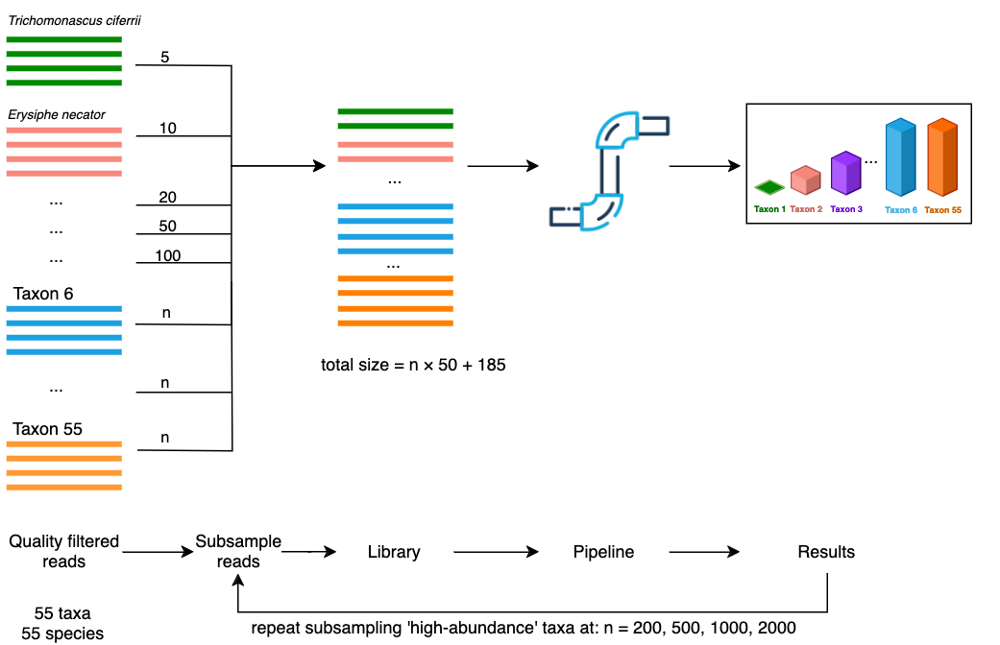

## Preparation of reads from fungal taxa for mock scenarios

In order to understand the behaviour of our pipeline under different sampling scenarios, a mock dataset was used based on sequencing data from 65 known fungal taxa.
We simulated data that might be encountered when sampling a complex fungal community, by controlling
the relative proportion of reads from each fungal taxa using various scenarios:

1) Even abundance where all fungal taxa have the same relative abundance of read count.
2) Uneven scenario where a subset of fungal taxa have a much lower abundance relative to the other taxa in the mock sample.

The raw basecalled reads were provided to us by collaborators from the Schwessinger Group at Australian National University [@anuSchwessingerGroupPlants].
They have performed: the identification and isolation of all fungal taxa, library preparation (DNA extraction and amplification), sequencing and basecalling.
@tbl-samplesheet provides the list of fungal taxa and the number of raw reads that were available to us for generating these mock scenarios.
The steps to generate and prepare reads for these mock datasets are outlined below.

### DNA extraction, amplification and sequencing

The genomic DNA of 65 fungal taxa was extracted with the Qiagen DNeasy Plant mini kit.
The DNA was extracted from mycelia or spore material of each fungal taxa.
Partial SSU, full ITS region and partial LSU regions of each sample were amplified with primers NS5 (forward) and LR6 (reverse).
The amplicons were prepared with Oxford Nanopore's Native Barcoding Kit 96 V14 (code SQK-NBD114.96, ONT).
The fungal samples plus a negative control were multiplexed and sequenced using a MinION R10.4 flow cell.

### Bioinformatics - Basecalling and primer trimming

The raw ONT data was basecalled and demultiplexed using Guppy v6.4.2 with the super-high accuracy model (dna_r10.4.1_e8.2_400bps_sup).

Sequencing adapters were trimmed from raw basecalled reads using Dorado v0.6.1 with the '`--no-trim-primers`' option to avoid removing primer sequences.
Cutadapt v4.6 [@Cutadapt] was used to select and trim primers from amplicons that contain both forward (NS5) and reverse primer (LR6) sequences.
Amplicons where both of these primer sequences could not be detected were excluded from the analysis.
Cutadapt was also used to re-orient reads that have been sequenced by the reverse strand ('`--revcomp`' option), facilitating analysis by downstream tools (@fig-filterTrimFlowchart).

### Bioinformatics - ITS extraction and quality filtering

The full ITS region of these reads was extracted using ITSxpress v2.0.1 [@Rivers2018] with default settings other than '`--single_end`' and '`--taxa Fungi`' options.
Chopper v0.7.0 [@DeCoster2023] was used to select reads of the full ITS region having a length between 300-6000bp and mean Phred quality score above Q20.
Chimeric reads were detected with VSEARCH v2.21.1 [@rognesVSEARCHVersatileOpen2016] using *de novo* and reference based methods.
The database used for reference based chimera detection of full ITS sequences was the UNITE+INSD 2024 reference database [@abarenkovFullUNITEINSDDataset2024; @vu_2024_12580255]

::: {#fig-filterTrimFlowchart}
```{dot}
//| fig-width: 6.5
//| fig-height: 0.65
digraph {
  graph [layout = dot, rankdir = LR, fontsize=30]
  node [shape = rectangle, peripheries=2, fontsize="20"]
    rec1 [label = "Adapter trimming\n(dorado)"]
    rec2 [label = "Primer trimming\n(cutadapt)"]
    rec3 [label = "Barcode region extraction\n(ITSxpress)"]
    rec4 [label = "Quality filtering\n(chopper)"]
      subgraph chimera {
      rank = same
      rec5 [label = "Chimera filtering\n(vsearch)"]
      node [shape = rectangle, peripheries=1]
      rec7 [label = "UNITE DB"]
      rec7 -> rec5;
    }

    node [shape = plaintext, peripheries=0]
    rec0 [label = "Raw demultiplexed reads\nfastq"]
    rec6 [label = "Quality filtered\nfull ITS sequences"]
	

    # edge definitions with the node IDs
    edge [ fontsize="20"]
    rec0 -> rec1 -> rec2 -> rec3
    rec3 -> rec4 [ label = "Full ITS"]
    rec4 -> rec5 -> rec6
}
```

Trimming and quality filtering of raw reads with the software used indicated in parentheses.
:::


### Sample selection and taxonomic naming validation

To ensure that taxonomic names were used consistently between the fungal taxa samples and the reference database, manual validation of each sample name was performed
by conducting searches for the recorded species name of each sample in the 2024 UNITE+INSD reference database [@abarenkovFullUNITEINSDDataset2024; @vu_2024_12580255].
Most mismatches were either due to names being misspelled or based on an older taxonomic synonym.
For example, *Nakaseomyces glabratus* in UNITE was originally recorded by its former name *Candida glabrata*.
Names of samples were manually updated using current names found in both Index Fungorum (www.indexfungorum.org) and the 2024 UNITE reference database.
For samples that were not classified at the species level (e.g. *Entoleuca sp* CCL052), the genus label was confirmed to exist in the reference database.

Seven samples were excluded from the mock dataset, leaving 58 samples (a total of 55 species).
Six samples that had less than a total of 2500 reads after basecalling, trimming and filtering were removed from the analysis.
This limit of 2500 reads was chosen in order to test scenarios with library sizes of up to around 150000 reads. See @fig-readCountDistributionBySample and @tbl-samplesheet for the distribution of read counts per sample.

Initial runs of the pipeline used the 2019 version of the UNITE database for reference-based chimera detection.
This step led to the loss of 99.0% of reads in the *Fusarium proliferatum* sample that was therefore excluded from the mock dataset.
At a later date, the pipeline was updated to use the 2024 version of the UNITE database which retained many more reads (total of 4894) from the *F. proliferatum* sample
but the pipeline was still configured to exclude the *F. proliferatum* sample.

The samples that were excluded (with updated names in parenthesis) were: *Aspergillus niger*, *Naganishia albida* (*Cryptococcus albidus*), *Geotrichum candidum* (*Galactomyces geotrichum*), *Meyerozyma guilliermondii*, Yarrowia lipolytica, *Fusarium proliferatum* and *Puccinia recondita* (*Puccinia triticina*).

## Mock scenarios

After the raw reads from each fungal taxa had been processed as described above, we had a pool of high quality full ITS sequences which we used to simulate different community structures.
The steps taken to combine these full ITS sequences into mock scenarios are outlined below.
Two approaches have been developed for simulating communities with even and uneven species abundance.

### Scenario 1 - Even abundance

The first mock scenario simulated an even community structure where every fungal taxa had an equal abundance in terms of number of reads.
Libraries of differing sizes were generated by subsampling an equal number of reads from each fungal taxa.
For each of the 58 fungal taxa: 20, 50, 167, 1000, 2000 and 2500 reads were randomly selected to produce libraries with sizes of 1160, 2900, 9686, 58000, 116000 and 145000 reads (@fig-equalAbundanceDiagram).
Seqtk v1.4 [@Lh3SeqtkToolkit] was used to perform the subsampling (with the '`sample`' command).
The subsampling was repeated five times for each library size producing a total of 30 libraries (6 libraries $\times$ 5  repetitions).
The random seed values given to seqtk's '`sample`' command for each repetition were generated deterministically so that each run of the pipeline was reproducible.

::: {#fig-equalAbundanceDiagram}
```{r}
knitr::include_graphics('analysis/images/05-even-sampling-diagram.png')
```

Process for generating mock communities with equal abundances. Equal numbers of reads were selected from the set of quality filtered reads of each fungal taxa then combined into a single library. The process was repeated with different subsampling depth to produce libraries with different sizes. Five replicate libraries of each size were created where clustering and taxonomic assignment was performed on each library individually.
:::

:::{#fig-unevenSamplingDiagram}



The process for generating mock communities with uneven abundances.
Five fungal taxa were subsampled at a low rate (between 5 and 100 reads).
The remaining 50 fungal isolates were subsampled at a fixed higher rate.
The 'high-abundance' fungal isolates were subsampled at rates between 200 and 2000 reads to produce four libraries.
Clustering and taxonomic assignment was performed on each library individually.
:::

### Scenario 2 - Uneven (5 low abundance)

As it is unlikely in a 'real world' environmental sample for all taxa have the same number of reads,
we explored situations where the number of reads between taxa was unequal.
For this scenario, we selected five species to be subsampled at a low abundance, while a remaining 50 species were subsampled at a higher abundance (@fig-unevenSamplingDiagram).
The low-abundance species *Trichomonascus ciferrii*, *Erysiphe necator*, *Eutypa lata*, *Penicillium chrysogenum* and *Candida zeylanoides*,
were subsampled at levels of 5, 10, 20, 50 and 100 reads respectively.
The remaining 50 high-abundance species were subsampled at an even rate and mixed with the low-abundance reads.
This process was repeated to produce different library sizes by subsampling the 'high-abundance' taxa at rates of 200, 500, 1000 and 2000 reads per taxon, while keeping the 'low-abundance' taxa unchanged.
This produced library sizes of 10185, 25185, 50185, 100185 respectively.


*Trichomonascus ciferrii*, *Erysiphe necator*, *Eutypa lata*, *Penicillium chrysogenum* and *Candida zeylanoides* were randomly selected as the low abundance taxa.
To simplify the interpretation of this scenario, we ensured that we did not subsample from the same species more than once (i.e. from two fungal isolates with the same species designation).
To do this, the following fungal isolates were excluded from the set of quality filtered reads: *Austropuccinia psidii* 2, *Cryptococcus gattii VG III*, *Cryptococcus neoformans VNI* in addition to those from Scenario 1.


## Bioinformatics - Clustering

For each scenario, full ITS sequences were grouped into approximate species-level OTUs using
two de-novo clustering approaches (@fig-clusterAssignFlowchart).

The first approach uses centroid-based clustering on sequence similarity as implemented in VSEARCH v2.21.1 [@rognesVSEARCHVersatileOpen2016].
The sequences were first de-replicated using VSEARCH's `'--fastx_uniques'` option to merge identical sequences into a single record, then clustered with the `'--cluster_size'` option.
97% identity was used as the pairwise sequence similarity threshold.
This clustering approach resulted in many low-abundance operational taxonomic units (OTUs).
Methods for selecting a threshold to remove low-abundance spurious OTUs is explored in @sec-cluster-results.

The second clustering approach grouped sequences by similarity of their k-mer signatures.
We followed the clustering approach used by the NanoCLUST tool [@rodriguez-perezNanoCLUSTSpecieslevelAnalysis2021; @langsiriTargetedSequencingAnalysis2023].
Each sequence was transformed into a k-mer frequency vector and stored in a tabular format.
In our pipeline, 6-mer frequencies were computed (as opposed to 5-mers in NanoCLUST).
The multidimensional tabular structure was then projected into two-dimensions using Uniform Manifold Approximation and Projection (UMAP) [@mcinnesUMAPUniformManifold2020].
Sequences (represented as points in the two-dimensional space) were then clustered using Hierarchical Density-Based Spatial Clustering of Applications with Noise (HDBSCAN) [@mcinnes2017hdbscan].
The '`cluster_selection_epsilon`' parameter used in HDBSCAN was set to 0.5, while the multiple '`min_cluster_size`' parameters were tested and explored in @sec-cluster-results.
For equal abundance scenarios a '`min_cluster_size`' parameter was chosen as 0.5% of the total library size.
For uneven abundance scenarios (...) .

:::{#fig-clusterAssignFlowchart}
```{dot}
//| fig-width: 6.5
//| fig-height: 1
digraph {
  graph [layout = dot, rankdir = LR, fontsize="50"]

  node [shape = rectangle, peripheries=1, fontsize="30", width=3.5]

  subgraph {
    subgraph A {
      derep [ label = "Read dereplication\n(vsearch)" ]
      vsearch [ label = "97% identity clustering\n(vsearch)" ]
    }
    subgraph B {
      kmer [ label = "k-mer frequencies\n(python)" ]
      umap [ label = "Dimension reduction\n(UMAP)" ]
      hdbscan [ label = "Clustering\n(HDBSCAN)" ]
    }
  }
  subgraph {
    rank = same
    mostA [ label = "Most abundant sequence\n(vsearch)" ]
    consA [ label = "Consensus sequence\n(polishing)" ]
    centr [ label = "centroids\n(vsearch)" ]

  }

  node [shape = rectangle, peripheries=2]
  subs [label = "Scenario 1\nEven abundance\n(6 libs, 5 reps)"]

  node [shape = plaintext, peripheries=0]
  qc [label = "Quality filtered\nfull ITS sequences"]

  reps [label = "Representative sequences\nfor classification" ]

  # edge definitions with the node IDs
  edge [ fontsize = "20"]
  qc -> subs
  subs -> derep -> vsearch
  subs -> kmer -> umap -> hdbscan -> mostA
  hdbscan -> consA
  vsearch -> consA

  vsearch -> centr -> reps
  consA -> reps
  mostA -> reps
  #vsearch -> dnabarcoder [ label = "centroids" ]
  #mostA -> dnabarcoder [ label = "most abundant" ]
  #unite -> dnabarcoder
  }
```

Read clustering using two clustering VSEARCH and NanoCLUST (UMAP + HDBSCAN), with the software tools used in parentheses.
A representative sequence from each cluster was selected either based on the most abundant sequence or the consensus sequence.
:::

## Bioinformatics - Taxonomic assignments

A representative sequence was selected from each cluster to aid their taxonomic assignment.
Our initial approach used the most abundant sequence as the representative sequence of each cluster.
The VSEARCH clustering approach provided the most abundant sequences with the '`--centroids`' option.
To determine the most abundant sequence from clusters in the UMAP + HDBSCAN approach, the VSEARCH v2.21.1 '`--fastx_uniques`' command in combination with '`--topn 1`' option was used (@fig-clusterAssignFlowchart).

Alternatively, a consensus sequence was built from the reads of each cluster following a similar approach used by NanoCLUST (@fig-clusterPolishFlow).
First, a subset of 200 sequences was selected from each cluster to reduce computation time and space requirements.
Then a draft sequence was selected by taking the read with the highest Average Nucleotide Identity (ANI) to all the other sequences with FastANI v1.34 [@jainHighThroughputANI2018].
The 200 reads used for polishing were then aligned to the draft sequence using minimap2 v2.28 [@liMinimap2PairwiseAlignment2018].
Subsequently, the draft read underwent polishing using Racon v1.5.0 [@vaserFastAccurateNovo2017] then Medaka v1.12.0 ([https://github.com/nanoporetech/medaka](https://github.com/nanoporetech/medaka)).
As Canu [@korenCanuScalableAccurate2017] is designed as a long-read assembler, it has a strict minimum genome size of 1000 making it unable to polish full ITS sequences from this dataset (which were around 400bp).

:::{#fig-clusterPolishFlow}
```{dot}
//| fig-width: 6.5
//| fig-height: 1
digraph {
  graph [layout = dot, rankdir = LR, fontsize="50"]

  node [shape = rectangle, peripheries=1, fontsize="30", width=3.5]

  subset [ label = "Subset reads for polishing\n(n=200)" ]
  subgraph {
  fastANI [ label = "Select draft by max ANI\n(fastANI)" ]
  minimap [ label = "Align reads to draft\n(minimap2)"]
  racon [  label = "Polish draft\n(racon)" ]
  medaka [ label = "Polish draft\n(medaka)" ]
  }

  node [shape = plaintext, peripheries=0]
  reads [label = "Set of reads in same cluster"]
  reps [label = "Representative sequences\nfor classification" ]

  # edge definitions with the node IDs
  edge [ fontsize = "20"]
  reads -> subset -> fastANI -> minimap -> racon -> medaka -> reps [ weight = 10 ]
  subset -> racon:sw
  subset -> medaka:nw
  subset -> minimap:sw
  fastANI:ne -> racon:nw
}
```

Process of producing a consensus sequence for each cluster by selecting and polishing a draft read.
An initial draft sequence is selected by taking the read with the highest Average Nucleotide Identity (ANI) from the first 200 reads in the cluster.
The 200 reads used for polishing were first aligned to the draft sequence, then polished using racon [@vaserFastAccurateNovo2017] and medaka ([https://github.com/nanoporetech/medaka](https://github.com/nanoporetech/medaka)).
:::


The representative sequence from each cluster was then given a taxonomic assignment with dnabarcoder v1.0.6 [@vuDnabarcoderOpensourceSoftware2022].
In this case, full ITS sequences were classified against the UNITE+INSD 2024 reference database [@abarenkovFullUNITEINSDDataset2024; @vu_2024_12580255] using precomputed similarity cutoffs provided by the dnabarcoder project [@vuDnabarcoderOpensourceSoftware2022].

## Pipeline implementation

The pipeline has been implemented using the Nextflow workflow language [@ditommasoNextflowEnablesReproducible2017].
The pipeline has been developed to run with Singularity [@kurtzerSingularityScientificContainers2017] or Docker [@merkel2014docker] containers.
A container-based approach is flexible and allows the pipeline to run on all systems that support either one of these container systems.
It also simplifies the setup of dependencies and ensures that the versions of dependencies are reproducible between installations.
The pipeline only requires Nextflow and a container system (Singularity or Docker) to be installed.

As input, the pipeline takes a set of `fastq` files where each file contains the raw basecalled reads for each sample in the metabarcoding experiment.

- hosted on github
- configurable:
  - number of threads
  - memory use

