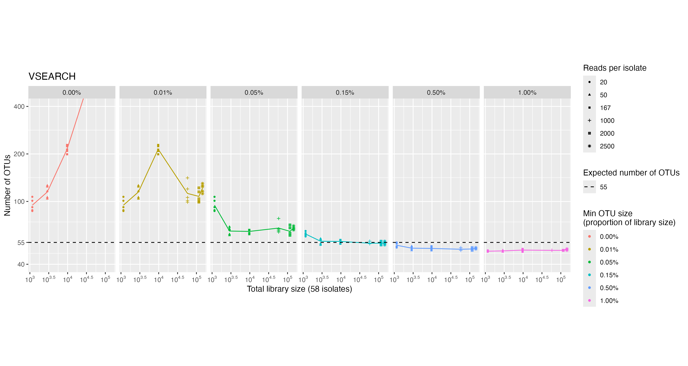
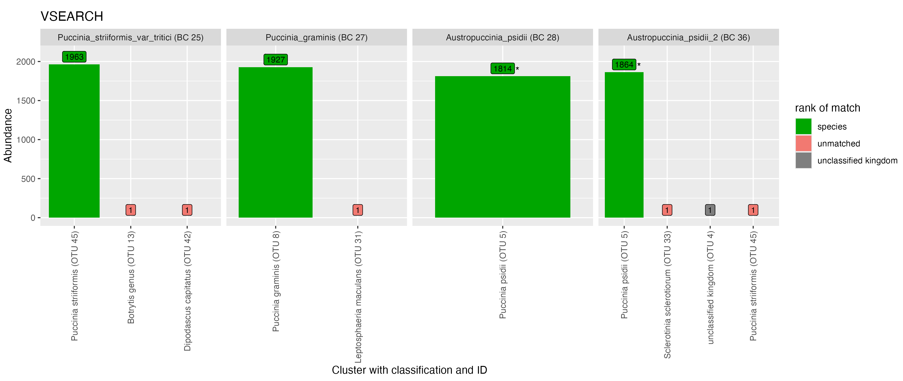
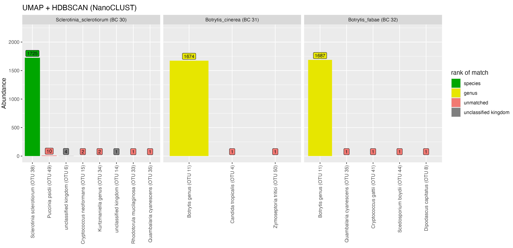
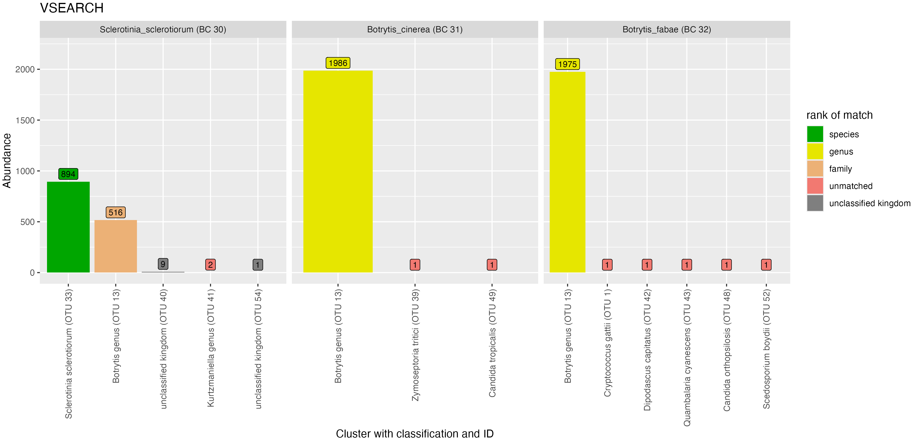
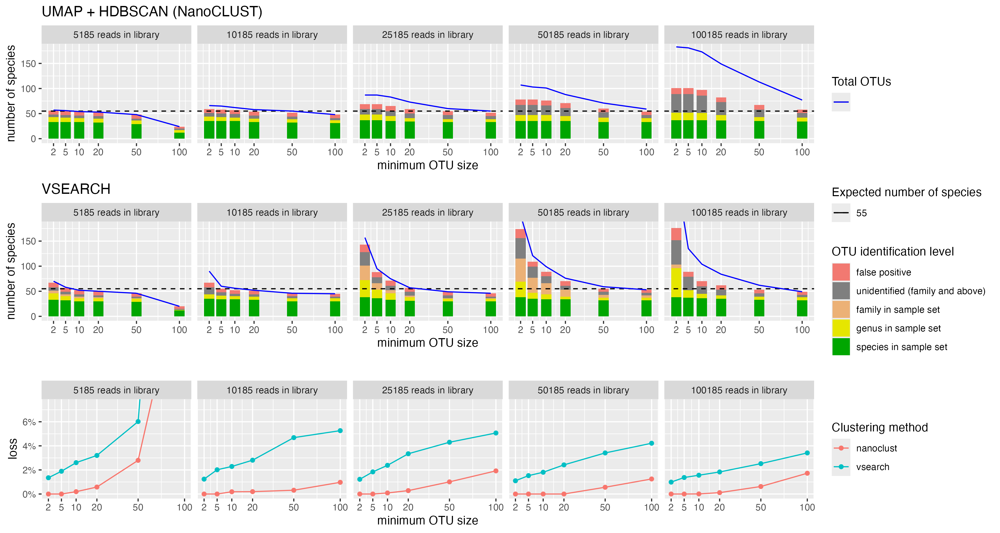

## Mock scenarios

### Quality control

After quality control, there was considerable read loss across the fungal taxa used to construct the mock scenarios (@tbl-samplesheet).
A minimum of 2500 reads per taxa was required to construct even-abundance mock scenarios with library sizes nearing 150K reads
($58 \text{ taxa} \times 2500 \text{ reads} = 145000\text{ reads}$).
This can be seen in @fig-readCountDistributionBySample, where seven samples are excluded.

::: {#fig-readCountDistributionBySample}
```{r}
knitr::include_graphics('analysis/images/06-read-count-distribution-by-sample.png')
```

The distribution of read counts per sample before (A) and after (B) quality control processing. Reads having less than 2500 reads were excluded from mock scenarios (dotted line in B). Note the x-axis is on a log scale.
:::

Tracking read counts at each stage of the pipeline has shown that the majority of reads were lost in the primer trimming and quality filtering stages of the pipeline (@fig-readLossByStage).
An average of 32.37% of reads were lost across samples after applying cutadapt to select and trim amplicons that contain both forward (ITS1F) and reverse primer (LR3) sequences.
The extraction of the full ITS region led to an average loss of 10.65% trimmed reads across samples.
An average of 71.82% of full ITS sequences were lost after selecting reads between 300-6000bp in length and having a mean quality score above Q20 (Phred scale).
Such large loss of reads can be attributed to many of the reads from the dataset being below the minimum mean quality threshold of Q20 (@fig-rawReadQuality).

::: {#fig-readLossByStage}
```{r}
knitr::include_graphics('analysis/images/06-read-loss-by-stage-by-sample.png')
```

Read loss for taxa used in mock scenarios at filtering and trimming stages of the pipeline.
Each point represents a fungal isolate sample.
Taxa that were excluded from downstream mock scenarios due to low read count have been coloured red.
The blue horizontal bar with percentages indicate the mean proportion of reads lost from the previous step.
The mean proportion of read loss was only calculated for samples that were not excluded from downstream scenarios.
Each step was executed in order from left to right.
:::

:::{#fig-rawReadQuality}


Mean read quality of reads from 58 fungal taxa before trimming or filtering steps.
The raw reads have been produced by a MinION R10.4 flow cell after basecalling with Guppy v6.4.2 (super-high accuracy model).
Quality scores are in the Phred (Q) scale. Read lengths are shown in thousands of basepairs.
Histograms on X and Y axes indicate the density of reads at respective quality scores and read lengths. (Plot generated by NanoPlot [@DeCoster2023])
:::

### Even abundance scenario {#sec-even-scenario}

#### Minimum cluster size threshold to recover the expected number of species {#sec-cluster-results}

The adopted clustering approaches aimed to group full ITS sequences from the same species together in the same OTU.
The total number of OTUs was used as a measure for successfully estimating the number of species in the mock community.
In this section we considered the even abundance mock community where 58 fungal taxa were equally represented (@sec-mock-fungal-communities).
Of the 58 taxa, some had the same species-level designation making for a total of 55 unique species.

Two clustering approaches were tested: a greedy sequence similarity-based clustering approach with VSEARCH and a k-mer signature based clustering approach (as implemented in NanoCLUST).
To recover the expected number of species from the mock community, both clustering approaches required a technique to filter out low-abundance OTUs.

The number of OTUs returned by VSEARCH at 97% sequence identity was consistently larger than the actual number of species present in the mock community.
VSEARCH significantly over-estimated the number of species in the mock community when no filtering was applied to the resulting set of OTUs.
A large proportion of OTUs had low abundance and this proportion increased dramatically as the library size increased.
For VSEARCH, to recover the expected number of species in the mock community, we implemented a crude cutoff which removed OTUs below a minimum size.
We set the cutoff to a proportion of the total library size we tested values between 0% and 2% (@fig-compareVsearchNanoclust).
We repeated the test for 6 different library sizes (1160, 2900, 9686, 58000, 116000, and 145000 reads) where each fungal taxa had an equal abundance.

With VSEARCH, we observed consistent behaviour when applying the minimum OTU size cutoff at all library sizes.
The number of OTUs was very high without a minimum OTU size cutoff, then decreased and 'flattened out' near the expected number of species as the OTU size cutoff increased.
We observed that setting the minimum OTU size to be 0.15% of the library size consistently recovered the expected number of species.

:::{#fig-compareVsearchNanoclust}


Impact of a minimum OTU size cutoff on the number of OTUs and the proportion of read loss between NanoCLUST (in red) and VSEARCH (in blue) clustering methods.
These are results from the even abundance scenario.
Plots have been organised in columns by increasing library size.
The top row of plots shows the number of OTUs after applying a minimum cluster size cutoff that is a proportion of the library size.
The bottom row of plots show the proportion of reads that are lost after applying the minimum OTU size cutoff.
The mean values of each have been plotted after five random resamplings at each library size.
The dashed line indicates the actual number of species in the mock scenario.
:::

<!--
  :::{#fig-vsearchotus}
  

  Effect of a minimum OTU size threshold on the number of OTUs when clustering with VSEARCH.
  Colours indicate the minimum OTU size threshold as a proportion of the total library size.
  The dashed line indicates the actual number of species in the mock scenario (55).
  Five repetitions were performed for each library size. X and Y axes are on a logarithmic scale.
  :::
-->

Alternatively, we tested the k-mer based clustering approach used by the NanoCLUST pipeline.
Within the NanoCLUST pipeline, HDBSCAN is the algorithm that performs the clustering and requires specifying a minimum cluster size parameter *a priori*.
<!-- The minimum cluster size parameter used by the HDBSCAN significantly impacts the resulting number of clusters by limiting the groupings that can be considered a cluster [@ParameterSelectionHDBSCAN].
-->
Similar to our approach with VSEARCH, we tested multiple values of HDBSCAN's minimum cluster size parameter on the even abundance mock community for 6 different library sizes (1160, 2900, 9686, 58000, 116000, and 145000 reads).
We tested a range of minimum cluster size parameters between 0% and 2% of the total library size.
We found that when the minimum cluster size parameter was set to its minimum value (2 reads), the NanoCLUST method overestimated the number of species for library sizes of 1160 reads and above.
With the minimum cluster size parameter set to 2, the number of OTUs increased in proportion to the library size but not as drastically as the number of unfiltered OTUs with VSEARCH.
For library sizes of 1160 reads and above, a minimum cluster size of 0.65% of the total library size consistently recovered the expected number of species.

<!--
  :::{#fig-nanoclustOTUs}

  

  Effect of minimum cluster size parameter and total library size on the number of OTUs when following the UMAP and HDBSCAN (NanoCLUST) clustering approach.
  Colours indicate the minimum cluster size parameter as a proportion of the total library size.
  The dashed line indicates the actual number of species in the mock dataset (55).
  Five repetitions were performed for each library size. X and Y axes are on a logarithmic scale.
  :::
-->

To aid the comparison of VSEARCH and NanoCLUST clustering methods, we recorded the proportion of reads that were lost due to defining a minimum OTU size.
We defined the proportion of reads lost for VSEARCH as:

$$
\frac{\text{\# of reads removed when filtering OTUs by size}}{\text{\# number of reads in library}}
$$

and for Nanoclust as:

$$
\frac{\text{\# of unclustered reads}}{\text{\# number of reads in library}}
$$

We found that for low library sizes (1160-9686 reads), the NanoCLUST method produced closer estimates of the actual number of species
with lower read loss than VSEARCH for all minimum OTU sizes.
For larger library sizes (58K-145K reads) using the VSEARCH method, we observed a consistent pattern read loss for the all library sizes.
The NanoCLUST method became less consistent for larger library sizes and lost a higher proportion reads to recover the same number of species (@fig-compareVsearchNanoclust).
<!--
For example, using the VSEARCH method, 5% of reads were lost when the minimum OTU size was set to 0.5% (of library size) for all library sizes.
While using the NanoCLUST method 2.5%, 0.6%, 0.75%
-->

<!--
For larger library sizes (50K-145K reads), the NanoCLUST method's minimum cluster size of 0.65% produced consistently
accurate estimates of the actual number of species while VSEARCH's minimum cluster threshold of 0.15% performed similarly.
When considering read loss at these thresholds, compared to VSEARCH, the NanoCLUST method performed better at a library size of 50K, similarly at a library size of 116K reads
and worse at a library size of 145K reads.
-->

#### Computing number of species after taxonomic assignments

While we were able to demonstrate above that the expected number of species can be recovered by setting a minimum OTU size,
 the number of OTUs may not be an accurate measure of the actual number of species.
For example, one species may have been split into multiple OTUs which have all been given the same species-level taxonomic assignment.
In addition, we wanted to explore using a minimum OTU size threshold that was not proportional to the library size.
We felt that a minimum OTU size of 0.65% for NanoCLUST and 0.15% for VSEARCH would exclude low abundance species
and may bias against samples with low read depth.

Here we explored the observed number of species in our even abundance mock community after assigning OTUs.
We performed VSEARCH and NanoCLUST clustering methods on four library sizes of 9686, 58000, 116000 and 145000 reads.
HDBSCAN clustering was performed six times for each library with minimum cluster sizes of: 2, 5, 10, 20, 50 and 100 reads.
VSEARCH clustering was performed once for each library at 97% identity, then OTUs with fewer than: 2, 5, 10, 20, 50 and 100 reads were removed.
The most abundant sequence was used at the representative sequence for each OTU and given a taxonomic assignment with dnabarcoder using the UNITE+INSD 2024 database.

For each minimum OTU size, we counted the number of unique taxonomic assignments given at the species level.
<!-- OTUs that were unidentified at the species level were counted as individual species (and not lumped together as a single species). -->
Of the OTUs that were given a species-level assignment, we counted the number of species that were known to be in the mock community (@tbl-samplesheet).
For OTUs that were only identified to genus or family level, we counted the number of OTUs that had genus or family level labels that were known to be in the mock community.
OTUs that were identified at species, genus or family levels but whose taxonomic label were not expected in the mock community were counted as false positives.
OTUs that were unidentified at the family level or higher were counted as their own group (@fig-fixed-min-cluster-size-even).
We also recorded the read loss after applying the minimum OTU size threshold as in the section above.


:::{#fig-fixed-min-cluster-size-even}


Number of species after 'collapsing' OTUs with the same species-level taxonomic assignment.
The even abundance mock community was clustered with VSEARCH and NanoCLUST, and six minimum OTU sizes were tested (2, 5, 10, 20, 50, 100).
Each OTU was given a taxonomic assignment with dnabarcoder using the UNITE+INSD 2024 database.
The blue line shows the number of OTUs after clustering.
Green bars show the number of species that were known to be in the mock community.
Yellow bars show the number of OTUs that were assigned at the genus level, and whose genus label was known to be in the mock community.
Orange bars show the number of OTUs that were assigned at the family level, and whose family label was known to be in the mock community.
Red bars show the number of OTUs that were assigned at the species, genus or family level but whose taxonomic label was not found in the mock community.
Grey bars show the number of OTUs that were unidentified at the family level or above.
The process was repeated for four library sizes of 9686, 58000, 116000 and 145000 reads.
The bottom row of plots show the proportion of reads that are lost after applying the minimum OTU size cutoff.
:::

We observed that 'collapsing' OTUs by their species-level identification was more accurate in estimating the number of species in the mock community compared to using the number OTUs.
We found that a core set of species from the mock community remained regardless of minimum OTU size or library size (green bars in @fig-fixed-min-cluster-size-even).
When increasing the library size, we observed an increase in OTUs that were unidentified or assigned to genera or families of the mock community for both NanoCLUST and VSEARCH.
Increasing the minimum OTU size with VSEARCH mostly removed OTUs that were unidentified or assigned to genera from the mock community.
NanoCLUST overestimated the number of species regardless of the minimum OTU size, but had the benefit of much lower read loss than VSEARCH.

#### Comparing cluster delineation between VSEARCH and NanoCLUST

To investigate if closely related species were recovered during clustering,
we looked at a single execution of the even abundance mock scenario where 2000 reads were selected from each of the 58 fungal taxa giving a total library size of 116K reads.
Reads were clustered separately with the NanoCLUST and VSEARCH methods.
Reads that were clustered with the UMAP + HDBSCAN method (NanoCLUST) used a minimum cluster size of 580 reads (0.5% of the library size).
Reads were clustered using VSEARCH at 97% identity and clusters that had fewer than 174 reads (0.15% of library size) were removed.
Taxonomy was assigned to the most abundant sequence of each cluster with dnabarcoder and the UNITE+INSD 2024 reference database.

The samples from the order *Pucciniales* are shown in @fig-splittingPuccinia.
Using the NanoCLUST method, the majority of reads from the *Puccinia striiformis (var tritici)* sample (BC 25) clustered together into a single OTU (OTU 37) with the expected species-level classification (*Puccinia striiformis*).
The remaining reads from the *P. striiformis (var tritici)* sample clustered into two groups (1 read each) which did not correspond to the expected taxonomic label.
The *Botrytis* genus classification of one of these clusters corresponds to another funga taxa present in the library
and may be indicative of index-switching (where a sequencing error has occurred in the barcode region of the read).


:::{#fig-splittingPuccinia}




Clustering of *Pucciniales* using the NanoCLUST (UMAP + HDBSCAN) vs VSEARCH methods.
Bars indicate the abundance of a cluster (number of reads).
The taxonomic classification given by dnabarcoder (with the UNITE 2024 database) for each cluster is shown in the x-axis labels.
Green bars indicate that the assignment given to a cluster matches the expected species-level classification.
Red bars indicate that the classification is incorrect for family-level and above.
Grey bars indicate that the cluster could not be given any taxonomic classification at all.
Bars marked with an asterix (*) indicate that taxonomic labels differed between reference database and our sample but were still considered the same species.
:::

For *Puccinia graminis* (BC 27) when using the NanoCLUST method, the majority of the reads were split into two OTUs, both of which
were classified as the expected *P. graminis* species.
Using the VSEARCH method, the majority of the *Puccinia graminis* reads clustered into a single correctly identified OTU.
This likely indicates that biological variation exists in the *P. graminis* sample that the NanoCLUST method was capable of detecting while VSEARCH (at 97% identity) could not.
The majority of reads for both *Austropuccinia psidii* samples (BC 28 and 36) were split into the same two OTUs (OTU 38 and 21)
which have been classified as *Puccinia psidii*.
A similar plot for all samples in this mock community can be seen in @fig-nanoclustSplitting2 and @tbl-tax-assignments-nanoclust.

- show results for:
  - Candida
    - consistent results between VSEARCH and NanoCLUST
    - BC53 + BC54 result same clusters
    - BC49 + BC50 unclassified
    - more noise in nanoclust
    - BC53 found in BC47 - potential contamination?
  - Cryptococcus
    - VSEARCH splits cryptococcus gatii VG I into 3 main clusters
        - shares cluster with C. neoformans VN IV
        - while nanoclust does not
    - VSEARCH OTU 9 present in all cryptococcuss samples
    - significant crossover of:
        - candida ortholopsis (BC54) found in Crypto. gattii VG III
        - kluveromyces marxianus (BC67) in C. neofarmans VNI
        - consistent in vsearch and nanoclust
  - Botrytis
    - share same OTU

:::{#fig-splittingCandida}


Clustering of selected *Candida*
:::

:::{#fig-splittingBotrytis}




Clustering of genus *Botrytis*
:::

:::{#fig-splittingBotrytis}


Clustering of genus *Cryptococcus*
:::


#### OTU clumping


#### Comparison of taxonomic assignment using the most abundant sequence or the consensus sequence

To explore the accuracy of the taxonomic classifications in the pipeline, two metrics were computed for the even abundance mock scenario (Scenario 1).
The genera classification proportion metric was defined as:

$$
\frac{\text{\# of reads classified at the genera level}}{\text{total \# of reads from the fungal taxa}}
$$

The genera precision metric has been defined as:

$$
\frac{\text{\# of reads classified correctly at the genera level}}{\text{\# of reads classified at the genera level}}
$$

These metrics were calculated for five library sizes (between 2900 and 145000 reads) for both NanoCLUST and VSEARCH clustering methods (@fig-precision).
We explored which technique for selecting a representative sequence from an OTU gave more accurate taxonomic classifications: most abundant sequence or consensus sequence.


Figure analysis:

- more variability with consensus sequences
- higher precision at lower classification proportion for lowest minimum cluster size (2)
- minimum cluster size introduces its own variability

:::{#fig-precision}


Comparing classification proportion and precision of most abundant sequence vs. consensus sequence.
:::

- limitations of reference database labels, difficult to ensure taxonomic assignments are correct in an automated fashion.

### Uneven abundance Scenario

<!--
#### Minimum cluster size threshold to recover the expected number of species

:::{#fig-n-species-uneven}



Number of species after 'collapsing' OTUs with the same species-level taxonomic assignment.
The uneven abundance mock community was clustered with VSEARCH and NanoCLUST, and six minimum OTU sizes were tested (2, 5, 10, 20, 50, 100).
Each OTU was given a taxonomic assignment with dnabarcoder using the UNITE+INSD 2024 database.
The blue line shows the number of OTUs after clustering.
Green bars show the number of species that were known to be in the mock community.
Yellow bars show the number of OTUs that were assigned at the genus level, and whose genus label was known to be in the mock community.
Orange bars show the number of OTUs that were assigned at the family level, and whose family label was known to be in the mock community.
Red bars show the number of OTUs that were assigned at the species, genus or family level but whose taxonomic label was not found in the mock community.
Grey bars show the number of OTUs that were unidentified at the family level or above.
The process was repeated for five library sizes of 5185, 10185, 25185, 50185, 100185 reads.
The bottom row of plots show the proportion of reads that are lost after applying the minimum OTU size cutoff.
:::
-->

#### Sensitivity of cluster thresholds in uneven abundance scenarios

To explore the impact of a minimum OTU size cutoff on low-abundance species, we created a mock scenario where a small subset of fungal taxa had much lower abundance than others.
This mock community contained a total of 55 fungal taxa.
The 50 high-abundance taxa each had an abundance of 2000 reads, while the remaining 5 taxa had abundances of 5, 10, 20, 50 and 100 reads, making for a total library size of 100185 reads.
We investigated the minimum OTU sizes that will cause low-abundance taxa to be lost @fig-uneven-min-cluster-thresh.

:::{#fig-uneven-min-cluster-thresh}


Impact of increasing the minimum OTU size for NanoCLUST (UMAP + HDBSCAN) and VSEARCH from left to right (values between 2 and 100).
OTUs containing reads from the five 'low abundance' fungal taxa are shown.
The low abundance fungal taxa are *Trichomanascus ciferri*, *Erysiphe necator*, *Eutypa lata*, *Penicillium chrysogenum* and *Candida zeylanoides* which
have abundance of 5, 10, 20, 50 and 100 reads respectively.
The remaining 50 taxa in the mock community each have an abundance of 2000 reads.
OTUs and their taxonomic classification (given by dnabarcoder) are shown on the x-axis.
Coloured bars show the proportion of reads belonging to the fungal taxa within an OTU.
The dotted line indicates the minimum OTU size threshold.
:::

We observed that when increasing the minimum cluster size parameter for HDBSCAN (the clustering algorithm used by NanoCLUST),
reads from 'low-abundance' fungal taxa are placed in OTUs with unrelated taxa.
For example in @fig-uneven-min-cluster-thresh when setting the minimum cluster size to 100 reads, we see reads from *Eutypa lata* were clustered together into an OTU which was classified as the distantly related *Dipodascus capitatus*.

For VSEARCH, the effect of a minimum OTU size was predictable in removing low-abundance OTUs.
Low-abundance taxa such as *Trichomanascus ciferri* and *Erysiphe necator* were lost at smaller minimum OTU sizes than expected because they had been split into smaller OTUs.


## Soil samples

- demultiplexing with minibar
  - retained 70% of reads, from 4,365,488 to 3,041,450
  - of these:
    - 88599 reads had 'multiple barcode matches'
    - 1235439 reads had unidentifiable barcodes


### Quality control

:::{#fig-qc-soil}


Read loss at each filtering and trimming stage of the pipeline. Each point represents a soil or control sample.
The blue horizontal bar with percentages indicate the mean proportion of reads lost from the previous step.
Four samples with the read count after quality control have been given colours: brown, green, pink and red.
Each step was executed in order from left to right. Note the y-axis has been plotted on a square root scale.
:::

- demultiplexing approach has already detected using primers, hence low read loss in primer trimming step compared to mock scenario.


:::{#fig-raw-read-quality-soil}


Mean read quality of reads from 25 soil samples before trimming or filtering steps.
The raw reads have been produced by a MinION R10.4.1 flow cell after basecalling with dorado v0.7.1 (super-high accuracy model).
Quality scores are in the Phred (Q) scale. Read lengths are shown in thousands of basepairs.
Histograms on X and Y axes indicate the density of reads at respective quality scores and read lengths. (Plot generated by NanoPlot [@DeCoster2023])
:::

### Clustering and taxonomic assignment

#### Effect of minimum cluster size on number of OTUs and number of species
