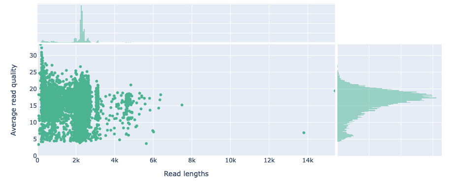
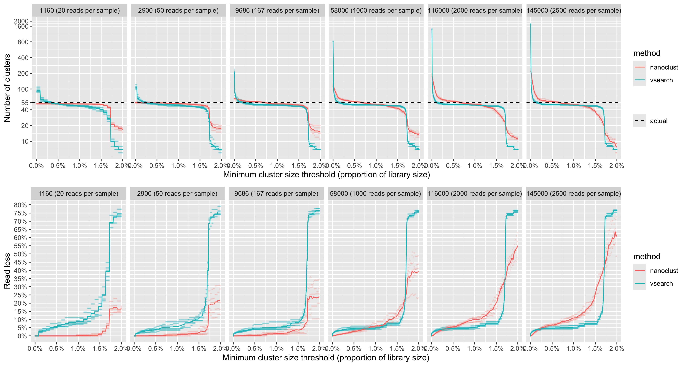

# Results

## Quality control

Tracking read loss at each stage of the pipeline has shown that large numbers of reads have been excluded from analysis in the primer trimming and quality filtering stages of the current implementation (Figure \@ref(fig:readLossByStage)).
32.15% read loss was observed after applying cutadapt to select and trim amplicons that contain both forward (ITS1F) and reverse primer (LR3) sequences.
The extraction of full ITS regions led to a loss of 12.41% trimmed reads.
71.61% of full ITS sequences were lost after selecting reads between 300-6000bp in length and having a mean quality above Q20 (Phred scale).
Such large loss of reads can be attributed to many of the reads from the dataset being below the minimum mean quality threshold of Q20 as in Figure \@ref(fig:rawReadQuality).


```{r readLossByStage, echo=FALSE, fig.cap = 'Read loss at each filtering and trimming stage of the pipeline. The percentages on each bar indicate the proportion of reads lost from the previous step. Each step is executed in order from left to right.'}
knitr::include_graphics('analysis/images/06-read-loss-by-stage.png')
```

It should be noted that no reads were lost after trimming ONT adapter sequences at the ends of reads with Dorado.
While the overall read loss for the chimera filtering step was relatively low (2.49%), we observed sample bias in reference-based chimera detection
leading to a loss of 99.0% of reads in Puccinia triticina and 68.8% of reads in Fusarium proliferatum samples.

```{r rawReadQuality, echo=FALSE, fig.cap = 'The mean read quality of unprocessed reads before trimming or filtering. Quality scores are in the Phred (Q) scale. Read lengths are shown in thousand basepairs. Histograms on X and Y axes indicate the density of reads at respective quality scores and read lengths.r'}

```

## minimum cluster size threshold can recover expected number of species from even read count scenario {#cluster-results}

- introduce number of clusters as measure for successfully estimating number of species.
- state that this is in 'even' scenario

clustering using vsearch at 97% sequence identity consistently over-estimated the number of species in mixed read scenarios.
large numbers of otus were encountered with many of the otus having low abundance.
this is to be expected when clustering long noisy reads via sequence identity and a procedure of filtering spurious reads
was adopted.
the method of removing otus with abundance levels below a specified threshold was explored in figure \@ref(fig:vsearchotus).
the minimum otu size threshold was selected as a proportion of the total library size.
when clustering with vsearch at 97% sequence identity, the threshold that gave consistent recovery of the number of species was 0.1% of total library size.
this was robust across different library sizes (1000-150000 total reads).

```{r vsearchotus, echo = FALSE, fig.fullwidth=TRUE, fig.cap = "the effect of a minimum otu size threshold and total library size on the number of otus when clustering with vsearch. colours indicate the minimum otu size as a proportion of the total library size. the dashed line indicates the actual number of species in the synthetic dataset. five repetitions were performed for each library size. x and y axes are on a logarithmic scale."}
knitr::include_graphics('analysis/images/06-otu-count-vsearch.png')
```

The NanoCLUST algorithm was explored to better estimate the number of species in mixed samples by potentially better handling noise in the ONT reads compared to VSEARCH.
We tested multiple library sizes to determine the optimal value for the minimum cluster size parameter used by NanoCLUST (hdbscan).
When the minimum cluster size parameter was set to its minimum value (2), the NanoCLUST method overestimated the number of species for library sizes 10000 and above.
The estimated number of species also increased with the library size for small values of the minimum cluster parameter (see Figure \@ref(fig:nanoclustOTUs)).
For library sizes of 10000 and above, when setting the minimum cluster size to 0.5% of the total library size the expected number of clusters were recovered.


```{r nanoclustOTUs, echo = FALSE, fig.fullwidth=TRUE, fig.cap = "The effect of minimum cluster size parameter and total library size on the number of clusters when clustering with NanoCLUST. Colours indicate the minimum cluster size parameter as a proportion of the total library size. The dashed line indicates the actual number of species in the synthetic dataset. Five repetitions were performed for each library size. X and Y axes are on a logarithmic scale."}
knitr::include_graphics('analysis/images/06-otu-count-nanoclust.png')
```

A direct comparison between the clustering methods was performed by comparing the read loss when specifying a minimum clustering threshold.
Read loss in this instance refers to the proportion of reads that are not placed in an OTU after clustering.
We found that for low library sizes (20-167 reads per sample), NanoCLUST produced closer estimates of the number of species with lower read loss than VSEARCH \@ref(fig:compareVsearchNanoclust).
For larger library sizes (1000-2500 reads per sample), NanoCLUST's minimum cluster size of 0.5% produced consistently accurate estimates of the actual number of species while VSEARCH's minimum cluster threshold of 0.1% performed similarly.
When considering read loss, NanoCLUST performed better at 1000 reads per sample, similarly at 2000 reads per sample and worse at 2500 reads per sample compared to VSEARCH.

```{r compareVsearchNanoclust, echo = FALSE, fig.fullwidth=TRUE, fig.cap = "Comparing the impact of a minimum cluster size threshold on the number of clusters and read loss between NanoCLUST and VSEARCH. Plots have been facetted by total library size. Five repetitions were performed for each library size."}

```

### Effect of newer base calling model