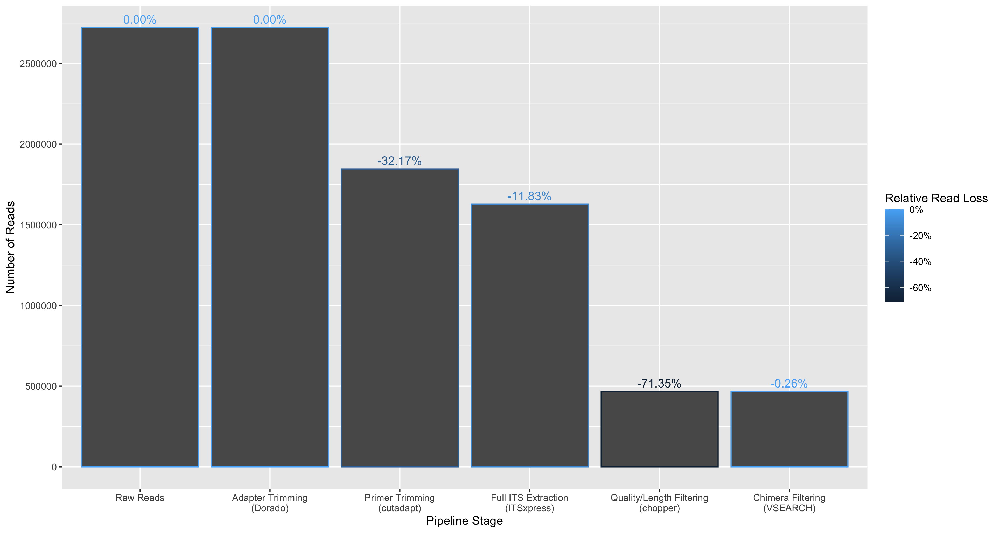

# Results

## Quality control

Tracking read counts at each stage of the pipeline has shown that large losses of reads occurred in the primer trimming and quality filtering stages of the pipeline (Figure \@ref(fig:readLossByStage)).
32.17% of reads were lost after applying cutadapt to select and trim amplicons that contain both forward (ITS1F) and reverse primer (LR3) sequences.
The extraction of full ITS regions led to a loss of 11.83% trimmed reads.
71.35% of full ITS sequences were lost after selecting reads between 300-6000bp in length and having a mean quality above Q20 (Phred scale).
Such large loss of reads can be attributed to many of the reads from the dataset being below the minimum mean quality threshold of Q20 as in Figure \@ref(fig:rawReadQuality).


```{r readLossByStage, echo=FALSE, fig.cap = 'Read loss at each filtering and trimming stage of the pipeline. The percentages on each bar indicate the proportion of reads lost from the previous step. Each step is executed in order from left to right.'}

```

It should be noted that no reads were removed after trimming ONT adapter sequences at the ends of reads with Dorado.
While the overall read loss for the chimera filtering step was relatively low (0.75%), we observed sample bias in reference-based chimera detection step for samples which were excluded from the analysis (99.0% loss in Puccinia triticina and 68.8% loss in Fusarium proliferatum).

```{r rawReadQuality, echo=FALSE, fig.cap = 'The mean read quality of unprocessed reads before trimming or filtering steps. Quality scores are in the Phred (Q) scale. Read lengths are shown in thousand basepairs. Histograms on X and Y axes indicate the density of reads at respective quality scores and read lengths. (Plot generated by NanoPlot [@DeCoster2023])'}
knitr::include_graphics('analysis/images/06-raw-read-quality.png')
```

## Minimum cluster size threshold can recover expected number of species from even abundance scenario {#cluster-results}

The clustering approach that was adopted aimed to group full ITS sequences from the same species together.
The total number of clusters was used as a measure for successfully estimating number of species in the community.
In this case we are considering the even abundance mock community where all samples are equally represented (Scenario 1).

Clustering using VSEARCH at 97% sequence identity consistently over-estimated the number of species in mixed read scenarios.
Large numbers of OTUs were encountered with many of them having low abundance.
The method of removing OTUs with abundance levels below a specified threshold was explored in figure \@ref(fig:vsearchotus).
The minimum OTU size threshold was selected as a proportion of the total library size.
When clustering with VSEARCH at 97% sequence identity, the threshold that gave consistent recovery of the number of species was 0.15% of total library size.
This threshold was robust across different library sizes (1000-150000 total reads) generated by subsampling the full dataset.

```{r vsearchotus, echo = FALSE, fig.fullwidth=TRUE, fig.cap = "The effect of minimum OTU size threshold and total library size on the number of OTUs when clustering with VSEARCH. Colours indicate the minimum OTU size as a proportion of the total library size. The dashed line indicates the actual number of species in the synthetic dataset. Five repetitions were performed for each library size. X and Y axes are on a logarithmic scale."}
knitr::include_graphics('analysis/images/06-otu-count-vsearch.png')
```

A k-mer based clustering method (used by NanoCLUST) was explored to test whether we could improve the accuracy of species level clustering by potentially
being more tolerant of noise in the ONT reads compared to VSEARCH.
We tested multiple library sizes to determine an optimal value for the minimum cluster size parameter used by the HDBSCAN clustering step.
When the minimum cluster size parameter was set to its minimum value (2), the NanoCLUST method overestimated the number of species for library sizes 10000 and above.
The estimated number of species also increased with the library size for small values of the minimum cluster parameter (see Figure \@ref(fig:nanoclustOTUs)).
For library sizes of 10000 reads and above, a minimum cluster size of 0.65% (of the total library size) approximately recovered the expected number of species.


```{r nanoclustOTUs, echo = FALSE, fig.fullwidth=TRUE, fig.cap = "The effect of minimum cluster size parameter and total library size on the number of clusters when following the NanoCLUST clustering approach. Colours indicate the minimum cluster size parameter as a proportion of the total library size. The dashed line indicates the actual number of species in the mock dataset. Five repetitions were performed for each library size. X and Y axes are on a logarithmic scale."}
knitr::include_graphics('analysis/images/06-otu-count-nanoclust.png')
```

A direct comparison between the clustering methods was performed by comparing the read loss when specifying a minimum clustering threshold.
Read loss in this instance refers to the proportion of reads that could not be placed in a cluster.
We found that for low library sizes (20-167 reads per sample), the NanoCLUST method produced closer estimates of the number of species
with lower read loss than VSEARCH for all threshold values (Figure \@ref(fig:compareVsearchNanoclust)).
For larger library sizes (1000-2500 reads per sample), the NanoCLUST method's minimum cluster size of 0.65% produced consistently
accurate estimates of the actual number of species while VSEARCH's minimum cluster threshold of 0.15% performed similarly.
When considering read loss at these thresholds, the NanoCLUST method performed better at 1000 reads per sample, similarly at 2000 reads per sample
and worse at 2500 reads per sample compared to VSEARCH.

```{r compareVsearchNanoclust, echo = FALSE, fig.fullwidth=TRUE, fig.cap = "Comparing the impact of a minimum cluster size threshold on the number of clusters and read loss between NanoCLUST and VSEARCH. Plots have been facetted by total library size. The mean values have been plotted after resampling five times at each library size."}
knitr::include_graphics('analysis/images/06-otu-count-and-loss.png')
```

### Splitting of species into clusters (Scenario 1)

To investigate the effect on clustering of closely related species we looked at a single run of the even abundance scenario (Scenario 1), sampling at 2000 reads per sample for a total
library size of 116K reads.
Reads were clustered using the UMAP and HDBSCAN method (NanoCLUST) using a min cluster size of 580 (0.5% of the library size).
The most abundant sequence of each cluster was assigned taxonomy with dnabarcoder using UNITE 2024 reference database.

The samples from the order *Pucciniales* are shown in Figure \@ref(fig:splittingPuccinia).
We can see that the majority of reads from the *Puccinia striiformis (var tritici)* sample (BC 25) have clustered together into a single cluster (OTU 43),
which has been given the expected species-level classification (*Punninia striiformis*).
The remaining reads from the *Puccinia striiformis (var tritici)* sample have clustered into two groups (5 reads each) which do not correspond to the sample taxonomy.
The taxonomic classification given to these clusters corresponds to other samples present in the library (*Zymoseptoria tritici* and the *Trichomonascus* genus)
and may be indicative of index-switching, where a sequencing error has occurred in the barcode region of the read.

```{r splittingPuccinia, echo=FALSE, fig.fullwidth=TRUE, fig.cap = "Plot indicating the splitting of samples into clusters. Each plot shows how reads from each sample are distributed into clusters. Bars indicate the abundance of a cluster (number of reads). Taxonomic classification of each cluster is shown in the X axis labels. Green indicates that a cluster matches the expected species-level classification."}
knitr::include_graphics('analysis/images/06-cluster-splitting-nanoclust-puccinia.png')
```

In the *Puccinia graminis* sample (BC 27), the majority of the reads have been split into two clusters, both of which
have been classified as the expected *P. graminis* species.
This likely indicates biological variation in the *P. graminis* sample that is causing the single sample to be split into separate clusters.
The majority of reads for both *Austropuccinia psidii* samples (BC 28 and 36) have been split into the same two clusters (OTU 38 and 21)
which have been given the classification *Puccinia psidii*.
A similar plot showing all samples can be seen in Figure \@ref(fig:nanoclustSplitting1)

- difficulty of clustering fungal ITS regions at species level due to variation
- classification of Austropuccinia psidii -> Puccinia psidii significant?
- limitation of using single representative sequence

### Effect of newer base calling model on clustering

### Classification proportion and precision 

```{r nanoclustPrecisionAbundance, echo=FALSE, fig.fullwidth=TRUE, fig.cap = ""}
knitr::include_graphics('analysis/images/06-precision-nanoclust-abundance.png')
```

- precision of nanoclust
    - using most abundance sequence
    - using consensus
- precision of vsearch