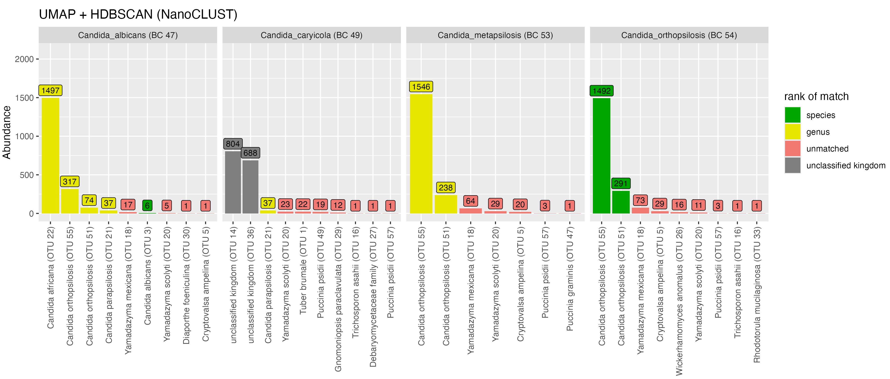
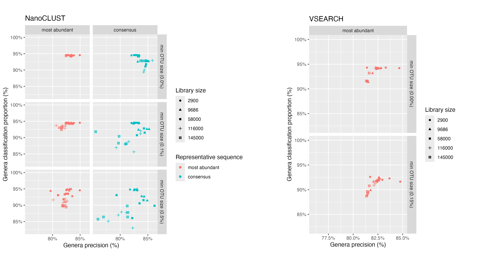
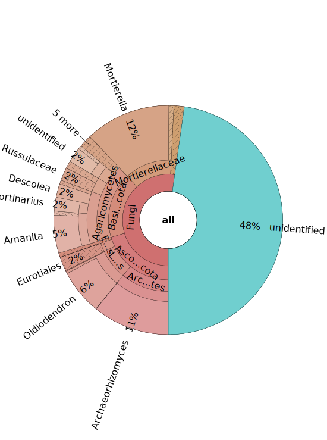
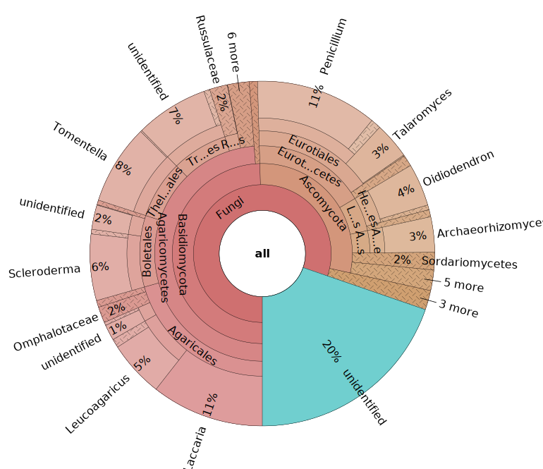

```{r}
#| message: false
library(dplyr)
library(flextable)

set_flextable_defaults(
        font.size = 10,
        theme_fun = theme_vanilla
)
```

## Mock scenarios

### Quality control

After quality control, there was considerable read loss across the fungal taxa used to construct the mock scenarios (@apptbl-samplesheet).
A minimum of 2,500 reads per taxa was required to construct even-abundance mock scenarios with library sizes nearing 150K reads
($58 \text{ taxa} \times 2500 \text{ reads} = 145000\text{ reads}$).
This can be seen in @fig-readCountDistributionBySample, where seven samples are excluded.

::: {#fig-readCountDistributionBySample}
```{r}
knitr::include_graphics('analysis/images/06-read-count-distribution-by-sample.png')
```

Read loss after quality control. The distribution of read counts per sample before (A) and after (B) quality control processing. Reads having less than 2,500 reads were excluded from mock scenarios (dotted line in B). Note the x-axis is on a log scale.
:::

Tracking read counts at each stage of the pipeline has shown that the majority of reads were lost in the primer trimming and quality filtering stages of the pipeline (@fig-readLossByStage).
An average of 32.37% of reads were lost across samples after applying cutadapt to select and trim amplicons that contain both forward (ITS1F) and reverse primer (LR3) sequences.
The extraction of the full ITS region led to an average loss of 10.65% trimmed reads across samples.
An average of 71.82% of full ITS sequences were lost after selecting reads between 300-6,000bp in length and having a mean quality score above Q20 (Phred scale).
Such large loss of reads can be attributed to many of the reads from the dataset being below the minimum mean quality threshold of Q20 (@fig-rawReadQuality).

::: {#fig-readLossByStage}
```{r}
knitr::include_graphics('analysis/images/06-read-loss-by-stage-by-sample.png')
```

Read loss for taxa used in mock scenarios at filtering and trimming stages of the pipeline.
Each point represents a fungal isolate sample.
Taxa that were excluded from downstream mock scenarios due to low read count have been coloured red.
The blue horizontal bar with percentages indicate the mean proportion of reads lost from the previous step.
The mean proportion of read loss was only calculated for samples that were not excluded from downstream scenarios.
Each step was executed in order from left to right.
:::

:::{#fig-rawReadQuality}


Mean read quality of reads from 58 fungal taxa before trimming or filtering steps.
The raw reads have been produced by a MinION R10.4 flow cell after basecalling with Guppy v6.4.2 (super-high accuracy model).
Quality scores are in the Phred (Q) scale. Read lengths are shown in thousands of basepairs.
Histograms on X and Y axes indicate the density of reads at respective quality scores and read lengths. (Plot generated by NanoPlot [@DeCoster2023])
:::

### Even abundance scenario {#sec-even-scenario}

#### Minimum cluster size threshold to recover the expected number of species {#sec-cluster-results}

The adopted clustering approaches aimed to group full ITS sequences from the same species together in the same OTU.
The total number of OTUs was used as a measure for successfully estimating the number of species in the mock community.
In this section we considered the even abundance mock community where 58 fungal taxa were equally represented (@sec-mock-fungal-communities).
Of the 58 taxa, some had the same species-level designation making for a total of 55 unique species.

Two clustering approaches were tested: a greedy sequence similarity-based clustering approach with VSEARCH and a k-mer signature based clustering approach (as implemented in NanoCLUST).
To recover the expected number of species from the mock community, both clustering approaches required a technique to filter out low-abundance OTUs.

The number of OTUs returned by VSEARCH at 97% sequence identity was consistently larger than the actual number of species present in the mock community.
VSEARCH significantly over-estimated the number of species in the mock community when no filtering was applied to the resulting set of OTUs.
Furthermore, this over-estimation was exacerbated as the library size increased.
As a significant proportion of these OTUs had low abundance, to recover the expected number of species in the mock community, we implemented a crude cutoff which removed OTUs below a minimum size.
We set the cutoff to a proportion of the total library size and tested values between 0% and 2% (@fig-compareVsearchNanoclust).
We repeated the test for 6 different library sizes (1,160; 2,900; 9,686; 58,000; 116,000; and 145,000 reads) where all fungal taxa had equal abundances.

With VSEARCH, we observed consistent behaviour when applying the minimum OTU size cutoff at all library sizes.
The number of OTUs was very high without a minimum OTU size cutoff, then decreased and stabilised near the expected number of species as the OTU size cutoff increased.
We observed that setting the minimum OTU size to be 0.15% of the library size consistently recovered the expected number of species.

:::{#fig-compareVsearchNanoclust}


Impact of a minimum OTU size cutoff on clustering methods.
The number of OTUs and the proportion of read loss is shown for NanoCLUST (in red) and VSEARCH (in blue) clustering methods.
These are results from the even abundance scenario.
Plots have been organised in columns by increasing library size.
The top row of plots shows the number of OTUs after applying a minimum cluster size cutoff that is a proportion of the library size.
The bottom row of plots show the proportion of reads that are lost after applying the minimum OTU size cutoff.
The mean values of each have been plotted after five random resamplings at each library size.
The dashed line indicates the actual number of species in the mock scenario.
:::

<!--
  :::{#fig-vsearchotus}
  

  Effect of a minimum OTU size threshold on the number of OTUs when clustering with VSEARCH.
  Colours indicate the minimum OTU size threshold as a proportion of the total library size.
  The dashed line indicates the actual number of species in the mock scenario (55).
  Five repetitions were performed for each library size. X and Y axes are on a logarithmic scale.
  :::
-->

Alternatively, we tested the k-mer based clustering approach used by the NanoCLUST pipeline.
Within the NanoCLUST pipeline, HDBSCAN is the algorithm that performs the clustering and requires specifying a minimum cluster size parameter *a priori*.
Similar to our approach with VSEARCH, we tested multiple values of HDBSCAN's minimum cluster size parameter on the even abundance mock community for 6 different library sizes (1,160; 2,900; 9,686; 58,000; 116,000; and 145,000 reads).
We tested a range of minimum cluster sizes between 0% and 2% of the total library size.
We found that when the minimum cluster size parameter was set to its minimum value (2 reads), the NanoCLUST method overestimated the number of species for library sizes of 1,160 reads and above.
With the minimum cluster size parameter set to 2, the number of OTUs showed a positive correlation with library size but not as dramatically as with VSEARCH.
For library sizes of 1,160 reads and above, a minimum cluster size of 0.65% of the total library size consistently recovered the expected number of species.

<!--
  :::{#fig-nanoclustOTUs}

  

  Effect of minimum cluster size parameter and total library size on the number of OTUs when following the UMAP and HDBSCAN (NanoCLUST) clustering approach.
  Colours indicate the minimum cluster size parameter as a proportion of the total library size.
  The dashed line indicates the actual number of species in the mock dataset (55).
  Five repetitions were performed for each library size. X and Y axes are on a logarithmic scale.
  :::
-->

To aid the comparison of VSEARCH and NanoCLUST clustering methods, we recorded the proportion of reads that were lost due to defining a minimum OTU size.
We defined the proportion of reads lost for VSEARCH as:

$$
\frac{\text{\# of reads removed when filtering OTUs by size}}{\text{\# number of reads in library}}
$$

and for Nanoclust as:

$$
\frac{\text{\# of unclustered reads}}{\text{\# number of reads in library}}
$$

We found that for low library sizes (1,160-9,686 reads), the NanoCLUST method produced closer estimates of the actual number of species
with lower read loss than VSEARCH for all minimum OTU sizes.
For larger library sizes (58K-145K reads) using the VSEARCH method, we observed a consistent pattern of read loss for all library sizes.
The NanoCLUST method became less consistent for larger library sizes and lost a higher proportion reads to recover the same number of species as VSEARCH (@fig-compareVsearchNanoclust).
<!--
For example, using the VSEARCH method, 5% of reads were lost when the minimum OTU size was set to 0.5% (of library size) for all library sizes.
While using the NanoCLUST method 2.5%, 0.6%, 0.75%
-->

<!--
For larger library sizes (50K-145K reads), the NanoCLUST method's minimum cluster size of 0.65% produced consistently
accurate estimates of the actual number of species while VSEARCH's minimum cluster threshold of 0.15% performed similarly.
When considering read loss at these thresholds, compared to VSEARCH, the NanoCLUST method performed better at a library size of 50K, similarly at a library size of 116K reads
and worse at a library size of 145K reads.
-->

#### Computing number of species after taxonomic assignments

While we were able to demonstrate above that the expected number of species can be recovered by setting a minimum OTU size,
 the number of OTUs may not be an accurate measure of the actual number of species.
For example, one species may have been split into multiple OTUs which have all been given the same species-level taxonomic assignment.
In addition, we wanted to explore using a minimum OTU size threshold that was not proportional to the library size.
We felt that a minimum OTU size of 0.65% for NanoCLUST and 0.15% for VSEARCH would exclude low-abundance species
and may bias against samples with low read depth.

Here we explored the observed number of species in our even abundance mock community after assigning OTUs.
We performed VSEARCH and NanoCLUST clustering methods on four library sizes of 9,686; 58,000; 116,000 and 145,000 reads.
HDBSCAN clustering was performed six times for each library with minimum cluster sizes of: 2, 5, 10, 20, 50 and 100 reads.
VSEARCH clustering was performed once for each library at 97% identity, then OTUs with fewer than: 2, 5, 10, 20, 50 and 100 reads were removed.
The most abundant sequence was used at the representative sequence for each OTU and given a taxonomic assignment with dnabarcoder using the UNITE+INSD 2024 database.

For each minimum OTU size, we counted the number of unique taxonomic assignments given at the species level.
<!-- OTUs that were unidentified at the species level were counted as individual species (and not lumped together as a single species). -->
Of the OTUs that were given a species-level assignment, we counted the number of species that were known to be in the mock community (listed in @apptbl-samplesheet).
For OTUs that were only identified to genus or family level, we counted the number of OTUs that had genus or family level labels that were known to be in the mock community.
OTUs that were identified at species, genus or family levels but whose taxonomic labels were not expected in the mock community were counted as false positives.
OTUs that were unidentified at the family level or higher were recorded as 'unidentified' (@fig-fixed-min-cluster-size-even).
We also recorded the proportion of read loss as in the previous section.


:::{#fig-fixed-min-cluster-size-even}


Number of species after 'collapsing' OTUs with the same species-level taxonomic assignment.
The even abundance mock community was clustered with VSEARCH and NanoCLUST, and six minimum OTU sizes were tested (2, 5, 10, 20, 50, 100).
Each OTU was given a taxonomic assignment with dnabarcoder using the UNITE+INSD 2024 database.
The dark blue line (first two rows) shows the number of OTUs after clustering.
Green bars show the number of species that were known to be in the mock community.
Yellow bars show the number of OTUs that were assigned at the genus level, and whose genus label was known to be in the mock community.
Orange bars show the number of OTUs that were assigned at the family level, and whose family label was known to be in the mock community.
Red bars show the number of OTUs that were assigned at the species, genus or family level but whose taxonomic label was not found in the mock community.
Grey bars show the number of OTUs that were unidentified at the family level or above.
The process was repeated for four library sizes of 9,686; 58,000; 116,000 and 145,000 reads.
The bottom row of plots show the proportion of reads that are lost after applying the minimum OTU size cutoff.
:::

We observed that 'collapsing' OTUs by their species-level identification was more accurate in estimating the number of species in the mock community compared to using the number OTUs.
We found that a core set of species from the mock community remained regardless of minimum OTU size or library size (green bars in @fig-fixed-min-cluster-size-even).
When the library size increased, we observed an increase in OTUs that were unidentified or assigned to the expected genus and family levels for both NanoCLUST and VSEARCH.
Increasing the minimum OTU size with VSEARCH mostly removed OTUs that were unidentified or assigned to genera from the mock community.
NanoCLUST overestimated the number of species regardless of the minimum OTU size, but had the benefit of much lower read loss than VSEARCH.

#### Comparing cluster delineation between VSEARCH and NanoCLUST

To investigate if closely related species could be distinguished after clustering,
we looked at a single execution of the even abundance mock scenario where 2,000 reads were selected from each of the 58 fungal taxa giving a total library size of 116K reads.
Reads were clustered separately with the NanoCLUST and VSEARCH methods.
Reads that were clustered with the NanoCLUST method used a minimum cluster size of 580 reads (0.5% of the library size).
VSEARCH clustering used a 97% identity and OTUs that had fewer than 174 reads (0.15% of library size) were removed.
The most abundant sequences of each OTU were classified with dnabarcoder and the UNITE+INSD 2024 reference database.

The samples from the order *Pucciniales* are shown in @fig-splittingPuccinia.
Using the NanoCLUST method, the majority of reads from the *Puccinia striiformis (var tritici)* sample (BC 25) clustered together into a single OTU (OTU 37) with the expected species-level classification (*Puccinia striiformis*).
The remaining reads from the *P. striiformis (var tritici)* sample clustered into singleton OTUs which did not correspond to the expected taxonomic label.
The *Botrytis* classification of one of these OTUs corresponds to another fungal taxa present in the library
and may be indicative of index-switching (where a sequencing error has occurred in the barcode region of the read).


:::{#fig-splittingPuccinia}


Clustering of *Pucciniales* using the NanoCLUST (UMAP + HDBSCAN) and VSEARCH methods.
Each plot shows the reads from a single fungal taxon and bars indicate the number of reads from the taxon placed in an OTU.
The taxonomic classification given by dnabarcoder (with the UNITE 2024 database) for each OTU is shown in the x-axis labels.
Green bars indicate that the assignment given to an OTU matches the expected species-level classification.
Red bars indicate that the classification is incorrect for family-level and above.
Grey bars indicate that the cluster could not be given any taxonomic classification at all.
Bars marked with an asterix (*) indicate that taxonomic labels differed between reference database and our sample but were still considered the same species.
:::

For *Puccinia graminis* (BC 27) when using the NanoCLUST method, the majority of the reads were split into two OTUs, both of which
were classified as the expected *P. graminis* species.
Using the VSEARCH method, the majority of the *Puccinia graminis* reads clustered into a single correctly identified OTU.
This likely indicates that biological variation exists in the *P. graminis* sample that the NanoCLUST method was capable of detecting while VSEARCH (at 97% identity) could not.
The majority of reads for both *Austropuccinia psidii* samples (BC 28 and 36) were split into the same two OTUs (OTU 38 and 21)
which have been classified as *Puccinia psidii*.
A similar plot for all samples in this mock community can be seen in @appfig-nanoclustSplitting2 with classifications shown in @apptbl-tax-assignments-nanoclust.

:::{#fig-splittingCandida}



Clustering of selected *Candida* using the NanoCLUST (UMAP + HDBSCAN) and VSEARCH methods.
Each plot shows the reads from a single fungal taxon and bars indicate the number of reads from the taxon placed in an OTU.
The taxonomic classification given by dnabarcoder (with the UNITE 2024 database) for each OTU is shown in the x-axis labels.
Green bars indicate that the assignment given to an OTU matches the expected species-level classification.
Yellow bars indicate a correct genus-level classification.
Red bars indicate that the classification is incorrect for family-level and above.
Grey bars indicate that the OTU could not be given any taxonomic classification at all.
:::

We observed similar clustering behaviour between VSEARCH and NanoCLUST for taxa in the genus *Candida* (@fig-splittingCandida).
With VSEARCH, sequences from *C. albicans* (BC47) were placed into three OTUs.
The OTU that received the most reads from *C. albicans* was classified correctly, while the other two were classified to other taxa in the mock community (*C. orthopsilosis* and *C. metapsilosis*).
A similar pattern was observed using NanoCLUST, although the major OTU was not classified correctly at the species-level and there were many more low-abundance OTUs (below 40 reads).
The majority of sequences from *C. caryicola* (BC49) were placed into two unclassified OTUs for both clustering methods.
Sequences from *C. metapsilosis* (BC53) and *C. orthopsilosis* (BC54) showed significant similarity as
VSEARCH placed the majority of reads from both taxa in the same OTU, while NanoCLUST placed a similar proportion of reads from each taxon into two major OTUs.

:::{#fig-splittingCryptococcus}


Clustering of genus *Cryptococcus* using the NanoCLUST (UMAP + HDBSCAN) and VSEARCH methods.
Each plot shows the reads from a single fungal taxon and bars indicate the number of reads from the taxon placed in an OTU.
The taxonomic classification given by dnabarcoder (with the UNITE 2024 database) for each OTU is shown in the x-axis labels.
Green bars indicate that the assignment given to an OTU matches the expected species-level classification.
Yellow bars indicate a correct genus-level classification.
Red bars indicate that the classification is incorrect for family-level and above.
Grey bars indicate that the OTU could not be given any taxonomic classification at all.
:::

In the genus *Cryptococcus*, with NanoCLUST, reads from *C. gattii VG I* (BC59) were placed into one major OTU with the correct species-level assignment while VSEARCH split reads into three major OTUs (@fig-splittingCryptococcus).
With VSEARCH, we observed a significant proportion of reads from all four *Cryptococcus* taxa were placed into the same OTU (OTU 9), while with NanoCLUST this only occurred for three of the taxa (*C. gattii* VG III (BC60), *C. neoformans* VNI (BC61) and *C. neoformans* VN IV (BC62)).
A proportion of reads from *Cryptococcus gatii* VG III (BC60) were misclassified as *Candida ortholopsis*,
while a proportion of reads from *Cryptococcus neoformans* VNI (BC61) were misclassified as *Kluveromyces marxianus*.

:::{#fig-splittingBotrytis}


Clustering of family *Sclerotiniaceae* using the NanoCLUST (UMAP + HDBSCAN) and VSEARCH methods.
Each plot shows the reads from a single fungal taxon and bars indicate the number of reads from the taxon placed in an OTU.
The taxonomic classification given by dnabarcoder (with the UNITE 2024 database) for each OTU is shown in the x-axis labels.
Green bars indicate that the assignment given to an OTU matches the expected species-level classification.
Yellow bars indicate a correct genus-level classification.
Red bars indicate that the classification is incorrect for family-level and above.
Grey bars indicate that the OTU could not be given any taxonomic classification at all.
:::

For the *Sclerotiniaceae* family, we found that both *Botrytis* taxa (BC31 and BC32) were placed in the same OTU with both NanoCLUST and VSEARCH.
With VSEARCH, 516 reads from *Sclerotinia sclerotiorum* were also placed in the same OTU with the *Botrytis* taxa.
With NanoCLUST, the majority of reads were placed into one correctly identified OTU.

Overall, with these clustering setting, NanoCLUST and VSEARCH performed similarly for delineating the majority of the taxa.
In the *Cryptococcus* and *Sclerotiniaceae* cases, NanoCLUST was observed to perform better at delineating closely related taxa.
However, in *Candida* and *Cryptococcus* cases, we observed many more low-abundance OTUs with incorrect taxonomic assignments for NanoCLUST compared to VSEARCH.

#### Comparison of representative sequence used for taxonomic assignment

To explore the accuracy of taxonomic classifications made by the pipeline, two metrics were computed for the even abundance mock scenario (Scenario 1).
The genera classification proportion metric for all fungal taxa was defined as:

$$
\frac{\text{\# of reads classified at the genera level}}{\text{total \# of reads in library}}
$$

The genera precision metric for all fungal taxa was defined as:

$$
\frac{\text{\# of reads classified correctly at the genera level}}{\text{\# of reads classified at the genera level}}
$$

These metrics were calculated for five library sizes (between 2,900 and 145,000 reads) for both NanoCLUST and VSEARCH clustering methods (@fig-precision).
We explored which representative sequence from an OTU gave more accurate taxonomic classifications: most abundant sequence or consensus sequence.
Consensus sequences were generated by polishing a subset of sequences from each OTU as described in @sec-pipeline-description.

A read's classification was deemed 'correct' if its genus-level label matched the sample from which the read originated.
This approach had limitations and was difficult to ensure taxonomic assignments were correct in an automated fashion due to synonymous naming conventions.
Manual adjustments were made for the following assignments that would have been otherwise considered misclassified:

- Reads classified as *Puccinia psidii* from the *Austropuccinia psidii* sample were considered to be a correct species-level assignment.
- Reads classified to the *Kurtzmaniella* genus from the *Candida boleticola* or *Candida zeylanoides* samples were considered to be correct genus-level assignment.

:::{#fig-precision}


Comparing the proportion of classified reads and the precision of classifications at the genera level between the most abundant sequence and consensus sequence.
Classification metrics were calculated for the even-abundance mock scenario with five library sizes of 2,900; 9,686; 58,000; 116,000 and 145,000 reads.
Five replicates were performed for each library.
Red points show classification proportion and precision when using the most abundance sequence from OTUs.
Blue points show classification proportion and precision when using a consensus sequence from OTUs.
Consensus sequence metrics were not shown for VSEARCH due very low classification proportion (35% and below).
:::

For NanoCLUST, we observed that clustering with a `min_cluster_size` of 2 and classifying the most abundant sequence gave
the most consistent results across all library sizes.
In this case, for all library sizes, ~95% of reads were classified and 82.5% to 85% of these classifications were correct.
We observed that increasing the `min_cluster_size` parameter introduced variability in these metrics and generally worsened classification performance.
When clustering with a `min_cluster_size` parameter of 2 and using the consensus sequence for classifications,
the classification precision improved slightly while the proportion of reads that were classified decreased.

For VSEARCH when using the most abundant sequence, we observed that increasing the minimum OTU size decreased the proportion of reads classified at the genera level by ~2.5% while the classification precision did not change significantly.
The classification rate of consensus sequences for VSEARCH was very poor with more than 65% of reads being unclassified at the genera level.
Overall, both NanoCLUST and VSEARCH approaches performed comparably when the minimum OTU size was low and the most abundant sequence was used for classifications.

### Uneven abundance Scenario

<!--
#### Minimum cluster size threshold to recover the expected number of species

:::{#fig-n-species-uneven}


Number of species after 'collapsing' OTUs with the same species-level taxonomic assignment.
The uneven abundance mock community was clustered with VSEARCH and NanoCLUST, and six minimum OTU sizes were tested (2, 5, 10, 20, 50, 100).
Each OTU was given a taxonomic assignment with dnabarcoder using the UNITE+INSD 2024 database.
The blue line shows the number of OTUs after clustering.
Green bars show the number of species that were known to be in the mock community.
Yellow bars show the number of OTUs that were assigned at the genus level, and whose genus label was known to be in the mock community.
Orange bars show the number of OTUs that were assigned at the family level, and whose family label was known to be in the mock community.
Red bars show the number of OTUs that were assigned at the species, genus or family level but whose taxonomic label was not found in the mock community.
Grey bars show the number of OTUs that were unidentified at the family level or above.
The process was repeated for five library sizes of 5,185; 10,185; 25,185; 50,185 and 100,185 reads.
The bottom row of plots show the proportion of reads that are lost after applying the minimum OTU size cutoff.
:::
-->

#### Sensitivity of cluster thresholds in uneven abundance scenarios

To explore the impact that a minimum OTU size cutoff might have on rare species in a real environmental sample, we modelled a scenario where a subset of fungal taxa had much lower abundance than others.
This mock community contained a total of 55 fungal taxa where
50 taxa each had an abundance of 2,000 reads, while the remaining five taxa had abundances of 5, 10, 20, 50 and 100 reads, making for a total library size of 100,185 reads.
We examined the minimum OTU size cutoff at which low-abundance taxa would be lost (@fig-uneven-min-cluster-thresh).

:::{#fig-uneven-min-cluster-thresh}


Impact of increasing the minimum OTU size for NanoCLUST (UMAP + HDBSCAN) and VSEARCH.
Each plot shows the OTUs that contained reads from the five 'low-abundance' fungal taxa.
The OTUs and their taxonomic classification (given by dnabarcoder) are shown on the x-axis.
Coloured bars show the proportion of reads belonging to the fungal taxa within an OTU.
Minimum OTU sizes of 2, 5, 10, 20, 50 and 100 were tested and shown in plots arranged from left to right.
The low-abundance fungal taxa are *Trichomanascus ciferri*, *Erysiphe necator*, *Eutypa lata*, *Penicillium chrysogenum* and *Candida zeylanoides* which
had abundances of 5, 10, 20, 50 and 100 reads respectively.
The remaining 50 taxa in the mock community each had an abundance of 2,000 reads.
The dotted line indicates the minimum OTU size relative to the OTU size.
:::

We observed that when increasing the `min_cluster_size` parameter for HDBSCAN (the clustering algorithm used by NanoCLUST),
reads from 'low-abundance' fungal taxa were placed in OTUs with unrelated taxa.
For example in @fig-uneven-min-cluster-thresh, when setting the `min_cluster_size` to 100 reads, we see that reads from *Eutypa lata* were clustered together into an OTU which was classified as the distantly related *Dipodascus capitatus*.
This behaviour was consistent when the `min_cluster_size` parameter exceeded the abundance of a fungal taxon.
<!--This behaviour was consistent when the `min_cluster_size` exceeded the number of reads of low-abundance taxa.-->

For VSEARCH, the effect of a minimum OTU size was predictable in removing low-abundance OTUs.
Low-abundance taxa such as *Trichomanascus ciferri* and *Erysiphe necator* were lost at lower minimum OTU sizes than expected because they had been split into smaller OTUs.


## Real world - Soil case study

For our 'real world' soil study, 23 samples were taken from soil beneath six tree species and two controls were sequenced with ONT MinION 10.4.1 and gave a total of 4,365,488 reads after basecalling.
After demultiplexing with minibar using a custom barcoding scheme, 3,041,450 reads remained (30% loss).
Of the reads where demultiplexing failed, 88,599 reads had multiple barcode matches and 1,235,439 had unidentifiable barcodes.

### Quality control

We observed considerably higher read quality scores from the soil samples (median: Q24.0) compared to the pure fungal taxa (median: Q16.8) used in the mock scenarios (compare @fig-raw-read-quality-soil and @fig-rawReadQuality).
<!--
mean -> 13.2, median -> 16.8
mean -> 18.6, median -> 24.0
-->
This was expected, as the soil samples were sequenced with the latest MinION chemistry and basecalled with the dorado's latest basecalling model (v5.0.0), while the pure fungal taxa were limited to older basecalling models (v4.1.0).

:::{#fig-raw-read-quality-soil}


Mean read quality of reads from 23 soil samples and two control samples before trimming or filtering steps.
The raw reads have been produced by a MinION R10.4.1 flow cell after basecalling with dorado v0.7.1 (super-high accuracy model).
Quality scores are in the Phred (Q) scale. Read lengths are shown in thousands of basepairs.
Histograms on X and Y axes indicate the density of reads at respective quality scores and read lengths. (Plot generated by NanoPlot [@DeCoster2023])
:::

After tracking the number of reads through the primer trimming, ITS extraction, quality filtering and chimera detection stages of the pipeline, we observed a mean read loss across all samples of 14.85%, 15.56%, 12.26% and 0% respectively (@fig-qc-soil).
We observed considerably more reads being retained after the primer trimming step for the soil samples as compared to the mock fungal samples (14.85% loss vs. 32.37% loss), which is likely due to the higher read quality
but also due to the demultiplexing approach having already detected and filtered reads that did not match the amplicon primers.
We also noted that the extraction kit (ExCon) and PCR negative control had a relatively low number of reads as expected after these stages.
The sample AP6 was excluded from further processing due to having a significantly lower read count (1,173) compared to the other samples.

:::{#fig-qc-soil}


Read loss at each filtering and trimming stage of the pipeline for soil case study samples.
Each point represents a soil or control sample.
The blue horizontal bar with percentages indicate the mean proportion of reads lost from the previous step.
Four samples with relatively low read count after quality control stages have been given colours; red: AP6 (*Allocasuarina paradoxa*), brown: EC1 (*Eucalyptus cephalocarpa*), green: ExCon (extraction kit control) and pink: PCRNegCon (PCR negative control).
Each step was executed in order from left to right. Note the y-axis has been plotted on a square root scale.
:::


### Clustering and taxonomic assignment

The full set of quality filtered reads were clustered with VSEARCH at 97% identity and the most abundant sequence of each
OTU was classified using dnabarcoder and the UNITE+INSD 2024 database.
Low-abundance OTUs were removed from samples if they were smaller than 0.15% of the number of reads in the sample.
The top 30 largest OTUS can be seen in @apptbl-top-30-soil-vsearch.
A high proportion of OTUs could not be given a classification by dnabarcoder.
71.7% of 1,590,965 reads were considered unclassified at the kingdom level consisting of
451 out of 775 OTUs (@fig-soil-classified).

:::{#fig-soil-classified}


The proportion of kingdom-level classifications by sample.
Each bar represents the number of reads in each sample that are either classified to kingdom level (blue) or not (red).
:::

The classifications by tree species are shown in @fig-AL-krona and @fig-EC-krona
and show a higher proportion of fungi are classified in *Eucalyptus* species compared to *Allocasuarina*.

:::{#fig-AL-krona layout-ncol=2 .content-visible when-format="html"}
```{=html}
<iframe width="400" height="500" src="analysis/krona/AL.html" title="Webpage example"></iframe>
<figcaption>A. litteralis</figcaption>
```

```{=html}
<iframe width="400" height="500" src="analysis/krona/AP.html" title="Webpage example"></iframe>
<figcaption>A. paradoxa</figcaption>
```

Classifications from *Allocasuarina* samples. Krona chart shows genus level classifications from all *Allocasuarina littoralis* and *Allocasuarina paradoxa* samples.
Generated using [@taudiereMiscMetabarPackageFacilitate2023; @ondovInteractiveMetagenomicVisualization2011].
:::

:::{#fig-AL-krona layout-ncol=2 .content-hidden when-format="html"}


Classifications from *Allocasuarina* samples. Krona chart shows genus level classifications from all *Allocasuarina littoralis* and *Allocasuarina paradoxa* samples.
Generated using [@taudiereMiscMetabarPackageFacilitate2023; @ondovInteractiveMetagenomicVisualization2011].
Interactive versions of these figures are available online at: https://aringeri.github.io/long-read-ITS-metabarcoding-thesis/06-Results.html#fig-AL-krona
:::


:::{#fig-EC-krona layout-ncol=2 .content-visible when-format="html"}
```{=html}
<iframe width="400" height="500" src="analysis/krona/EC.html" title="Webpage example"></iframe>
<figcaption>E. cephalocarpa</figcaption>
```

```{=html}
<iframe width="400" height="500" src="analysis/krona/EV.html" title="Webpage example"></iframe>
<figcaption>E. viminalis</figcaption>
```

Classifications from *Eucalyptus* samples. Krona chart shows genus level classifications from all *Eucalyptus cephalocarpa* and *Eucalyptus viminalis* samples.
Generated using [@taudiereMiscMetabarPackageFacilitate2023; @ondovInteractiveMetagenomicVisualization2011].
:::

:::{#fig-EC-krona layout-ncol=2 .content-hidden when-format="html"}




Classifications from *Eucalyptus* samples. Krona chart shows genus level classifications from all *Eucalyptus cephalocarpa* and *Eucalyptus viminalis* samples.
Generated using [@taudiereMiscMetabarPackageFacilitate2023; @ondovInteractiveMetagenomicVisualization2011].
Interactive versions of these figures are available online at: https://aringeri.github.io/long-read-ITS-metabarcoding-thesis/06-Results.html#fig-EC-krona
:::


