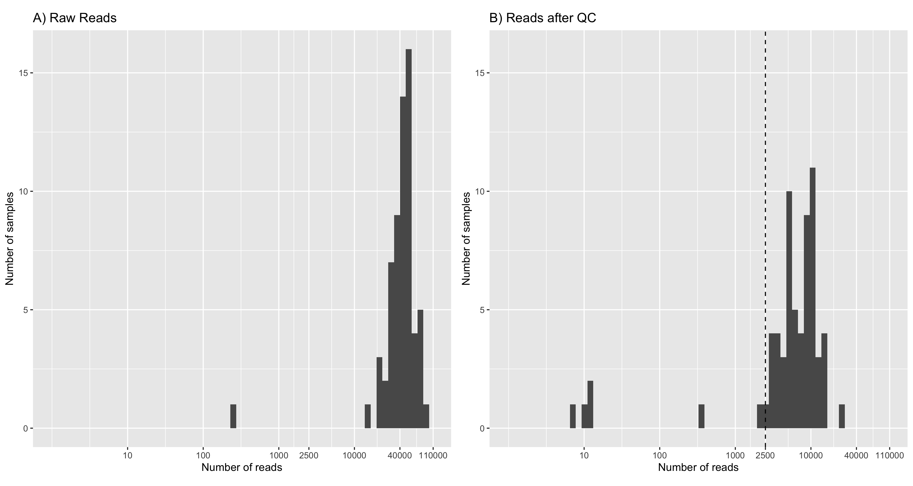
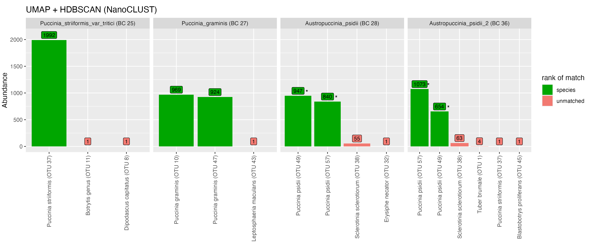
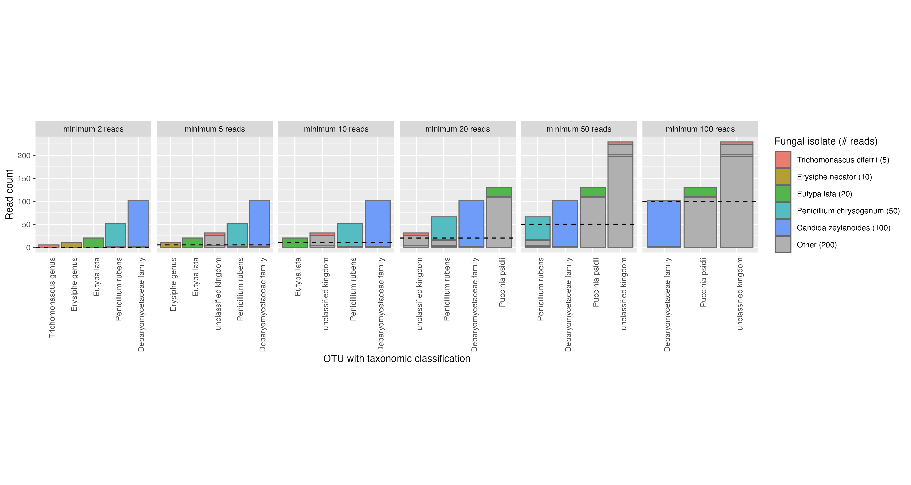

## Quality control

There was considerable read loss across many of the samples during the quality control steps (@tbl-samplesheet, @fig-readCountDistributionBySample).
Only samples with greater than 2500 reads were kept for the mock scenarios so that the pipeline could be tested with library sizes of around 150K reads.
Therefore, seven samples were excluded when creating mock scenarios due to their low number of reads relative to other samples.

::: {#fig-readCountDistributionBySample}
```{r}

```
:::{custom-style="Caption"}
The distribution of read counts per sample before (A) and after (B) quality control processing. Reads having less than 2500 reads were excluded from mock scenarios (dotted line in B). Note the x-axis is on a log scale.
:::

Read count loss by sample after quality control
:::

Tracking read counts at each stage of the pipeline has shown that the majority of reads were lost in the primer trimming and quality filtering stages of the pipeline (@fig-readLossByStage).
An average of 32.37% of reads were lost across samples after applying cutadapt to select and trim amplicons that contain both forward (ITS1F) and reverse primer (LR3) sequences.
The extraction of the full ITS region led to an average loss of 10.65% trimmed reads across samples.
An average of 71.82% of full ITS sequences were lost after selecting reads between 300-6000bp in length and having a mean quality score above Q20 (Phred scale).
Such large loss of reads can be attributed to many of the reads from the dataset being below the minimum mean quality threshold of Q20 (@fig-rawReadQuality).

::: {#fig-readLossByStage}
```{r}
knitr::include_graphics('analysis/images/06-read-loss-by-stage-by-sample.png')
```
:::{custom-style="Caption"}
Read loss at each filtering and trimming stage of the pipeline. Each point represents a fungal isolate sample.
Samples that were excluded from downstream mock scenarios due to low read count have been coloured red.
The blue horizontal bar with percentages indicate the mean proportion of reads lost from the previous step.
The mean proportion of read loss was only calculated for samples that were not excluded from downstream scenarios.
Each step was executed in order from left to right.
:::

Read loss by pipeline stage
:::

:::{#fig-rawReadQuality}


:::{custom-style="Caption"}
The mean read quality of reads from 58 fungal isolates before trimming or filtering steps.
The raw reads have been produced by a MinION R10.4 flow cell after basecalling with Guppy v6.4.2 (super-high accuracy model).
Quality scores are in the Phred (Q) scale. Read lengths are shown in thousands of basepairs.
Histograms on X and Y axes indicate the density of reads at respective quality scores and read lengths. (Plot generated by NanoPlot [@DeCoster2023])
:::

Read quality of raw reads

:::

## Even abundance scenario

### Minimum cluster size threshold to recover the expected number of species {#sec-cluster-results}

The clustering approach that was adopted aimed to group full ITS sequences from the same species together.
The total number of clusters was used as a measure for successfully estimating the number of species in the community.
In this section we considered the even abundance mock community where 58 fungal isolates (of 55 species) were equally represented (Scenario 1).

Clustering using VSEARCH at 97% sequence identity consistently over-estimated the number of species in mixed read scenarios.
Large numbers of OTUs with low abundances were detected.
We removed these low-abundance OTUs by selecting a minimum OTU size cutoff (@fig-compareVsearchNanoclust, @fig-vsearchotus).
OTUs that had a read count which was less than the cutoff were discarded.
The cutoff was specified as a proportion of the total library size.
The minimum OTU size cutoffs were tested across a range of values between 0% and 1% of the total library size.
When clustering with VSEARCH at 97% sequence identity, the threshold that gave consistent recovery of the number of species was 0.15% of total library size.
This threshold was robust across different the library sizes tested in this scenario (@fig-vsearchotus).


:::{#fig-compareVsearchNanoclust}


:::{custom-style="Caption"}
Comparing the impact of a minimum cluster size threshold on the number of clusters and read loss between NanoCLUST and VSEARCH clustering methods. Plots have been organised in columns by increasing library size. The top row of plots shows the number of clusters after applying a minimum cluster size cutoff that is a proportion of the total library size. The bottom row of plots show the proportion of reads that are lost after applying the minimum cluster size threshold. The mean values of each have been plotted after five random resamplings at each library size. The dashed line indicates the actual number of species in the mock scenario.
:::

Minimum cluster size thresholds
:::

:::{#fig-vsearchotus}


:::{custom-style="Caption"}
The effect of a minimum OTU size threshold on the number of OTUs when clustering with VSEARCH. Colours indicate the minimum OTU size threshold as a proportion of the total library size. The dashed line indicates the actual number of species in the mock scenario. Five repetitions were performed for each library size. X and Y axes are on a logarithmic scale.
:::

Minimum cluster size cutoff - VSEARCH
:::


A k-mer based clustering method (used by NanoCLUST) was explored to test whether we could improve the accuracy of species-level clustering and retain more reads compared to VSEARCH.
The minimum cluster size parameter used by the HDBSCAN significantly impacted the resulting number of clusters by limiting the groupings that can be considered a cluster (CITE).
We tested multiple library sizes to understand whether the minimum cluster size parameter can be set to reliably recover the expected number of species in our mock community.
When the minimum cluster size parameter was set to its minimum value (2), the NanoCLUST method overestimated the number of species for library sizes ~1000 and above.
The number of clusters increased significantly with library size for small values of the minimum cluster parameter (@fig-nanoclustOTUs).
For library sizes of ~1000 reads and above, a minimum cluster size of 0.65% of the total library size approximately recovered the expected number of species.

:::{#fig-nanoclustOTUs}


:::{custom-style="Caption"}
The effect of minimum cluster size parameter and total library size on the number of OTUs when following the UMAP and HDBSCAN (NanoCLUST) clustering approach. Colours indicate the minimum cluster size parameter as a proportion of the total library size. The dashed line indicates the actual number of species in the mock dataset. Five repetitions were performed for each library size. X and Y axes are on a logarithmic scale.
:::

Minimum cluster size cutoff - NanoCLUST (UMAP + HDBSCAN)
:::

A comparison between the clustering methods was performed by comparing the read loss at a given minimum cluster size cutoff.
Read loss in this instance refers to the proportion of reads that were removed from the analysis due to being placed in a cluster that was smaller than the given threshold.
We found that for low library sizes (1000-10000 reads), the NanoCLUST method produced closer estimates of the actual number of species
with lower read loss than VSEARCH for all threshold values (@fig-compareVsearchNanoclust).
For larger library sizes (50K-145K reads), the NanoCLUST method's minimum cluster size of 0.65% produced consistently
accurate estimates of the actual number of species while VSEARCH's minimum cluster threshold of 0.15% performed similarly.
When considering read loss at these thresholds, compared to VSEARCH, the NanoCLUST method performed better at a library size of 50K, similarly at a library size of 116K reads
and worse at a library size of 145K reads.

### Comparing cluster delineation between VSEARCH and NanoCLUST

To investigate if closely related species were recovered during clustering, we looked at a single execution of the even abundance scenario (Scenario 1) where 2000 reads were selected
from each of the 58 fungal isolates giving a total library size of 116K reads.
Reads were clustered separately with the NanoCLUST and VSEARCH methods.
Reads that were clustered with the UMAP + HDBSCAN method (NanoCLUST) used a minimum cluster size of 580 (0.5% of the library size).
Reads were clustered using VSEARCH at 97% identity and clusters that had fewer than 174 reads (0.15% of library size) were removed.
Taxonomy was assigned to the most abundant sequence of each cluster with dnabarcoder and the UNITE+INSD 2024 reference database.

The samples from the order *Pucciniales* are shown in @fig-splittingPuccinia.
Using the NanoCLUST method, the majority of reads from the *Puccinia striiformis (var tritici)* sample (BC 25) clustered together into a single cluster (OTU 37) with the expected species-level classification (*Puccinia striiformis*).
The remaining reads from the *P. striiformis (var tritici)* sample clustered into two groups (1 read each) which do not correspond to the expected sample taxonomy.
The *Botrytis* genus classification of one of the clusters corresponds to another sample present in the library
and may be indicative of index-switching (where a sequencing error has occurred in the barcode region of the read).


:::{#fig-splittingPuccinia}



:::{custom-style="Caption"}
Two plots showing how reads from fungal isolates in the order *Pucciniales* are split into clusters using the NanoCLUST (UMAP + HDBSCAN) and VSEARCH methods.
Bars indicate the abundance of a cluster (number of reads).
The taxonomic classification given by dnabarcoder (with the UNITE 2024 database) for each cluster is shown in the x-axis labels.
Green indicates that the assignment given to a cluster matches the expected species-level classification.
Red indicates the classification is incorrect for family-level and above.
Grey indicates that the cluster could not be given a taxonomic classification at all.
:::

Clustering of Pucciniales - NanoCLUST vs VSEARCH
:::

In the *Puccinia graminis* sample (BC 27), when using the NanoCLUST method, the majority of the reads have been split into two clusters, both of which
have been classified as the expected *P. graminis* species.
Using the VSEARCH method, the majority of the *Puccinia graminis* reads cluster into a single correctly identified OTU.
This likely indicates biological variation in the sequences from the *P. graminis* sample that NanoCLUST is capable of detecting.
The majority of reads for both *Austropuccinia psidii* samples (BC 28 and 36) have been split into the same two clusters (OTU 38 and 21)
which have been given the classification *Puccinia psidii*.
A similar plot for all samples in this mock scenario can be seen in @fig-nanoclustSplitting2 and @tbl-tax-assignments-nanoclust.

- difficulty of clustering fungal ITS regions at species level due to variation
- classification of Austropuccinia psidii -> Puccinia psidii
  - likely an old name in the reference database, meaning the dnabarcoder's classification is correct

- show results for:
  - Candida
  - Cryptococcus
  - Botrytis


- limitation of using single representative sequence

### Comparison of taxonomic assignment using the most abundant sequence or the consensus sequence

In order to explore the accuracy of the taxonomic classifications in the pipeline, two metrics were computed for the even abundance mock scenario (Scenario 1).
The genera classification proportion metric has been defined as:

$$
\frac{\text{\# of reads classified at the genera level}}{\text{total \# of reads from isolate}}
$$

The genera precision metric has been defined as:

$$
\frac{\text{\# of reads classified correctly at the genera level}}{\text{\# of reads classified at the genera level}}
$$

These metrics were calculated for five library sizes (between 2900 and 145000 reads) for both NanoCLUST and VSEARCH clustering methods (@fig-nanoclustPrecisionAbundance).
We wanted to explore which representative sequence (most abundant or consensus) of each cluster gave more accurate taxonomic classifications.

:::{#fig-nanoclustPrecisionAbundance}


:::{custom-style="Caption"}
TODO
:::

Most abundant sequence less variable in precision than consensus - NanoCLUST
:::

Figure analysis:

- more variability with consensus sequences
- higher precision at lower classification proportion for lowest minimum cluster size (2)
- minimum cluster size introduces its own variability

:::{#fig-vsearchPrecisionAbundance}


:::{custom-style="Caption"}
VSEARCH precision ...
:::

Most abundant sequence less variable in precision than consensus - VSEARCH
:::

- limitations of reference database labels, difficult to ensure taxonomic assignments are correct in an automated fashion.

## Uneven abundance Scenario

### Sensitivity of cluster thresholds in uneven abundance scenarios (Scenario 2)

- points at which we lose samples
- tradeoff -> inflated number of clusters / noisy
- min cluster size as proportion of library size not robust for uneven sampling approaches

:::{#fig-uneven-min-cluster-thresh-nanoclust}



:::{custom-style="Caption"}
The impact of increasing the minimum cluster size parameter for NanoCLUST (UMAP + HDBSCAN) from left to right (values between 2 and 100).
Only clusters containing reads from the five 'low-abundance' fungal isolates are shown.
OTUs and their taxonomic classification (given by dnabarcoder) are shown on the x-axis.
As minimum cluster size increases, reads from 'low-abundance' fungal isolates are merged with those from
unrelated taxa (i.e. reads from *Eutypa lata* are clustered together with those identified as *Puccinia psidii* at minimum cluster size equal to 20).

:::

Impact of min_cluster_size on low abundance clusters in NanoCLUST
:::

## Number of species after taxonomic classification

PLACEHOLDER:
- explore merging clusters together than have same taxonomic classification


