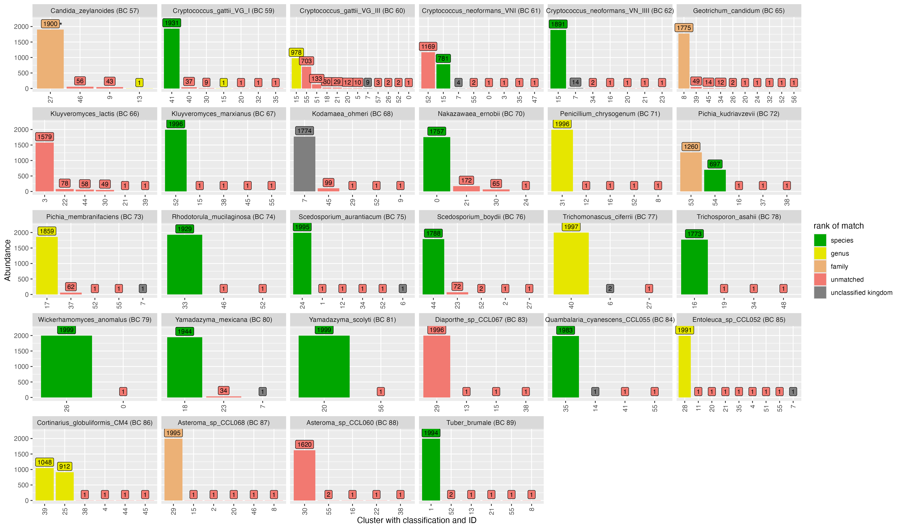

```{r}
#| message: false
#| label: tbl-samplesheet
#| tbl-cap: Samplesheet showing the species, sequencing barcode, number of raw reads after basecalling and number of reads remaining after quality control (QC). Corrections to names based on the latest taxonomic synonyms are shown in parenthesis.
library(dplyr)
library(flextable)

set_flextable_defaults(
  font.size = 10,
  theme_fun = theme_vanilla
)

read.csv('../../../experiments/66-fungal-isolate-ONT/sample-stats-fmt.csv') %>%
  rename_with(\(col) gsub('\\.', ' ', col)) %>%
  flextable() %>%
  align_text_col(align = "left") %>%
  align_nottext_col( align = "right") %>%
  align(j=4, align="right", part="all") %>%
  width(j=1, width=2, unit = "cm") %>%
  width(j=2, width=8, unit = "cm") %>%
  width(j=3, width=2.5, unit = "cm") %>%
  width(j=4, width=3, unit = "cm")
```

:::{#fig-nanoclustSplitting2}



:::{custom-style="Caption"}
Chart showing how 58 fungal isolates are split into clusters based on a single execution of the even abundance mock scenario.
Each isolate has been subsampled to 2000 reads and then clustered using the NanoCLUST (UMAP + HDBSCAN) method with a minimum cluster size set to 580 (0.5% of the total library size).
Bars indicate the abundance of a cluster (number of reads). The taxonomic classification given by dnabarcoder (with the UNITE 2024 database) for each cluster is shown in the X axis labels. Green indicates that the assignment given to a cluster matches the expected species-level classification. Yellow indicates a correct genus-level classification.
Orange indicates a correct family-level classification. Red indicates the classification is incorrect for family-level and above.
Grey indicates that the cluster could not be given a taxonomic classification at all.
:::

Clusters per isolate - Even Abundance (Scenario 1) - NanoCLUST

:::


```{r}
#| message: false
#| label: tbl-tax-assignments-nanoclust
#| tbl-cap: The set of taxonomic assignments for each cluster in @fig-nanoclustSplitting2. The most abundant sequence of each cluster was given a taxonomic assignment using dnabarcoder and the UNITE 2024 database. The OTU ID column refers clusters found in @fig-nanoclustSplitting2 (x-axis). The genus assignment, species assignment, BLAST score and confidence as reported by dnabarcoder are also shown.
flextable(
  read.csv('analysis/tables/all-otus-tax.csv') %>%
    arrange(OTU.ID) %>%
    select(OTU.ID, genus, species, score, confidence) %>%
    mutate(
      score = scales::percent(score, 0.01),
      confidence = scales::percent(confidence)
    ) %>%
    rename_with(\(col) gsub('\\.', ' ', col))
) %>%
  align(j=4, align="right", part="all") %>%
  align(j=5, align="right", part="all") %>%
  autofit()
```