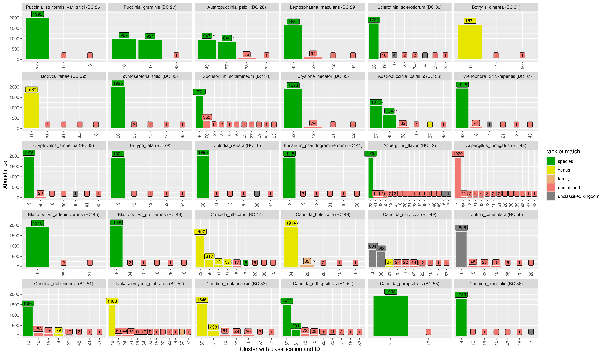

# Supplemental Tables

```{r samplesheet, echo=FALSE, message=FALSE }
library(dplyr)

knitr::kable(
  read.csv('../../../experiments/66-fungal-isolate-ONT/sample-stats-fmt.csv') %>%
    rename_with(\(col) gsub('\\.', ' ', col)),
  align = c('r', 'l', 'r', 'r'),
  caption = "Samplesheet showing the species, sequencing barcode and number of raw reads after basecalling."
)
```

# Supplemental Figures

## Nanoclust splitting (all samples)


```{r nanoclustSplitting1, echo=FALSE, fig.fullwidth=TRUE}

```

```{r nanoclustSplitting2, echo=FALSE, fig.fullwidth=TRUE, fig.cap = "Plot indicating the splitting of all samples into clusters using the UMAP + HDBSCAN method. Each plot shows how reads from each sample are distributed into clusters. Bars indicate the abundance of a cluster (number of reads). Taxonomic classification of each cluster is shown in the X axis labels. Green indicates that a cluster matches the expected species-level classification."}
knitr::include_graphics('analysis/images/06-cluster-splitting-nanoclust-with-tax-31.png')
```
