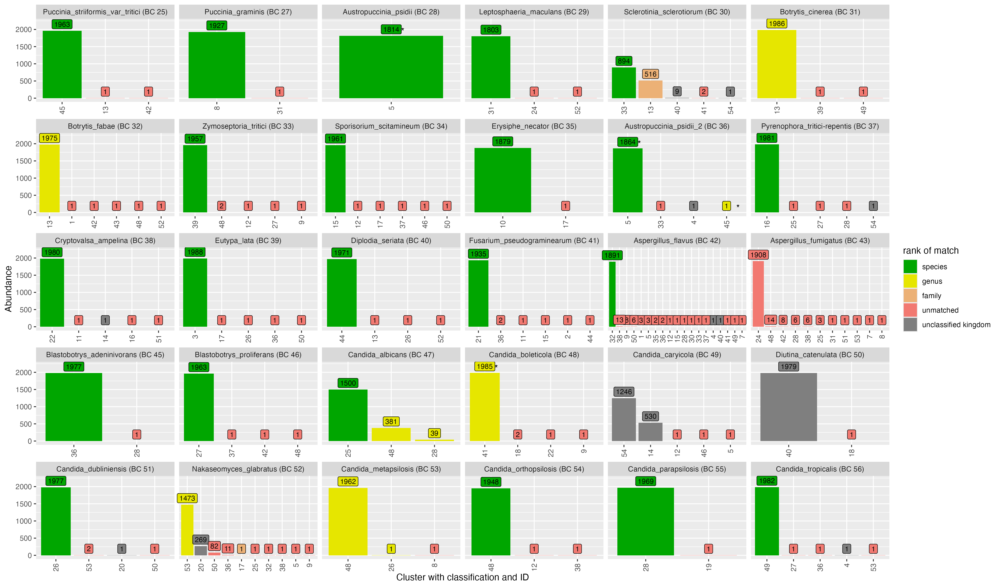
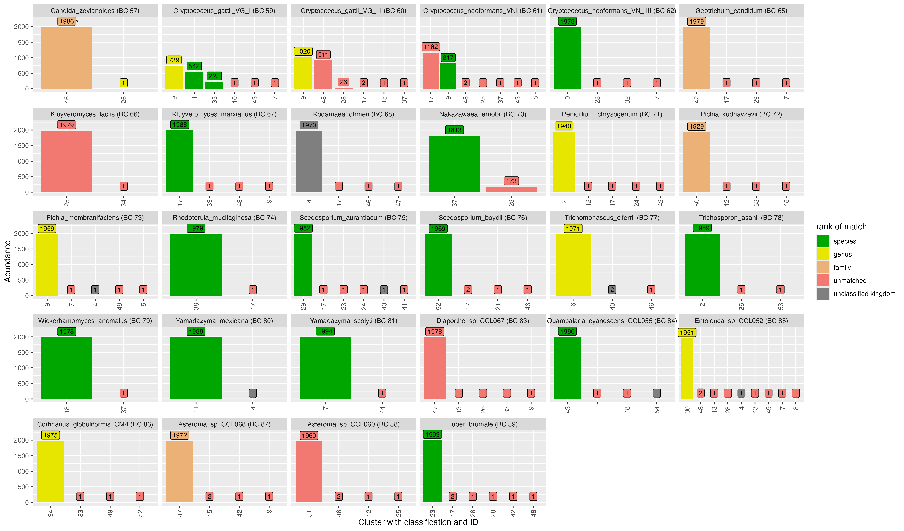

# Appendices {#.appendices}

```{r}
#| message: false
library(dplyr)
library(flextable)

set_flextable_defaults(
  font.size = 10,
  theme_fun = theme_vanilla
)
```

## Pipeline

:::{#apptbl-software-pipeline}
```{r}
flextable(data.frame(
    step='Adapter trimming',
    name='dorado',
    version='v0.6.1'
  ) %>% rbind(data.frame(
    step='Primer trimming',
    name='cutadapt',
    version='v4.6'
  )) %>% rbind(data.frame(
    step='ITS region extraction',
    name='ITSxpress',
    version='v2.0.1'
  )) %>% rbind(data.frame(
    step='Quality filtering',
    name='chopper',
    version='v0.7.0'
  )) %>% rbind(data.frame(
    step='Chimera detection\nClustering\nDereplication',
    name='VSEARCH',
    version='v2.21.1'
  )) %>% rbind(data.frame(
    step='Subsampling reads',
    name='seqtk',
    version='v1.4'
  )) %>% rbind(data.frame(
    step='Dimension reduction',
    name='UMAP',
    version='v0.4.6'
  )) %>% rbind(data.frame(
    step='Clustering',
    name='HDBSCAN',
    version='v0.8.26'
  )) %>% rbind(data.frame(
    step='Taxonomic assignment',
    name='dnabarcoder',
    version='v1.0.6'
  )) %>% rbind(data.frame(
    step='Fastq/fasta file manipulation',
    name='seqkit',
    version='v2.6.1'
  )) %>% rbind(data.frame(
    step='Draft read selection',
    name='fastANI',
    version='v1.34'
  )) %>% rbind(data.frame(
    step='Read mapping',
    name='minimap',
    version='v2.28'
  )) %>% rbind(data.frame(
    step='Read polishing',
    name='racon',
    version='v1.5.0'
  )) %>% rbind(data.frame(
    step='Read polishing',
    name='medaka',
    version='v1.12.0'
  ))
  ) %>%
  set_table_properties(layout='fixed') %>%
  width(j=1, width=5, unit = "cm") %>%
  width(j=2, width=3, unit = "cm") %>%
  width(j=3, width=3, unit = "cm")
```

Software used in pipeline
:::


## Mock scenarios

:::{#apptbl-samplesheet}
```{r}
sample_stats <-  read.csv('../../../experiments/66-fungal-isolate-ONT/sample-stats-fmt.csv')

sample_stats %>%
  select(Barcode, Sample, Number.of.raw.reads, Number.of.reads.after.QC) %>%
  rename_with(\(col) gsub('\\.', ' ', col)) %>%
  flextable() %>%
  align_text_col(align = "left") %>%
  align_nottext_col( align = "right") %>%
  align(j=4, align="right", part="all") %>%
  width(j=1, width=2, unit = "cm") %>%
  width(j=2, width=8.5, unit = "cm") %>%
  width(j=3, width=2.5, unit = "cm") %>%
  width(j=4, width=3, unit = "cm") %>%
  footnote(
    i = which(sample_stats$excluded_even), j = 2,
    ref_symbols = "e,",
    value = as_paragraph("Excluded from even abundance scenario")
  ) %>%
  footnote(
    i = which(sample_stats$excluded_uneven), j = 2,
    ref_symbols = "u",
    inline=F,
    value = as_paragraph("Excluded from uneven abundance scenario")
  )
```

Read statistics from isolated fungal taxa used in mock scenarios. List of the taxa, sequencing barcode, number of raw reads (following basecalling) and number of reads after quality control (QC). Corrections to original based on the UNITE+INSD (v2024) taxonomy [@abarenkovFullUNITEINSDDataset2024] are shown in parenthesis.
:::


:::{#apptbl-software-isolate}
```{r}
flextable(data.frame(
    step='Basecalling +\n Demultiplexing',
    name='guppy',
    version='v6.4.2',
    command='guppy_basecaller \\\n\t-i ./calledFast5 \\\n\t-s ./calledFastq \\\n\t-c dna_r10.4.1_e8.2_400bps_sup.cfg \\\n\t-r -x auto --disable_qscore_filtering \\\n\t--barcode_kits "SQK-NBD114-96"  \\\n\t--trim_adapters --compress_fastq'
  )) %>%
  set_table_properties(layout='fixed') %>%
  width(j=1, width=3, unit = "cm") %>%
  width(j=2, width=2, unit = "cm") %>%
  width(j=3, width=2, unit = "cm") %>%
  width(j=4, width=9, unit = "cm")
```

Software used basecalling the fungal isolate dataset used in mock scenarios.
:::

### Clustering - NanoCLUST

:::{#appfig-nanoclustSplitting2}


Chart showing how 58 fungal isolates are clustered into OTUs based on a single execution of the even abundance mock scenario.
Each isolate has been subsampled to 2000 reads and then clustered using the NanoCLUST (UMAP + HDBSCAN) method with a minimum cluster size set to 580 (0.5% of the total library size).
Bars indicate the abundance of an OTU (number of reads).
The taxonomic classification given by dnabarcoder (with the UNITE 2024 database) for each OTU is shown in the X axis labels (See @apptbl-tax-assignments-nanoclust for classifications).
Green bars indicate that the assignment given to an OTU matches the expected species-level classification.
Yellow bars indicate a correct genus-level classification.
Orange bars indicate a correct family-level classification.
Red bars indicate the classification is incorrect for family-level and above.
Grey indicates that the OTU could not be given a taxonomic classification at all.
Bars marked with an asterix (*) indicate that taxonomic labels differed between reference database and our sample but were still considered the same species.
:::


:::{#apptbl-tax-assignments-nanoclust}
```{r}
#| message: false
flextable(
  read.csv('analysis/tables/all-otus-tax.csv') %>%
    arrange(OTU.ID) %>%
    select(OTU.ID, genus, species, score, confidence) %>%
    mutate(
      score = scales::percent(score, 0.01),
      confidence = scales::percent(confidence)
    ) %>%
    rename_with(\(col) gsub('\\.', ' ', col))
) %>%
  align(j=4, align="right", part="all") %>%
  align(j=5, align="right", part="all") %>%
  autofit()
```

The set of taxonomic assignments for each OTU in @appfig-nanoclustSplitting2. The most abundant sequence of each OTU was given a taxonomic assignment using dnabarcoder and the UNITE 2024 database. The OTU ID column refers OTUs found in @appfig-nanoclustSplitting2 (x-axis). The genus assignment, species assignment, BLAST score and confidence as reported by dnabarcoder are also shown.
:::

### Clustering - VSEARCH

:::{#appfig-vsearchSplittingFull}




Chart showing how 58 fungal isolates are clustered into OTUs based on a single execution of the even abundance mock scenario.
Each isolate has been subsampled to 2000 reads and then clustered using VSEARCH at 97% identity.
OTUs with less than 174 reads were removed (0.15% of the total library size).
Bars indicate the abundance of an OTU (number of reads).
The taxonomic classification given by dnabarcoder (with the UNITE 2024 database) for each OTU is shown in the X axis labels (See @apptbl-tax-assignments-vsearch for classifications).
Green bars indicate that the assignment given to a OTU matches the expected species-level classification.
Yellow bars indicate a correct genus-level classification.
Orange bars indicate a correct family-level classification.
Red bars indicate the classification is incorrect for family-level and above.
Grey indicates that the OTU could not be given a taxonomic classification at all.
Bars marked with an asterix (*) indicate that taxonomic labels differed between reference database and our sample but were still considered the same species.
:::


:::{#apptbl-tax-assignments-vsearch}
```{r}
#| message: false
flextable(
        read.csv('analysis/tables/all-otus-tax-vsearch.csv') %>%
                arrange(OTU.ID) %>%
                select(OTU.ID, genus, species, score, confidence) %>%
                mutate(
                        score = scales::percent(score, 0.01),
                        confidence = scales::percent(confidence)
                ) %>%
                rename_with(\(col) gsub('\\.', ' ', col))
) %>%
        align(j=4, align="right", part="all") %>%
        align(j=5, align="right", part="all") %>%
        autofit()
```

The set of taxonomic assignments for each OTU in @appfig-vsearchSplittingFull. The most abundant sequence of each OTU was given a taxonomic assignment using dnabarcoder and the UNITE 2024 database. The OTU ID column refers to OTUs found in @appfig-vsearchSplittingFull (x-axis). The genus assignment, species assignment, BLAST score and confidence as reported by dnabarcoder are also shown.
:::


## Real world - Soil case study

:::{#apptbl-soil-samplesheet}
```{r}
soil_sample_stats <-  read.csv('../../../experiments/camille-soil-samples/soil-sample-stats-fmt.csv')

soil_sample_stats %>%
  select(Sample, Number.of.raw.reads, Number.of.reads.after.QC) %>%
  rename_with(\(col) gsub('\\.', ' ', col)) %>%
  flextable() %>%
  align_text_col(align = "left") %>%
  align_nottext_col( align = "right") %>%
  align(j=3, align="right", part="all") %>%
  width(j=1, width=2.5, unit = "cm") %>%
  width(j=2, width=2.5, unit = "cm") %>%
  width(j=3, width=3, unit = "cm")
```

Read statistics for soil sample data. List of the samples, number of raw reads (following basecalling) and number of reads after quality control (QC).
:::


:::{#apptbl-software-soil}
```{r}
flextable(data.frame(
    step='Basecalling',
    name='dorado',
    version='v0.7.1',
    command=''
  ) %>%
  rbind(data.frame(
    step='Demultiplexing',
    name='minibar',
    version='v0.25',
    command='minibar.py -F \\\n\t../minibar-primers.txt \\\n\t../raw/SoilSamples.fastq.gz'
  ))
  ) %>%
  set_table_properties(layout='fixed') %>%
  width(j=1, width=3, unit = "cm") %>%
  width(j=2, width=2, unit = "cm") %>%
  width(j=3, width=2, unit = "cm") %>%
  width(j=4, width=9, unit = "cm")
```

Software used basecalling and demultiplexing the soil sample dataset
:::

:::{#apptbl-top-30-soil-vsearch}
```{r}
#| message: false
#| warning: false
flextable(
  read.csv('./analysis/tables/soil-top30-otus-vsearch.csv') %>%
    rename_all(\(x) gsub('_', ' ', x)) %>%
    mutate(
      score = scales::percent(score, 0.01),
      cutoff = scales::percent(as.numeric(cutoff), 0.01)
    )
)
```

Top 30 largest OTUs in the soil case study dataset after clustering the full set of reads (~3 million) with VSEARCH.
Each column shows: the classification given by dnabarcoder, the number of reads in the OTU, the BLAST identity score for the classification, the percent identity cutoff used by dnabarcoder, the UNITE+INSD reference identifier of the closest match, and the name of the closest match from the UNITE+INSD database.
:::

:::{#apptbl-top-30-soil-nanoclust}
```{r}
#| message: false
#| warning: false
flextable(
  read.csv('./analysis/tables/soil-top30-otus-nanoclust.csv') %>%
    rename_all(\(x) gsub('_', ' ', x)) %>%
    mutate(
      score = scales::percent(score, 0.01),
      cutoff = scales::percent(as.numeric(cutoff), 0.01)
    )
)
```

Top 30 largest OTUs in the soil case study dataset after clustering the full set of reads (~3 million) with NanoCLUST.
Each column shows: the classification given by dnabarcoder, the number of reads in the OTU, the BLAST identity score for the classification, the percent identity cutoff used by dnabarcoder, the UNITE+INSD reference identifier of the closest match, and the name of the closest match from the UNITE+INSD database.
:::