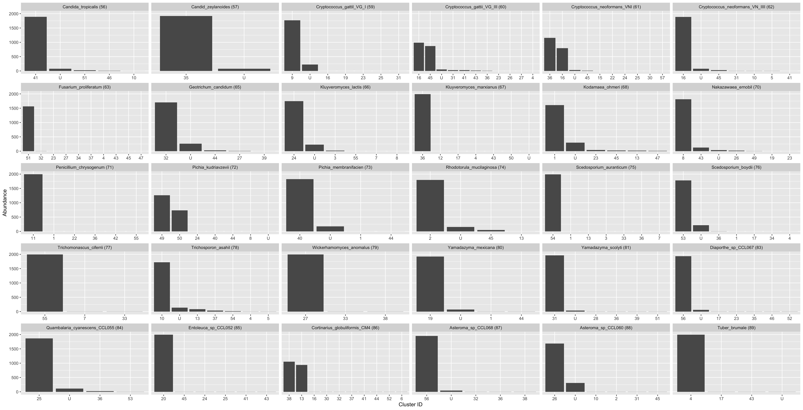

# Supplemental Tables

```{r samplesheet, echo=FALSE, message=FALSE }
library(tidyr)
library(dplyr)

knitr::kable(
  read.csv('../../../experiments/66-fungal-isolate-ONT/sample-stats.tsv', sep='\t') %>%
    separate_wider_delim(file, '.', names_sep = "_") %>%
    mutate(
      BC = gsub('BC', '', file_4),
      sample = gsub('_', ' ', file_3)
    ) %>%
    select(BC, sample, num_seqs) %>%
    arrange(BC) %>%
    rename(Barcode = 'BC', Sample = 'sample',  'Number of reads'=num_seqs),
  caption = "Samplesheet showing the species, sequencing barcode and number of raw reads after basecalling."
)
```

# Supplemental Figures

## Nanoclust splitting (all samples)


```{r nanoclustSplitting1, echo=FALSE, fig.fullwidth=TRUE}

```

```{r nanoclustSplitting2, echo=FALSE, fig.fullwidth=TRUE}

```


## Nanoclust Clumping (All OTUs)
```{r nanoclustClumping1, echo=FALSE, fig.fullwidth=TRUE}

```

```{r nanoclustClumping2, echo=FALSE, fig.fullwidth=TRUE}
knitr::include_graphics('analysis/images/06-cluster-clumping-nanoclust-31-60.png')
```